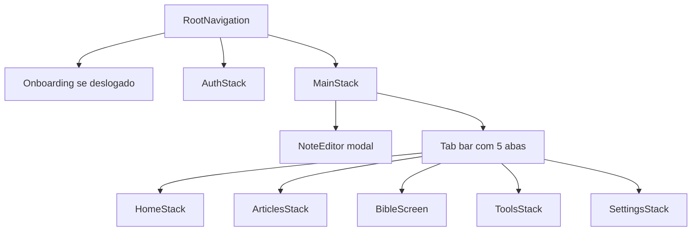

# Navegação e Telas

Toda a navegação está montada em `App.js` com React Navigation 6. São aprox. 31 telas (julho de 2026) distribuídas em 5 abas fixas no rodapé.

## As 5 abas

Os nomes de rota das abas são fixos em português (Início, Artigos, Bíblia, Ferramentas, Ajustes) e usados internamente para navegar. O rótulo visível é traduzido via `t()`, ver [[Idiomas (i18n)]].

1. **Início**: HomeStack, a porta de entrada com atalhos para quase tudo.
2. **Artigos**: ArticlesStack, lista de artigos por categoria e detalhe. Ver [[Artigos]].
3. **Bíblia**: `src/screens/BibleScreen.jsx` direto na aba, sem stack interno. Ver [[Leitor da Bíblia]].
4. **Ferramentas**: ToolsStack, o hub das ferramentas (quiz, terço, caderno, mapa e afins).
5. **Ajustes**: SettingsStack, configurações e telas legais.

## Stacks internos

Cada stack fica DENTRO do tab navigator, então a tab bar continua visível nas sub-telas.

- **HomeStack**: `HomeMain` mais aprox. 21 telas secundárias (Referências, Busca, Liturgia, Quiz, Diálogo, Terço, Caderno e outras).
- **ToolsStack**: `ToolsMain` mais praticamente o mesmo conjunto de sub-telas do HomeStack.
- **SettingsStack**: `SettingsMain`, Legal, Glossário, Favoritos e algumas telas que os favoritos abrem.
- **ArticlesStack**: `ArticlesList` para `ArticleDetail`, com `RefDetail` e Glossário.
- **MainStack** (raiz logada): `MainTabs` mais `NoteEditor`, que é modal full-screen sem tab bar.
- **AuthStack** (deslogado): Login, Cadastro e Recuperar senha.
- **Onboarding**: exibido antes das abas quando não há conta logada. Hoje aparece em toda abertura (escolha temporária de pré-lançamento), o gate por `hasSeenOnboarding` está pronto em `src/utils/onboarding.js`.

## Árvore de navegação

## Rotas duplicadas de propósito

`ArticleFromSearch` e `RefDetail` existem em vários stacks (Home, Tools, Settings, Articles). Isso é intencional: um artigo ou referência aberto a partir de qualquer aba abre dentro do stack da aba ativa, mantendo a tab bar e o botão voltar coerentes. Sem essas rotas repetidas, tocar num artigo pela aba Ajustes, por exemplo, não seria tratado por nenhum navegador.

Outros detalhes úteis:

- `backBehavior="history"` no tab navigator faz o voltar do Android percorrer o histórico de abas.
- `RefDetail` (`src/screens/RefDetailScreen.jsx`) mostra uma única referência de forma fluida, sem a lista completa. Ver [[Referências]].
- Na web, `documentTitle` formata o título da aba do navegador como "APPologética · seção".
