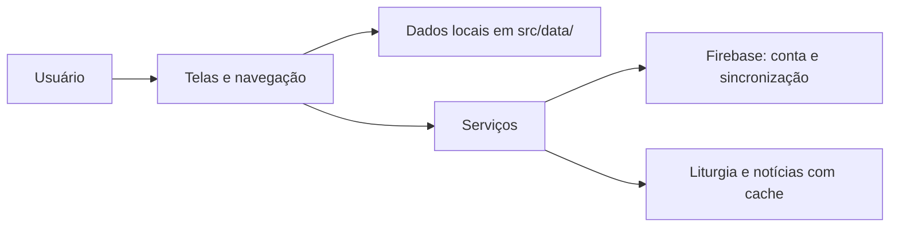

# Visão Geral

O APPologetica é um app de apologética católica bilíngue (PT/EN) feito em React Native com Expo. O mesmo código roda em Android, iOS e web. Em julho de 2026 o app tem aprox. 31 telas organizadas em 5 abas, detalhadas em [[Navegação e Telas]].

## Stack

| Peça | Versão | Papel |
| --- | --- | --- |
| Expo SDK | 54 | build, dev server e módulos nativos |
| React | 19.1 | biblioteca de UI |
| React Native | 0.81 | runtime nativo (na web via react-native-web) |
| React Navigation | 6 | abas e stacks de navegação |
| Firebase | 12 | conta e sincronização, ver [[Contas e Sincronização]] |

## Princípio offline-first

Todo o conteúdo (Bíblia, artigos, referências, quiz, glossário e afins) vive em arquivos estáticos dentro de `src/data/` e é lido de forma síncrona, sem rede. O racional está em [[Decisão - App 100% offline]] e o inventário completo em [[Catálogo de Dados]].

A rede só entra em poucos pontos, todos com fallback:

- Autenticação Firebase e Firestore para os dados do usuário, ver [[Contas e Sincronização]]
- Liturgia do dia em `src/services/liturgyApi.js`, com cache diário
- Notícias católicas em `src/services/newsApi.js`, com cache de algumas horas

Sem internet o app abre normalmente. Só esses cards de conteúdo do dia mostram a versão em cache ou um aviso.

## Fluxo geral

## Plataformas e monitoramento

- Android e iOS são o alvo principal. A web serve como vitrine e demonstração, com banners convidando a baixar o app.
- Arquivos `*.web.js` substituem módulos nativos na web (notificações, captura de imagem, Sentry).
- O Sentry (`src/sentry.js`) só inicializa em build standalone. No Expo Go e na web (`src/sentry.web.js`) vira no-op, para não arrastar módulos nativos.

## Onde continuar

- [[Estado Global e Tema]] explica os três contexts que envolvem o app.
- [[Serviços]] resume cada arquivo de `src/services/`.
- [[Mapa de Arquitetura]] lista todas as notas desta seção.
