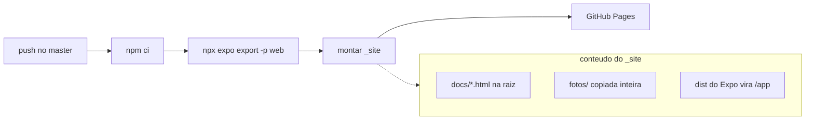

# Deploy e Publicação

Como o site e o app chegam nas pessoas: GitHub Pages para a web e EAS para as lojas.

## Pipeline web (GitHub Pages)

Definido em `.github/workflows/deploy-web.yml`. A cada push no `master` que toque arquivos relevantes, o site inteiro é reconstruído e publicado:

Detalhes que valem saber:

- O export do Expo roda com `PAGES_BASE_URL: /apologetica-app/app`, para os assets do app web funcionarem no subcaminho do Pages.
- O job cria `_site/.nojekyll` para o Pages não processar nada com Jekyll.
- Concurrency com grupo `pages` e `cancel-in-progress: false`, ou seja, deploys não rodam em paralelo e um deploy em andamento nunca é cancelado.

## Filtro de paths (o que dispara o deploy)

O workflow só dispara quando o push muda `src/`, `assets/`, `docs/`, `fotos/`, `App.js`, `app.json`, `app.config.js`, `package.json`, `package-lock.json` ou o próprio workflow. Mudanças só em `brain/` ou em documentos `.md` da raiz NÃO disparam deploy, então dá para editar este cofre à vontade sem gastar build. Também existe `workflow_dispatch` para rodar na mão.

## Builds de loja (EAS)

`eas.json` define três perfis para o `eas build`:

- `development`: APK com development client, distribuição interna.
- `preview`: APK de distribuição interna para testar em aparelho real.
- `production`: build de loja com `autoIncrement` de versão (fonte de versão remota).

## Ligações

- [[Site (Landing Page)]] (o que é publicado)
- [[Como Verificar e Publicar]] (checklist antes de dar push)
- [[Decisão - Pastas fotos e documentos na raiz]]
