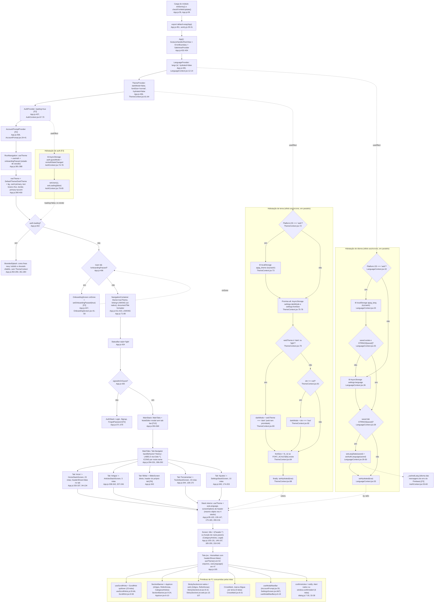
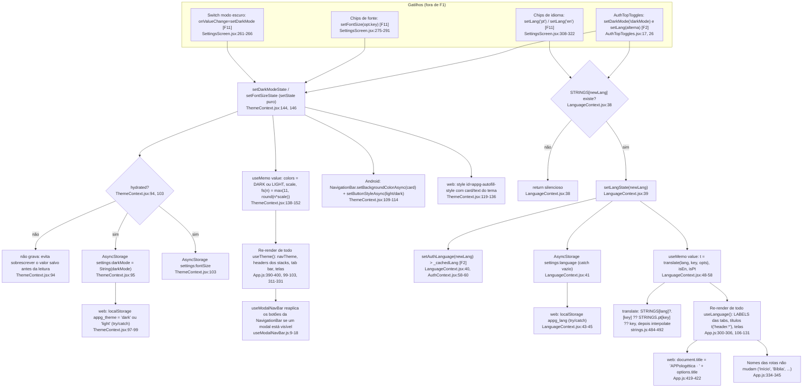

# 01. F1: Shell, tema e idioma (fluxograma)

Data: 2026-09-23. Base: commit `d54a5f2` (HEAD no momento da leitura). Levantamento somente leitura, todos os `file:line` conferidos com `cat -n` / `sed -n` / `grep -n` no código atual. Linhas sem prefixo de pasta em `src/context/`, `src/components/`, `src/hooks/`, `src/utils/` e `src/i18n/` referem-se a esses diretórios.

## Escopo

- Árvore de providers e navegação: `App.js` (providers `432-446`, `RootNavigation` `381-428`, `MainTabs` `294-348`, stacks internos `94-246`, `MainStack` `350-369`, `BrandedSplash` `250-284`, `LINKING` `71-89`).
- Tema: `src/context/ThemeContext.jsx` (paletas `LIGHT` `6-24` e `DARK` `29-47`, `FONT_SCALES` `49-54`, hidratação `66-91`, persistência `93-104`, NavigationBar Android `109-114`, CSS de autofill web `119-136`, `value`/`fs()` `138-152`).
- Idioma: `src/context/LanguageContext.jsx` (hidratação `16-35`, `setLang` `37-46`, `value` `48-58`, `useT` `70-73`) e `src/i18n/strings.js` (`STRINGS.pt` a partir de `6`, `STRINGS.en` a partir de `244`, `interpolate` `484-487`, `translate` `489-492`).
- Primitivas visuais: `ScrollHint.jsx` + `useScrollHints.js`, `SectionBanner.jsx`, `StickySectionList.jsx` / `.web.jsx`, `AppIcon.jsx`, `CrossMark.jsx`, `useModalNavBar.js`, `utils/dialog.js`.

Fora do escopo (só citados como dependência): `AuthContext.jsx` (F2), `OnboardingScreen.jsx` (F2), `AccountPrompt.jsx` (F2), `SettingsScreen.jsx` (F11), `sentry(.web).js`, `webUpdate(.web).js`, `ErrorBoundary.jsx` (F14), `docs/index.html` (landing).

## Fluxograma principal: boot até a tela

Convenção: nós com `[Fx]` pertencem a outra feature. Linhas pontilhadas são efeitos assíncronos ou re-render, não chamadas diretas.

Leitura do caminho feliz:

1. Antes de qualquer render, o módulo executa `initSentry()` (`App.js:55`, no-op no Expo Go por `sentry.js:9-12` e na web por `sentry.web.js:3`) e `checkForWebUpdate()` (`App.js:59`, no-op nativo em `webUpdate.js:3`, na web pode recarregar a aba uma vez em `webUpdate.web.js:60-82`).
2. `App()` monta a árvore `Language > Theme > Auth > AccountPrompt > RootNavigation` (`App.js:435-439`). Os três primeiros providers disparam cada um seu `useEffect` de hidratação em paralelo, sem ordem garantida entre eles.
3. `RootNavigation` só espera `auth.loading` (`App.js:402`). Enquanto `loading` for `true` mostra `BrandedSplash` (`App.js:250-259`), que usa cores fixas e não lê o tema. `hydrated` do tema e do idioma não é lido por ninguém fora dos próprios contextos (grep em `src/` e `App.js`: zero consumidores), então a primeira tela pode ser renderizada com `pt` e tema claro e trocar logo em seguida quando o AsyncStorage responder.
4. Com `loading=false`: sem usuário e sem `onboardingPassed` (estado de sessão, `App.js:388`) mostra `OnboardingScreen` (`App.js:407`). O `onDone` é chamado tanto em `skip` quanto em `start` (`OnboardingScreen.jsx:49-59`) e só muda o estado local, o gate volta a ser avaliado.
5. `NavigationContainer` recebe `navTheme` derivado de `colors` (`App.js:390-400`), `linking` só no nativo (`App.js:71`) e o `documentTitle` que forma o título da aba do navegador (`App.js:419-422`). Dentro dele, `signedInOrGuest` decide entre `MainStack` e `AuthStack` (`App.js:425`).
6. `MainStack` > `MainTabs` (`App.js:360`). As cinco tabs têm nomes fixos em PT que são a API de navegação (`App.js:334-345`); o rótulo visível vem de `LABELS[route.name]` (`App.js:300-306, 324, 326`) e o ícone de `ICONS[route.name]` (`App.js:286-292, 327-330`).
7. Quatro tabs abrem um stack interno (Home, Articles, Tools, Settings); `Bíblia` monta `BibleScreen` direto (`App.js:343`) e usa o header do próprio tab, que a tela sobrescreve com `navigation.setOptions` (`BibleScreen.jsx:179-182`, F6). Cada stack chama `useTheme()` e `useLanguage()` (`App.js:95-96, 139-140, 175-176, 208-209`) e passa `screenOptions` com `headerStyle`, `headerTintColor` e `headerTitleStyle` (`App.js:99-103` etc.), e cada `Screen` recebe `title: t('header.*')` (`App.js:106-131` etc.).
8. A tela final consome `colors`/`fs` e `t` diretamente e as primitivas de F1 (subgrafo `PR`).

## Fluxograma 2: trocar tema e trocar idioma

Diferença de estilo entre os dois fluxos, como fato: o tema persiste por efeito (`useEffect` observando `darkMode`/`fontSize`, `ThemeContext.jsx:93-104`), o idioma persiste dentro do próprio `setLang` (`LanguageContext.jsx:37-46`). Por isso o tema precisa da guarda `hydrated` e o idioma não.

Sincronização Language > Auth: `AuthContext` fica acima de `LanguageContext` na árvore (`App.js:435-437`) e não pode usar `useLanguage()` (comentário em `AuthContext.jsx:56-57`). Ele mantém `_cachedLang` (`AuthContext.jsx:53`), preenchido de três formas: leitura própria de `settings:language` na carga do módulo (`AuthContext.jsx:54`), `setAuthLanguage(saved)` na hidratação do idioma (`LanguageContext.jsx:30`) e `setAuthLanguage(newLang)` em cada troca (`LanguageContext.jsx:40`). Esse cache só é usado para escolher o mapa de mensagens de erro do Firebase (`AuthContext.jsx:62-65`).

## Efeitos colaterais

| Efeito | Onde | Quando |
|---|---|---|
| AsyncStorage `settings:darkMode` | leitura `ThemeContext.jsx:76`, escrita `:95` | boot; toda mudança de `darkMode` após `hydrated` |
| AsyncStorage `settings:fontSize` | leitura `ThemeContext.jsx:77`, escrita `:103` | boot; toda mudança de `fontSize` após `hydrated` |
| AsyncStorage `settings:language` | leitura `LanguageContext.jsx:26` e `AuthContext.jsx:54`; escrita `LanguageContext.jsx:41` | boot (duas leituras independentes); cada `setLang` |
| localStorage `appg_theme` (web) | leitura `ThemeContext.jsx:73`, escrita `:98`; landing `docs/index.html:15, 613, 619` | boot (prioridade sobre AsyncStorage `:79-80`); cada mudança de `darkMode` |
| localStorage `appg_lang` (web) | leitura `LanguageContext.jsx:23`, escrita `:44`; landing `docs/index.html:607, 618` | boot (prioridade sobre AsyncStorage `:25-27`); cada `setLang` |
| AsyncStorage `auth:guestMode`, `onboarding:done`, `onboarding:startIntent` | `AuthContext.jsx:19`, `utils/onboarding.js:3-4` | gate de `RootNavigation` depende deles (F2, não F1) |
| sessionStorage `appg:updateReloaded` + `window.location.reload()` (web) | `webUpdate.web.js:16, 67, 79-80` | carga do módulo via `App.js:59` (F14) |
| NavigationBar Android (fundo = `card`, botões `light`/`dark`) | `ThemeContext.jsx:109-114`; `useModalNavBar.js:9-18` | montagem e cada mudança de `darkMode`; abertura/fechamento de modal (com `setTimeout` 50 ms) |
| Injeção de CSS `<style id="appg-autofill-style">` em `document.head` (web) | `ThemeContext.jsx:119-136` | montagem e cada mudança de `darkMode`; elemento reutilizado por id |
| `document.title` (web) | `NavigationContainer documentTitle`, `App.js:419-422` | cada mudança de rota focada; único ponto do app que mexe no título (grep: sem `document.title` direto) |
| StatusBar `light` fixo | `App.js:424` | sempre, independe do tema |
| Sentry init / wrap | `App.js:55, 451`; `sentry.js:11-31` | carga do módulo, só em build standalone |

## Ramos de erro e fallback

- **Chave de tradução ausente**: `translate` cai de `STRINGS[lang][key]` para `STRINGS.pt[key]` e, se nem PT tiver, devolve a própria chave como texto (`strings.js:490`). `interpolate` deixa `{{k}}` literal quando `opts` não traz a variável (`strings.js:486`).
- **Idioma inválido**: `setLang` ignora silenciosamente (`LanguageContext.jsx:38`); na hidratação, valor fora de `STRINGS` é descartado (`:25, :28`) e o app fica em `pt`.
- **Tamanho de fonte inválido**: ignorado na hidratação (`ThemeContext.jsx:84`); `scale` tem `?? 1` (`:140`); `fs()` tem piso de 11 px (`:149`).
- **Persistência indisponível** (AsyncStorage rejeita, `localStorage` bloqueado em modo privado): todo acesso a `localStorage` está em `try/catch` (`ThemeContext.jsx:73, 98`; `LanguageContext.jsx:23, 44`), toda escrita em AsyncStorage tem `.catch(() => {})` (`ThemeContext.jsx:95, 103`; `LanguageContext.jsx:41`), e a hidratação do tema tem `try/catch` com `finally setHydrated(true)` (`:85-89`), então o app segue com os padrões.
- **`hydrated=false`**: os efeitos de persistência do tema não gravam (`ThemeContext.jsx:94, 103`), evitando sobrescrever o valor salvo com o padrão antes da leitura terminar. Fora disso, `hydrated` não bloqueia nada: `RootNavigation` só olha `auth.loading` (`App.js:402`).
- **NavigationBar** (dispositivo sem suporte, iOS, web): guardado por `Platform.OS !== 'android'` (`ThemeContext.jsx:110`; `useModalNavBar.js:10`) e `.catch(() => {})` (`ThemeContext.jsx:112-113`; `useModalNavBar.js:12, 16`).
- **CSS de autofill**: guardado por `Platform.OS !== 'web' || typeof document === 'undefined'` (`ThemeContext.jsx:120`).
- **Hook fora do provider**: `useTheme` e `useLanguage` lançam erro explícito (`ThemeContext.jsx:159`; `LanguageContext.jsx:65`), assim como `useAccountPrompt` (`AccountPrompt.jsx:45`).
- **Erro de render**: `ErrorBoundary` (`App.js:433`) mostra tela de fallback com textos fixos em PT e botão "Tentar novamente" (`ErrorBoundary.jsx:24-40`). Como fica acima de `LanguageProvider` e `ThemeProvider`, não tem acesso a `t()` nem a `colors`.
- **Rota sem ícone**: `tabBarIcon` acessa `ICONS[route.name].on` sem guarda (`App.js:328-329`); os rótulos têm fallback `|| route.name` (`:324, :326`). Só as 5 tabs registradas existem, então o ramo não ocorre hoje.
- **Deep link na web**: `LINKING` é `undefined` (`App.js:71`), então o roteamento por URL não é ativado na versão web.
- **Diálogos na web**: `Alert.alert` é no-op no react-native-web, por isso `dialog.js` usa `window.confirm`/`window.alert` (`dialog.js:16-20, 34-37`). No nativo os rótulos padrão são `'Cancelar'` e `'OK'` fixos (`:23, :25`), fora do `strings.js`.
- **StickySectionList web**: `scrollToLocation` cai para o topo se não encontra o nó alvo ou se qualquer medida falha (`StickySectionList.web.jsx:54-57, 65-67`); seções vazias renderizam `ListEmptyComponent` (`:72, 84-85`). Props de virtualização do `SectionList` nativo são descartadas de propósito (`:26-27`).
- **Sentry**: `isExpoGo` desliga init, wrap e captura (`sentry.js:9, 12, 30, 34`); `Sentry.init` em `try/catch` (`:13-25`).
- **Atualização web**: no máximo um reload por aba, e qualquer falha (sem rede, sem `version.json`, storage bloqueado) é engolida (`webUpdate.web.js:64-82`).

## Dependências externas (o que F1 chama ou de que depende)

- **F2 (auth, visitante, onboarding)**: `AuthProvider` (`App.js:437` > `AuthContext.jsx:67`); `useAuth` em `RootNavigation` lendo `user`, `signedInOrGuest`, `loading` (`App.js:383`; expostos em `AuthContext.jsx:187-191`); `setAuthLanguage` chamado por `LanguageContext.jsx:5, 30, 40` (definido em `AuthContext.jsx:58-60`); `AccountPromptProvider` (`App.js:438` > `AccountPrompt.jsx:24-41`); `OnboardingScreen` com `onDone` (`App.js:407`; `OnboardingScreen.jsx:41, 51, 58`, que grava `onboarding:done` via `utils/onboarding.js:14`); `AuthStack` (`App.js:371-379`). Dependência reversa: `AuthTopToggles.jsx:9-10, 17, 26` chama `setDarkMode` e `setLang` de F1 a partir de Login, Signup e Onboarding.
- **F11 (Ajustes)**: `SettingsScreen.jsx:48-49` consome `setDarkMode`, `setFontSize`, `setLang` (`:263, :279, :310, :318`); `FONT_OPTIONS` (`SettingsScreen.jsx:30-35`) espelha as chaves de `FONT_SCALES` (`ThemeContext.jsx:49-54`); `useModalNavBar` em `SettingsScreen.jsx:667`.
- **F14 (infra)**: `initSentry`/`wrap` (`App.js:51, 55, 451` > `sentry.js:11-31`, `sentry.web.js:3-9`); `checkForWebUpdate` (`App.js:52, 59` > `webUpdate.js:3`, `webUpdate.web.js:60-82`); `ErrorBoundary` (`App.js:48, 433` > `ErrorBoundary.jsx:4`).
- **F10**: `NoteEditor` como modal do `MainStack` (`App.js:362-366`).
- **F6**: `BibleScreen` montado direto na tab (`App.js:343`) e sobrescrevendo o header do tab com `navigation.setOptions` (`BibleScreen.jsx:179-182`).
- **F3 a F11 (telas)**: todos os imports de tela em `App.js:11-43` são registrados nos stacks de F1.
- **Landing (site estático)**: `docs/index.html` lê e grava as mesmas chaves `appg_theme` (`:15, 613, 619`) e `appg_lang` (`:607, 618`) no mesmo domínio, e é a fonte de prioridade que os contextos respeitam no boot web.
- **Bibliotecas**: `@react-navigation/native`, `bottom-tabs`, `native-stack` (`App.js:4-6`), `expo-navigation-bar` (`ThemeContext.jsx:4`; `useModalNavBar.js:3`), `@react-native-async-storage/async-storage` (`ThemeContext.jsx:3`; `LanguageContext.jsx:3`), `@expo/vector-icons` (`App.js:7`; `AppIcon.jsx:1`; `ScrollHint.jsx:3`), `react-native-safe-area-context` (`App.js:9, 296`), `expo-status-bar` (`App.js:8`), `react-native-gesture-handler` (`App.js:1-2`).

## Duplicações observadas (só fatos, dentro do escopo)

1. O objeto `screenOptions` de header (`headerStyle: { backgroundColor: colors.primary }`, `headerTintColor: '#fff'`, `headerTitleStyle: { fontWeight: 'bold' }`) aparece literalmente 5 vezes (`App.js:99-103, 143-147, 179-183, 212-216, 354-358`) e uma sexta vez espalhado dentro do `screenOptions` de `MainTabs` (`App.js:312-314`). Grep de `headerStyle: { backgroundColor: colors.primary }`: 6 ocorrências, todas em `App.js`.
2. A função de título de `Legal` está duplicada em `App.js:131` e `:186`; a de `CategoryArticles` em `App.js:114` e `:153`. As rotas em si estão registradas em vários stacks (levantamento em `00-features.md`: 57 registros para 27 rotas).
3. O par `useScrollHints()` + `<ScrollHint direction="up"/>` + `<ScrollHint direction="down"/>` está em **23 telas** (`grep -rl "<ScrollHint" src/screens`), cada uma repetindo as quatro ligações `onScroll`, `onContentSizeChange`, `onLayout`, `scrollEventThrottle` que o próprio hook documenta em `useScrollHints.js:6-15`. A pauta falava em 24; a 24ª ocorrência do grep é o comentário de uso dentro de `useScrollHints.js:14-15`, não uma tela.
4. A chave `'settings:language'` está declarada em dois arquivos (`LanguageContext.jsx:7` e `AuthContext.jsx:20`) e é lida duas vezes no boot (`AuthContext.jsx:54` na carga do módulo, `LanguageContext.jsx:26` no efeito). A leitura de `AuthContext` não considera `appg_lang` da web; é corrigida depois por `setAuthLanguage` (`LanguageContext.jsx:30`).
5. O bloco `if (Platform.OS === 'web') { try { window.localStorage... } catch {} }` tem a mesma forma em quatro lugares: `ThemeContext.jsx:72-74` e `:97-99`, `LanguageContext.jsx:22-24` e `:43-45`.
6. `NavigationBar.setButtonStyleAsync(darkMode ? 'light' : 'dark')` aparece em `ThemeContext.jsx:113` e duas vezes em `useModalNavBar.js:12, 16`.
7. `const c = darkMode ? DARK : LIGHT` é recalculado em `ThemeContext.jsx:111`, `:121` e `:139`.
8. As quatro chaves de tamanho de fonte (`pequeno`, `normal`, `grande`, `enorme`) existem em `FONT_SCALES` (`ThemeContext.jsx:49-54`) e de novo em `FONT_OPTIONS` (`SettingsScreen.jsx:30-35`), com rótulos fixos em PT e fora de `strings.js`.
9. As cores da marca `#1a3a5c` e `#c9a84c` estão fixas em `BrandedSplash` (`App.js:256, 266, 269, 279`), além de `LIGHT.primary`/`LIGHT.accent` (`ThemeContext.jsx:8, 10`) e `app.json:12, 31`.
10. `ICONS` (`App.js:286-292`) e `LABELS` (`App.js:300-306`) são dois mapas paralelos indexados pelas mesmas cinco strings PT; `LABELS[route.name] || route.name` aparece em `App.js:324` e `:326`.
11. Branco fixo `'#fff'` para texto de header em `App.js:101, 145, 181, 214, 313, 356, 396`, sem passar pela paleta.
12. Strings de UI em PT fora de `strings.js`: `dialog.js:23, 25` (`'Cancelar'`, `'OK'`), `ErrorBoundary.jsx:28-36`, `SettingsScreen.jsx:31-34` (rótulos de fonte), `App.js:254-255` (splash).
13. Exports sem consumidor: `useT` (`LanguageContext.jsx:70-73`, zero usos fora do próprio arquivo) e `hydrated` exposto pelos dois contextos (`ThemeContext.jsx:150`; `LanguageContext.jsx:55`) sem leitura em `src/` ou `App.js`.
14. `SectionBanner` usa o padrão `makeStyles(colors, fs)` (`SectionBanner.jsx:11, 26`) como as telas; `ScrollHint` e `CrossMark` usam estilos inline (`ScrollHint.jsx:44, 49`; `CrossMark.jsx:17-28`).

## Confiança e lacunas

- **Alta** para a árvore de providers, os gates, a hidratação e os efeitos: `App.js`, os dois contextos, `strings.js` (cabeçalho e cauda) e todas as primitivas foram lidos na íntegra.
- **Alta** para as contagens de uso (grep por arquivo em `src/` e `App.js`): `useTheme()` 54 arquivos, `useLanguage()` 47, `<ScrollHint` 23 telas, `useModalNavBar` 2 consumidores, `dialog.js` 6 telas, `SectionBanner` 3, `StickySectionList` 2, `CrossMark` 5, `AppIcon` 2.
- **Média** para o comportamento em tempo de execução: o app não foi executado. A ordem real entre `auth.loading=false` e o fim das hidratações de tema/idioma não foi medida; o código não impõe ordem, e o splash só depende de `loading`.
- **Não lido**: o corpo de `AccountPromptModal` (`AccountPrompt.jsx:49+`), o miolo de `STRINGS` (`strings.js:31-243`, `245-480`), o restante de `docs/index.html` além das linhas de storage, o splash nativo de `app.json:10-12` (precede `BrandedSplash`, mas o tempo entre eles não foi verificado), e `AuthTopToggles.jsx` além das linhas 3-26.
- O título do header da tab `Bíblia` é definido pelo tab (`App.js:324`) e sobrescrito por `BibleScreen.jsx:179-182`; não foi verificado se outras telas fazem `setOptions` parecido.

## Fontes consultadas

| Arquivo | Faixas lidas |
|---|---|
| `App.js` | 1-451 (íntegra) |
| `src/context/ThemeContext.jsx` | 1-161 (íntegra) |
| `src/context/LanguageContext.jsx` | 1-73 (íntegra) |
| `src/i18n/strings.js` | 1-30, 440-492; linhas de abertura de `pt` (6) e `en` (244) por grep |
| `src/components/ScrollHint.jsx` | 1-67 |
| `src/hooks/useScrollHints.js` | 1-66 |
| `src/components/SectionBanner.jsx` | 1-45 |
| `src/components/StickySectionList.jsx` | 1-12 |
| `src/components/StickySectionList.web.jsx` | 1-109 |
| `src/components/AppIcon.jsx` | 1-10 |
| `src/components/CrossMark.jsx` | 1-32 |
| `src/hooks/useModalNavBar.js` | 1-19 |
| `src/utils/dialog.js` | 1-39 |
| `src/context/AuthContext.jsx` | 18-26, 50-70, 71-90, 180-196 |
| `src/components/AccountPrompt.jsx` | 24-48, grep de hooks (7, 9, 50, 52, 55) |
| `src/components/AuthTopToggles.jsx` | grep (3-4, 8-10, 17, 26) |
| `src/components/ErrorBoundary.jsx` | 1-40 |
| `src/sentry.js` | 9-36; `src/sentry.web.js` grep (3, 5, 9) |
| `src/utils/webUpdate.js` | 1-7; `src/utils/webUpdate.web.js` 1-20, 55-82 |
| `src/utils/onboarding.js` | grep (3-4, 6, 14, 21, 29) |
| `src/screens/OnboardingScreen.jsx` | 1-12, 41-60 |
| `src/screens/SettingsScreen.jsx` | 28-36, 258-322, grep (48-49, 667) |
| `src/screens/BibleScreen.jsx` | 176-186 |
| `docs/index.html` | 12-18, 597-600, 604-622 |
| `app.json` | grep de `splash`/`userInterfaceStyle` (9-12, 31) |
| `docs/design/PATHFINDER-2026-09-23/00-features.md` | 1-43 |
