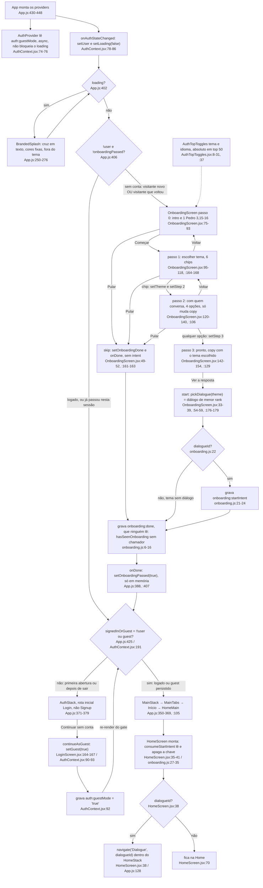
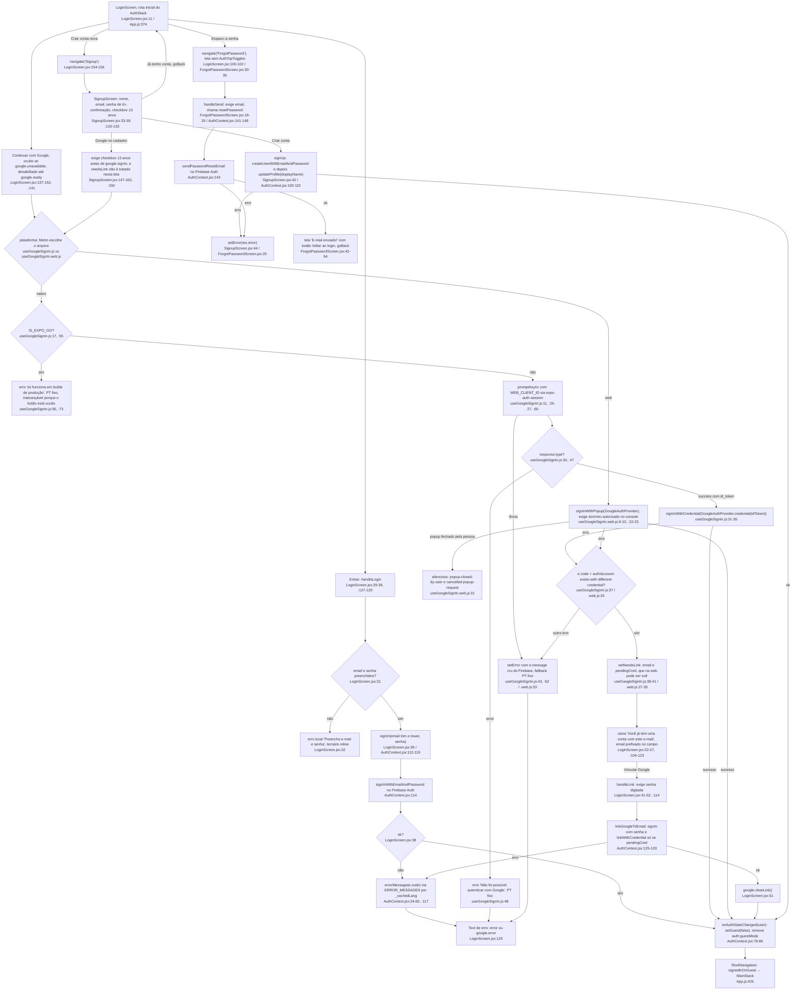
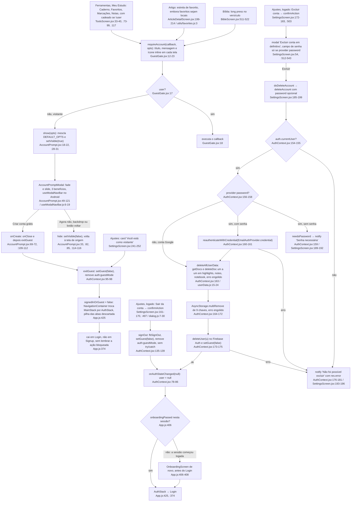

# 02. Auth, visitante e onboarding (F2)

Data: 2026-09-23. Base: commit `d54a5f2` (HEAD atual, `src/` intocado). Levantamento somente leitura por subagente do Pathfinder. Todo `arquivo:linha` foi conferido no código deste commit.

## Escopo

Arquivos lidos por inteiro: `src/context/AuthContext.jsx`, `src/screens/auth/LoginScreen.jsx`, `SignupScreen.jsx`, `ForgotPasswordScreen.jsx`, `src/hooks/useGoogleSignIn.js`, `useGoogleSignIn.web.js`, `src/screens/OnboardingScreen.jsx`, `src/utils/onboarding.js`, `src/components/GuestGate.jsx`, `AccountPrompt.jsx`, `AuthTopToggles.jsx`, `src/context/LanguageContext.jsx`, `src/services/firebase.js`, `src/utils/dialog.js`, `src/hooks/useModalNavBar.js`, `firestore.rules`. Em `App.js`: gate raiz (`381-428`), `AuthStack` (`371-379`), `MainStack` (`350-369`), `BrandedSplash` (`250-276`), providers (`430-448`). Trechos: `SettingsScreen.jsx:40-60, 150-260, 490-545` (conta, sair, excluir), `HomeScreen.jsx:1-80` (consumo do startIntent), `userData.js:1-24` (`deleteAllUserData`), os três call sites de `useRequireAccount` (`BibleScreen.jsx:511-522`, `ToolsScreen.jsx:33-40, 73-99`, `ArticleDetailScreen.jsx:199-214`).

Três diagramas: (1) gate raiz + onboarding + startIntent, (2) login, cadastro, senha e Google, (3) gate "criar conta?", sair e excluir conta. Total: **94 nós**.

## Fluxograma 1: gate raiz, onboarding e startIntent (26 nós)

Cobre o caminho feliz (a): primeira abertura → onboarding em 4 passos → "Ver a resposta" ou "Pular" → Login → "Continuar sem conta" → Home consome o `startIntent` → Dialogue. Atenção aos dois desvios que o código impõe: o visitante que volta vê o onboarding de novo em toda abertura fria e depois cai direto na Home (pula o Login), e quem está logado não vê onboarding nenhum.

Notas do diagrama 1:

- O `OnboardingScreen` é renderizado no lugar do `NavigationContainer` (`App.js:406-408` retorna antes de `:410`). Enquanto ele está na tela não existe navegador nenhum, por isso a intenção viaja por AsyncStorage e não por `route.params` (comentário em `onboarding.js:18-20`).
- O passo 2 (público) não grava nada: as quatro opções chamam só `setStep(3)` (`OnboardingScreen.jsx:129`). O comentário em `:25` confirma que é só copy.
- `pickDialogue` usa `getDialoguesByCategory(themeKey)` (`dialogues.js:702`) e ordena por `rank` crescente (`OnboardingScreen.jsx:37`). Se a lista vier vazia, `setStartIntent(null)` é no-op (`onboarding.js:22`).
- O efeito em `HomeScreen.jsx:35-41` depende só de `[navigation]`, então roda uma vez por montagem de `HomeMain`. `HomeMain` remonta toda vez que o gate troca `AuthStack` por `MainStack`.

## Fluxograma 2: login, cadastro, senha e Google (37 nós)

Cobre os caminhos (b) email e senha, (c) Google nativo vs web, mais cadastro, "esqueci a senha" e a caixa de vínculo (`linkInfo`).

Notas do diagrama 2:

- Nenhuma tela de auth navega para a Home: a troca `AuthStack` → `MainStack` acontece só por estado, quando `onAuthStateChanged` entrega um `user` (`AuthContext.jsx:78-86` → `App.js:425`). Por isso o `handleLogin` não faz nada no sucesso além de `setBusy(false)` (`LoginScreen.jsx:37-38`).
- `onAuthStateChanged` dispara já em `createUserWithEmailAndPassword`, antes do `updateProfile` (`AuthContext.jsx:102-104`). O objeto `user` guardado no estado é a mesma instância que o SDK muta, sem novo `setUser`.
- No nativo, `google.ready` depende de `request` do `expo-auth-session` carregar (`useGoogleSignIn.js:72`), então o botão nasce desabilitado (`LoginScreen.jsx:141`, `SignupScreen.jsx:151`).
- O `WEB_CLIENT_ID` (`useGoogleSignIn.js:11`) é usado também no nativo. O comentário em `:13-16` diz que a solução real são Client IDs nativos em dev build EAS, ainda não configurados no código.
- A persistência do Firebase Auth muda por plataforma em `firebase.js:33-42`: IndexedDB com fallback localStorage e `browserPopupRedirectResolver` na web, `getReactNativePersistence(AsyncStorage)` no nativo. Sem o resolver, `signInWithPopup` lança `auth/argument-error` (`:39-40`).

## Fluxograma 3: gate "criar conta?", sair e excluir conta (31 nós)

Cobre (d) visitante toca ação bloqueada → `useRequireAccount` → `AccountPrompt` → "Criar conta grátis" → `exitGuest` → onde cai, e (e) exclusão de conta com o que apaga e o que deixa. Inclui "Sair da conta" porque compartilha o desfecho.

Notas do diagrama 3:

- `useRequireAccount` decide só por `user` (`GuestGate.jsx:17`), não por `guest`. Dentro do `MainStack` os dois casos coincidem, porque `signedInOrGuest` é `!!user || guest` (`AuthContext.jsx:191`).
- O `AccountPromptProvider` fica abaixo do `AuthProvider` e acima do `RootNavigation` (`App.js:437-441`), então o modal sobrevive à troca de stack, mas `onCreate` fecha o modal antes de chamar `exitGuest` (`AccountPrompt.jsx:70-71`).
- O comentário em `SettingsScreen.jsx:198` diz que a troca de estado "leva de volta ao login automaticamente". No código atual, quem abriu o app já logado tem `onboardingPassed = false` (`App.js:388`), então depois de sair ou excluir vê o onboarding inteiro antes do Login (`App.js:406-408`).

## Efeitos colaterais

### Firebase Auth (rede)

| Chamada | Onde | Disparada por |
|---|---|---|
| `createUserWithEmailAndPassword` + `updateProfile` | `AuthContext.jsx:102-104` | `SignupScreen.jsx:42` |
| `signInWithEmailAndPassword` | `AuthContext.jsx:114`, `:127` | `LoginScreen.jsx:36`, `:48` |
| `linkWithCredential` | `AuthContext.jsx:128` | `LoginScreen.jsx:48`, só se `pendingCred` |
| `signInWithCredential` (Google nativo) | `useGoogleSignIn.js:35` | resposta do `promptAsync` |
| `signInWithPopup` (Google web) | `useGoogleSignIn.web.js:23` | `LoginScreen.jsx:140`, `SignupScreen.jsx:150` |
| `sendPasswordResetEmail` | `AuthContext.jsx:143` | `ForgotPasswordScreen.jsx:22` |
| `reauthenticateWithCredential` | `AuthContext.jsx:161` | `SettingsScreen.jsx:187`, só provider password |
| `deleteUser` | `AuthContext.jsx:173` | `SettingsScreen.jsx:187` |
| `signOut` | `AuthContext.jsx:136` | `SettingsScreen.jsx:168` |
| `onAuthStateChanged` (listener único) | `AuthContext.jsx:78-87` | montagem do `AuthProvider` |

Persistência da sessão Firebase: `firebase.js:33-42` (IndexedDB ou localStorage na web, AsyncStorage no nativo). O SDK limpa essa persistência sozinho em `signOut` e `deleteUser`.

### Firestore (rede)

- Única escrita do F2: `deleteAllUserData()` (`userData.js:20-24`) faz `getDocs` + `deleteDoc` por documento em `users/{uid}/highlights`, `notes` e `notebook` (`:15-18`). Não usa batch. O erro é engolido em `AuthContext.jsx:163`.
- Regras: `firestore.rules:10-12` só deixam o próprio `uid` ler e escrever. Se a limpeza falhar e o `deleteUser` prosseguir, os documentos ficam sob um `uid` que não existe mais, e nenhuma credencial do app consegue alcançá-los.

### AsyncStorage (local)

| Chave | Escreve | Lê | Remove |
|---|---|---|---|
| `auth:guestMode` | `AuthContext.jsx:92` | `:74` (async, não segura o `loading`) | `:83` (login), `:97` (exitGuest), `:138` (signOut) |
| `settings:language` | `LanguageContext.jsx:41` | `AuthContext.jsx:54` (na carga do módulo, para `ERROR_MESSAGES`), `LanguageContext.jsx:26` | nunca |
| `onboarding:done` | `onboarding.js:15` | nunca (`hasSeenOnboarding` `:6-12` sem chamador) | nunca |
| `onboarding:startIntent` | `onboarding.js:23` | `:29` | `:30` (no mesmo consumo) |
| `settings:darkMode`, `settings:fontSize` | `ThemeContext.jsx:95`, `:103` | `:76-77` | nunca |

`deleteAccount` apaga 9 chaves em `AuthContext.jsx:164-172`: `favorites:articles`, `reading:read`, `reading:plan`, `reading:plan:fundamentos`, `reading:plan:aprofundamento`, `notifications:prefs`, `search:history`, `bible:position`, `bible:read`. (O `00-features.md`, item 8, fala em 10, a lista tem 9.)

`deleteAccount` deixa: `lastRead:article` (`lastRead.js:3`), `reading:streak` (`readingProgress.js:5`), `quiz:history` e `quiz:streak` (`QuizScreen.jsx:11-12`), `onboarding:done` e `onboarding:startIntent`, `settings:language`, `settings:darkMode`, `settings:fontSize`, `settings:ttsVoice`, `settings:ttsVoiceEn`, `settings:ttsRate` (`ttsVoice.js:5-7`), `liturgy:cache` (`liturgyApi.js:6`), cache de notícias (`newsApi.js`). Os `reading:plan:*` apagados são dois IDs de trilho fixos, enquanto a chave real é gerada por `planKey(trackId)` (`readingProgress.js:55`).

Na web, além do AsyncStorage: `localStorage['appg_lang']` é lido primeiro (`LanguageContext.jsx:22-24`) e gravado em `:43-45`, compartilhado com a landing (`docs/index.html:607`, `:618`).

### Navegação

- Transições Onboarding ↔ Auth ↔ Main acontecem por estado, não por `navigate`: `App.js:402-408` (splash e onboarding, ambos fora do `NavigationContainer`) e `:425` (troca de stack dentro dele). Cada troca descarta a pilha anterior.
- Únicos `navigate` do escopo: `LoginScreen.jsx:100` (`ForgotPassword`), `:154` (`Signup`), `HomeScreen.jsx:38` (`Dialogue`). `goBack` em `SignupScreen.jsx:57`, `:164` e `ForgotPasswordScreen.jsx:36`, `:51`.
- Efeitos de UI do modal: `useModalNavBar` muda o estilo dos botões da barra Android com `expo-navigation-bar` (`useModalNavBar.js:9-18`), chamado em `AccountPrompt.jsx:55`.

## Ramos de erro

### Códigos do Firebase traduzidos (`ERROR_MESSAGES`, `AuthContext.jsx:24-51`)

10 códigos mais `default`, em PT e EN: `email-already-in-use`, `invalid-email`, `user-not-found`, `wrong-password`, `invalid-credential`, `weak-password`, `network-request-failed`, `too-many-requests`, `requires-recent-login`, `no-current-user`. O idioma vem de `_cachedLang` (`:53`), preenchido na carga do módulo por `AsyncStorage.getItem('settings:language')` (`:54`) e depois por `setAuthLanguage` (`:58-60`), chamado em `LanguageContext.jsx:30` e `:40`. Se a tela de auth renderizar antes do `getItem` resolver, o erro sai em PT mesmo com o app em EN.

`'auth/user-not-found'` tem mensagem própria (`:28`, `:41`). Se o projeto Firebase não tiver proteção contra enumeração de e-mail ativada, a tela "Esqueci a senha" revela se o e-mail existe. Não verificado no console.

### Validações locais (fora do Firebase)

- Login: campos vazios (`LoginScreen.jsx:31-33`), senha vazia no vínculo (`:43-46`).
- Cadastro: nome, e-mail, senha < 6, confirmação diferente, checkbox 13 anos (`SignupScreen.jsx:35-39`, mensagens em `:25-31`). O Firebase também rejeita senha curta (`weak-password`), então a regra existe duas vezes.
- Esqueci a senha: e-mail vazio (`ForgotPasswordScreen.jsx:20`).

### Google

- Expo Go: `IS_EXPO_GO` (`useGoogleSignIn.js:17`) esconde o botão nas duas telas (`unavailable`, `:73` → `LoginScreen.jsx:137`, `SignupScreen.jsx:147`). A mensagem de `:56` só seria vista se alguém chamasse `signIn` por fora do botão.
- Nativo: `response.type === 'error'` (`:47-49`), `promptAsync` lançando (`:61-63`), `signInWithCredential` falhando (`:42-44`, mostra `e.message` cru).
- Web: popup fechado pela pessoa é silencioso (`.web.js:31`), qualquer outro código mostra `e.message` cru (`:33`).
- Todas as mensagens do hook são strings PT fixas (`useGoogleSignIn.js:43`, `:48`, `:56`, `:62`, `.web.js:33`), fora do `ERROR_MESSAGES` e fora do `strings.js`.

### `linkInfo` (conta existente com o mesmo e-mail)

- Detecção: `auth/account-exists-with-different-credential` (`useGoogleSignIn.js:37-41`, `.web.js:25-30`). Depende de "uma conta por e-mail" estar ativo no projeto (comentário em `AuthContext.jsx:121-124`). Não verificado no console.
- No Login: caixa em `LoginScreen.jsx:104-123`, e-mail prefixado por efeito (`:25-27`), botão "Vincular Google" → `linkGoogleToEmail` (`AuthContext.jsx:125-133`). Na web `pendingCred` pode ser `null` (`.web.js:29`), e aí `:128` pula o `linkWithCredential`: a pessoa entra com a senha e nada é vinculado, sem aviso.
- No Cadastro: `SignupScreen.jsx` lê `google.error`, `unavailable`, `ready`, `busy` e `signIn`, mas não `needsLink` nem `clearLink`. Se o código disparar ali, `busy` termina e a tela não muda.

### Exclusão de conta

- `auth/no-current-user` (`AuthContext.jsx:155`), `needsPassword` (`:159` → `SettingsScreen.jsx:189-192`), `requires-recent-login` (`:177-179`, mesmo resultado que o ramo genérico em `:180`), genérico (`:180` → `SettingsScreen.jsx:193-196`).
- `deleteAllUserData` e `multiRemove` com `.catch(() => {})` (`:163`, `:172`): a conta é excluída mesmo se a limpeza falhar (por exemplo, offline).
- `signOut` não tem try/catch (`:135-139`). Uma rejeição de `fbSignOut` sobe até o `onConfirm` de `confirmAction` (`SettingsScreen.jsx:168`) sem tratamento.

## Dependências externas (file:line)

Pacotes:
- `firebase/auth`: `AuthContext.jsx:3-14`, `useGoogleSignIn.js:5`, `useGoogleSignIn.web.js:2`, `firebase.js:7-13`.
- `firebase/firestore`: `userData.js:1-4`.
- `@react-native-async-storage/async-storage`: `AuthContext.jsx:2`, `onboarding.js:1`, `LanguageContext.jsx:3`, `firebase.js:15`.
- `expo-auth-session/providers/google`, `expo-web-browser`, `expo-constants`: `useGoogleSignIn.js:2-4` (só nativo, a variante web mantém o pacote fora do bundle, `.web.js:5-7`).
- `expo-navigation-bar`: `useModalNavBar.js:3`, via `AccountPrompt.jsx:10`.
- `@expo/vector-icons` (Ionicons) e `react-native` (`Modal`, `Animated`, `KeyboardAvoidingView`): todas as telas do escopo.
- `@react-navigation/native`: `App.js:4-6`, `HomeScreen.jsx:4`.

Módulos do app:
- `src/services/firebase.js` (`auth`, `db`): `AuthContext.jsx:15`, `useGoogleSignIn.js:6`, `.web.js:3`, `userData.js:5`.
- `src/services/userData.js` `deleteAllUserData`: `AuthContext.jsx:16` → `userData.js:20-24`.
- `src/data/dialogues.js` `getDialoguesByCategory` (`:702`): `OnboardingScreen.jsx:7`. As chaves de tema em `OnboardingScreen.jsx:16-23` são strings exatas de categoria dos diálogos.
- `src/i18n/strings.js`: `auth.*` em `:144-160` (PT) e `:382-398` (EN), `settings.guest.*` em `:213-214` e `:451-452`, `settings.logout` em `:108` e `:346`.
- `src/context/LanguageContext.jsx:5, :30, :40` chama `setAuthLanguage` de `AuthContext.jsx:58-60` (dependência circular de módulo entre os dois contextos, resolvida porque só funções são usadas).
- `src/utils/dialog.js` `confirmAction` e `notify` (`:7-39`): `SettingsScreen.jsx:3`. Na web viram `window.confirm` e `window.alert` (`:16-20`, `:34-37`).
- `src/components/CrossMark.jsx`: `LoginScreen.jsx:9`, `OnboardingScreen.jsx:9`.
- `src/context/ThemeContext.jsx` e `LanguageContext.jsx`: todas as telas e componentes do escopo.

Consumidores do F2 fora do escopo:
- `useRequireAccount`: `BibleScreen.jsx:13, :61, :512`, `ToolsScreen.jsx:8, :47, :78`, `ArticleDetailScreen.jsx:22, :57, :201`.
- `useAuth` em `SettingsScreen.jsx:50` (`user`, `signOut`, `guest`, `exitGuest`, `deleteAccount`) e `ToolsScreen.jsx:45` (`user`, para o cadeado).
- `consumeStartIntent`: `HomeScreen.jsx:10, :37`.

Configuração fora do repositório:
- Firebase Console: domínio autorizado para o popup web (`useGoogleSignIn.web.js:9-10`), Web Client ID (`useGoogleSignIn.js:10-11`), "uma conta por e-mail" (`AuthContext.jsx:121-124`), regras publicadas a partir de `firestore.rules:1-14`.
- Landing web: `docs/index.html:607, :618` (`appg_lang`).

## Duplicações observadas no escopo

1. Mensagens do gate inline em 3 telas, cada uma com título, mensagem PT/EN e ícone próprios: `BibleScreen.jsx:514-519`, `ToolsScreen.jsx:80-86` (interpolando `item.label`), `ArticleDetailScreen.jsx:206-212`. O `DEFAULT_OPTS` em `AccountPrompt.jsx:18-22` é só PT, e o EN entra por comparação de string em `:95-100`, então qualquer chamador que passe `title` ou `message` custom precisa resolver o idioma sozinho.
2. Dois divisores "ou" no Login: `LoginScreen.jsx:131-135` (estilo `divider`, `:211-213`) e `:158-162` (estilo `guestDivider`, `:224-226`, caixa alta com letter spacing). Terceira cópia em `SignupScreen.jsx:141-145` (`:204-206`).
3. Bloco de marca repetido com três implementações: `LoginScreen.jsx:64-68` (CrossMark + "APPologética" + subtítulo), `OnboardingScreen.jsx:77-78` (CrossMark + h1), `App.js:250-259` (`BrandedSplash` com o caractere "✝" em texto, "APPologética" e "1 Pedro 3,15", cores literais `#1a3a5c` e `#c9a84c` em `:261-276`, fora do tema). O onboarding cita o mesmo versículo em `OnboardingScreen.jsx:84-91`.
4. Botão Google (JSX + estilo) duplicado: `LoginScreen.jsx:137-152` + `:238-250` e `SignupScreen.jsx:147-162` + `:207-218`.
5. Linha de input com ícone, olho de senha e `makeStyles` repetidos nas três telas de auth: `LoginScreen.jsx:70-98` / `:184-210`, `SignupScreen.jsx:66-118` / `:180-202`, `ForgotPasswordScreen.jsx:63-74` / `:94-112`. O hack `Platform.OS === 'web' ? { outlineStyle: 'none', outlineWidth: 0 }` está em `LoginScreen.jsx:194`, `SignupScreen.jsx:189`, `ForgotPasswordScreen.jsx:103`.
6. Invólucro `KeyboardAvoidingView` + `ScrollView keyboardShouldPersistTaps="handled"` idêntico em `LoginScreen.jsx:57-63`, `SignupScreen.jsx:50-56`, `ForgotPasswordScreen.jsx:31-35`.
7. Ternário bilíngue inline convivendo com `t('auth.*')` na mesma tela: `LoginScreen.jsx:32, :44, :107-118, :133, :148, :160, :169-171`; `SignupScreen.jsx:25-31, :63, :70, :97, :112, :125, :131, :143, :158, :166`; `ForgotPasswordScreen.jsx:20, :45-49, :58-60`; `SettingsScreen.jsx:163-165, :174-178, :190, :194, :506, :516-520, :527, :538`; `AccountPrompt.jsx:95-106`. "Continuar com Google" e "ou" existem em duas telas sem chave em `strings.js`.
8. Quatro redações da mesma promessa "marcações e notas ficam salvas e sincronizadas": `LoginScreen.jsx:169-171` (guestHint), `SignupScreen.jsx:63` (subtítulo), `AccountPrompt.jsx:20` + `:104-106` (mensagem e benefícios), `SettingsScreen.jsx:176-177` / `:519-520` (aviso de exclusão).
9. `email.trim().toLowerCase()` em `LoginScreen.jsx:36`, `SignupScreen.jsx:42`, `ForgotPasswordScreen.jsx:22`.
10. Padrão `try { ... } catch (e) { return { ok: false, error: errorMessage(e.code) } }` cinco vezes em `AuthContext.jsx:101-109, :113-118, :126-132, :142-147, :157-181`.
11. `isPasswordUser` calculado com a mesma expressão em `SettingsScreen.jsx:54` e `AuthContext.jsx:156`.
12. As duas variantes do hook Google devolvem o mesmo objeto de 7 chaves (`useGoogleSignIn.js:66-74`, `.web.js:40-48`) e o mesmo tratamento de `account-exists-with-different-credential` (`:37-41` vs `:25-30`), mantidos em sincronia à mão.
13. Vermelho de erro `#c0392b` literal em `LoginScreen.jsx:197`, `SignupScreen.jsx:190`, `ForgotPasswordScreen.jsx:104`, `SettingsScreen.jsx:499-500, :505-506, :515`, fora da paleta do `ThemeContext`.
14. `AuthTopToggles` em `OnboardingScreen.jsx:65`, `LoginScreen.jsx:61`, `SignupScreen.jsx:54`, ausente em `ForgotPasswordScreen.jsx`. No Cadastro divide o topo com a seta de voltar (`SignupScreen.jsx:57-59`).

## Fatos sem solução (registro, não opinião)

1. O gate do onboarding é estado de sessão (`App.js:388`) marcado "TEMPORÁRIO" (`:384-387`). `onboarding:done` é gravado (`onboarding.js:15`) e nunca lido. O visitante que volta vê o onboarding em toda abertura fria e depois cai direto na Home, sem passar pelo Login (`App.js:406` → `:425` com `guest` já carregado).
2. Quem sai ou exclui a conta numa sessão que começou logada vê o onboarding antes do Login (`App.js:406-408`), ao contrário do que o comentário em `SettingsScreen.jsx:198` descreve.
3. `loading` vira `false` no primeiro `onAuthStateChanged` (`AuthContext.jsx:85`) sem esperar o `getItem(GUEST_KEY)` (`:74-76`). Hoje o onboarding cobre essa janela. Se o gate passar a usar `hasSeenOnboarding`, um visitante que volta pode ver o Login por um instante antes do `guest` chegar.
4. "Criar conta grátis" no modal e o card de visitante nos Ajustes levam ao Login (`App.js:374`), não ao Cadastro, e a ação que estava bloqueada não é lembrada depois do login (o `callback` de `GuestGate.jsx:16` é descartado).
5. Favoritos são AsyncStorage local (`utils/favorites.js:3`) e funcionam sem rede, mas estão atrás do gate de conta em `ArticleDetailScreen.jsx:201-213` e `ToolsScreen.jsx:36, :78`.
6. `deleteAccount` exclui a conta mesmo quando a limpeza do Firestore ou do AsyncStorage falha (`AuthContext.jsx:163`, `:172`). Os documentos órfãos ficam inalcançáveis por `firestore.rules:10-12`.
7. `deleteAccount` deixa `lastRead:article`, `reading:streak`, `quiz:history`, `quiz:streak` e `onboarding:*` no aparelho (lista completa em "AsyncStorage" acima). A lista de trilhos apagados é fixa (`:166`) enquanto a chave real é `reading:plan:${trackId}` (`readingProgress.js:55`).
8. Erros do Google são PT fixo e às vezes `e.message` cru (`useGoogleSignIn.js:43, :48, :56, :62`, `.web.js:33`), fora do `ERROR_MESSAGES` (`AuthContext.jsx:24-51`) e do `strings.js`.
9. `SignupScreen.jsx` não trata `needsLink`, e na web o `pendingCred` pode ser `null` (`.web.js:29`), caso em que `linkGoogleToEmail` só faz login com senha (`AuthContext.jsx:128`).
10. A mensagem de Expo Go em `useGoogleSignIn.js:56` é inalcançável pela UI (botão oculto em `LoginScreen.jsx:137`, `SignupScreen.jsx:147`).
11. O ramo `requires-recent-login` em `AuthContext.jsx:177-179` produz o mesmo resultado do ramo genérico em `:180`.
12. `signOut` sem try/catch (`AuthContext.jsx:135-139`).
13. `_cachedLang` para as mensagens de erro depende de uma leitura assíncrona na carga do módulo (`AuthContext.jsx:54`), sem garantia de ordem em relação ao primeiro render das telas de auth.
14. `ERROR_MESSAGES` inclui `'auth/user-not-found'` com mensagem própria (`AuthContext.jsx:28`), o que pode expor a existência do e-mail na recuperação de senha se o projeto não tiver proteção contra enumeração. Não verificado no console.
15. `onAuthStateChanged` dispara no `createUserWithEmailAndPassword`, antes do `updateProfile(displayName)` (`AuthContext.jsx:102-104`), sem novo `setUser` depois.
16. `BrandedSplash` (`App.js:250-276`) não usa `CrossMark` nem o tema: cruz em caractere de texto e cores literais, sempre navy mesmo em modo claro.

## Confiança e lacunas

- Alta: `AuthContext.jsx`, as três telas de auth, os dois hooks Google, `OnboardingScreen.jsx`, `onboarding.js`, `GuestGate.jsx`, `AccountPrompt.jsx`, `AuthTopToggles.jsx`, `LanguageContext.jsx`, `firebase.js`, `dialog.js`, `useModalNavBar.js`, `firestore.rules`, e os trechos citados de `App.js`. Todos lidos por inteiro com número de linha.
- Média: `SettingsScreen.jsx` (lido em `:40-60`, `:150-260`, `:490-545`, mais grep), `HomeScreen.jsx:1-80`, `userData.js:1-24`, os três call sites do gate (só o trecho). `readingProgress.js`, `ttsVoice.js`, `QuizScreen.jsx`, `liturgyApi.js` só por grep de chaves.
- Não verificado (fora do código): configuração do projeto Firebase (uma conta por e-mail, proteção contra enumeração, domínios autorizados, Client IDs nativos para EAS). Comportamento em runtime não foi executado, nem em Expo Go nem na web. A chave do cache de notícias em `newsApi.js` não foi conferida por nome.
- Os números de linha valem para o commit `d54a5f2`. `00-features.md` foi produzido sobre `f00ef6d`, mas `src/` está intocado entre os dois segundo o `git status`.

## Fontes consultadas

`App.js` (`1-80`, `250-276`, `340-451`), `src/context/AuthContext.jsx` (inteiro), `src/context/LanguageContext.jsx` (inteiro), `src/screens/auth/LoginScreen.jsx` (inteiro), `src/screens/auth/SignupScreen.jsx` (inteiro), `src/screens/auth/ForgotPasswordScreen.jsx` (inteiro), `src/hooks/useGoogleSignIn.js` (inteiro), `src/hooks/useGoogleSignIn.web.js` (inteiro), `src/screens/OnboardingScreen.jsx` (inteiro), `src/utils/onboarding.js` (inteiro), `src/components/GuestGate.jsx` (inteiro), `src/components/AccountPrompt.jsx` (inteiro), `src/components/AuthTopToggles.jsx` (inteiro), `src/components/CrossMark.jsx` (inteiro), `src/hooks/useModalNavBar.js` (inteiro), `src/services/firebase.js` (inteiro), `src/services/userData.js` (`1-60`), `src/utils/dialog.js` (inteiro), `firestore.rules` (inteiro), `src/screens/SettingsScreen.jsx` (`3`, `40-60`, `150-260`, `490-545`), `src/screens/HomeScreen.jsx` (`1-80`), `src/screens/BibleScreen.jsx` (`500-540`), `src/screens/ToolsScreen.jsx` (`1-100`, `117`), `src/screens/ArticleDetailScreen.jsx` (`195-225`), `src/i18n/strings.js` (grep `auth.*`, `settings.guest.*`, `settings.logout`, `tab.*`, `header.dialogue`), `src/data/dialogues.js` (`702`, grep `rank`), `src/utils/readingProgress.js` (`4-5`, `53-62`), `src/utils/ttsVoice.js` (`5-7`), `src/screens/QuizScreen.jsx` (`11-12`), `src/context/ThemeContext.jsx` (`56-57`, `76-103`), `docs/index.html` (`607`, `618`), `docs/design/PATHFINDER-2026-09-23/00-features.md` (inteiro), `git log -1`, `git status`.
