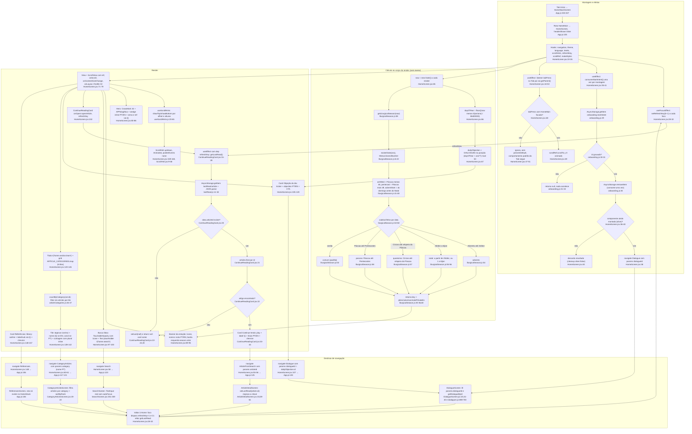

# 03. Início (F3): fluxograma

Data: 2026-09-23. Base: commit `d54a5f2` (mesmo conteúdo de `src/` e `App.js` de `f00ef6d`, sem diff entre os dois). Leitura completa de `HomeScreen.jsx`, `ContinueReadingCard.jsx`, `liturgicalSeason.js`, `lastRead.js`, `onboarding.js`, `useScrollHints.js`, `ScrollHint.jsx`, `CrossMark.jsx`, `AppIcon.jsx`, mais o cabeçalho e o `countByCategory` de `articleCategories.js`, as primeiras entradas de `dialogues.js` e os trechos de `App.js` que registram a aba e o HomeStack. Somente leitura, nada executado.

## Escopo

A feature é a tela raiz da aba `Início`: `App.js:333-337` monta `HomeStackScreen`, cujo primeiro registro é `HomeMain → HomeScreen` com `headerShown: false` (`App.js:105`). A tela é um único `ScrollView` com sete blocos na ordem em que aparecem no JSX: hero (`HomeScreen.jsx:80-86`), banner da estação litúrgica (`:89-95`), busca falsa (`:97-100`), card "Continue lendo" (`:102`), card "Objeção do dia" (`:105-120`), grid de 6 categorias (`:123-145`) e card "Versículos e Referências" (`:148-157`). Não há header nativo, por isso o `paddingTop` soma o `insets.top` do safe area (`:22, :26, :168`).

Dados usados: `ARTICLE_CATEGORIES` (6 entradas, `articleCategories.js:8-15`) e `countByCategory` (`:46-47`), `DIALOGUES` (53 entradas com `id`, `objection`, `objectionEn`, `dialogues.js:6-10`), `getLiturgicalSeason` (`liturgicalSeason.js:38-61`), `consumeStartIntent` (`onboarding.js:27-35`), `getLastRead` (`lastRead.js:11-18`) e `articles` (`ContinueReadingCard.jsx:6, 21`).

Fora do escopo (só citados como destino): `SearchScreen`, `ArticleDetailScreen`, `DialogueScreen`, `CategoryArticlesScreen`, `ReferencesScreen`.

## Fluxograma

Nós: 59 (16 em montagem, 13 em cálculo, 19 em render, 11 em navegação).

### Leitura do caminho feliz

1. `App.js:333-337` monta a aba `Início` com `HomeStackScreen`; `App.js:105` registra `HomeMain → HomeScreen` sem header.
2. `HomeScreen.jsx:19-26` resolve hooks e `makeStyles(colors, fs, insets.top)` (assinatura de três argumentos, `:165`, diferente do `makeStyles(c, fs)` de `ContinueReadingCard.jsx:47`).
3. `useFocusEffect` (`:28-32`) incrementa `refreshKey` a cada foco. O único consumidor é a prop `refreshKey` do `ContinueReadingCard` (`:102`), cujo `useEffect` tem essa dependência (`ContinueReadingCard.jsx:28`). Efeito colateral do mesmo `setState`: a Home inteira re-renderiza a cada foco e recalcula `now`, objeção e estação (`:65-68`), pois não há `useMemo`.
4. `useEffect` (`:35-41`) chama `consumeStartIntent()` (`onboarding.js:27-35`): lê `onboarding:startIntent`, apaga se existir e devolve o id ou `null`. Se houver id e o componente ainda estiver montado (`alive`), `navigate('Dialogue', { dialogueId })` (`:38`). Quem grava essa chave é `OnboardingScreen.jsx:56` (`setStartIntent`), fora do tab navigator, daí o transporte por AsyncStorage em vez de params (`onboarding.js:18-20`).
5. `useEffect` (`:44-53`) registra `tabPress` no navigator pai (`navigation.getParent()`, o Tab). Se `HomeMain` estiver focada, rola ao topo (`:49`). O listener não chama `preventDefault`, então o comportamento padrão do Tab não é alterado.
6. No corpo do render: `dayOfYear` e `dailyObjection` (`:65-67`, rotação determinística com semente `ano*7`, igual ao comentário em `:63-64` que cita `getVerseOfDay`), e `season = getLiturgicalSeason(now)` (`:68`, `liturgicalSeason.js:38-61`: Páscoa por Meeus/Jones/Butcher, Cinzas, Pentecostes, 1o domingo do Advento, cadeia de `if` em `:53-58`).
7. Render em ordem: hero (`:80-86`), banner (`:89-95`, cor e ícone vêm de `SEASONS`, `liturgicalSeason.js:30-36`), busca falsa (`:97-100`), `ContinueReadingCard` (`:102`), objeção (`:105-120`), grid (`:123-145`, `countByCategory` por tile em `articleCategories.js:46-47`, ícone via `AppIcon` `AppIcon.jsx:6-10`), card Referências (`:148-157`). Setas de scroll em `:159-160` alimentadas por `useScrollHints` (`useScrollHints.js:20-65`).
8. Destinos: `Search` (`:58`, `App.js:123`), `ArticleFromSearch` (`:55-56`, `App.js:125`), `Dialogue` (`:107`, `App.js:128`), `CategoryArticles` (`:60-61`, `App.js:117-121`, título do header traduzido pelo `route.params.category`), `References` (`:148`, `App.js:106`). Todas resolvem dentro do HomeStack porque estão registradas nele.

## Efeitos colaterais

| Efeito | Onde | Tipo |
|---|---|---|
| `AsyncStorage.getItem('onboarding:startIntent')` | `onboarding.js:29` via `HomeScreen.jsx:37` | leitura, uma vez por montagem |
| `AsyncStorage.removeItem('onboarding:startIntent')` | `onboarding.js:30` | escrita (remoção), só quando havia id |
| `AsyncStorage.getItem('lastRead:article')` | `lastRead.js:13` via `ContinueReadingCard.jsx:18` | leitura, a cada foco da Home (`refreshKey`) |
| `navigation.navigate('Dialogue', …)` automático | `HomeScreen.jsx:38` | navegação sem toque do usuário, só na ativação do onboarding |
| `tabNav.addListener('tabPress')` + `unsub` no cleanup | `HomeScreen.jsx:47-52` | listener no navigator pai |
| `scrollRef.current?.scrollTo` | `HomeScreen.jsx:49` | UI |
| `Animated.timing` / `Animated.loop` das setas | `ScrollHint.jsx:14-42` | UI, para no cleanup |

Rede: nenhuma. Firestore/auth: nenhum acesso, a Home é idêntica para visitante e logado (não importa `AuthContext` nem `userData`). A única escrita em `lastRead:article` é de `ArticleDetailScreen.jsx:61` (`setLastRead`, `lastRead.js:5-9`), não da Home. `lastRead:article` não entra na lista de chaves limpas por `deleteAccount` (fato 8 do `00-features.md`).

## Ramos

- **Sem último lido** (`ContinueReadingCard.jsx:20-24, 30`): `getLastRead()` devolve `null` (chave ausente ou erro de parse, `lastRead.js:15-17`), ou o objeto não tem `articleId`, ou `articles.find` não acha o id. Nos três casos `setLast(null)` e `return null`: o card não ocupa espaço e o layout passa direto da busca falsa para a objeção do dia. O mesmo vale no primeiro paint, antes do `await` resolver (`last` inicia `null`, `:13`).
- **startIntent nulo** (`onboarding.js:31-33`, `HomeScreen.jsx:38`): `consumeStartIntent()` devolve `null` e o `if (alive && dialogueId)` não navega. É o caso de toda abertura que não vem do onboarding v2 (o `OnboardingScreen.jsx:55` só grava quando o usuário escolheu um tema, `pickDialogue(theme)`, senão grava `null` e `setStartIntent` ignora, `onboarding.js:22`).
- **Desmontagem antes do `await`** (`HomeScreen.jsx:36-40`): `alive=false` no cleanup, a promessa resolve e é descartada. A chave já foi apagada (`onboarding.js:30`), então a intenção se perde.
- **tabPress com sub-tela aberta** (`HomeScreen.jsx:48`): `navigation.isFocused()` é falso quando o HomeStack está em `Search`, `Dialogue` etc., então não rola ao topo. O que acontece com a pilha nesse toque é o padrão do `@react-navigation/bottom-tabs`, não configurado neste arquivo.
- **Estação litúrgica**: cinco saídas de `liturgicalSeason.js:53-58`; a ordem dos `if` faz `natal` cobrir 25/dez a 31/dez (`now >= christmas`, `:55`) e 1 a 6/jan (`:56`), sem chegar até o Batismo do Senhor. O cabeçalho (`:1-3`) declara o cálculo como aproximado.
- **Idioma**: `isEn` escolhe `season.en/noteEn` (`:92-93`), `dailyObjection.objectionEn` (`:114`), `t('category.<id>')` para o nome do tile e `cat.id` (nome PT) quando PT (`:137`), e o plural `article(s)/artigo(s)` inline (`:140`). Chave ausente em EN cai para PT por `translate` (`strings.js:489-491`).
- **Deep link nativo** (`App.js:71-89`): `dialogo/:dialogueId`, `artigo/:articleId` e `referencia/:highlightId` apontam para o stack `Início` (`:77-82`). A Home não participa do parse, mas fica na pilha por baixo como primeira rota do HomeStack (padrão do react-navigation, não verificado em código da lib).

## Dependências externas (file:line)

- Navegação: `useNavigation`, `useFocusEffect` (`HomeScreen.jsx:4`); `navigation.getParent()` pressupõe que `HomeMain` vive dentro de um Tab (`App.js:333-337`); rotas destino `App.js:106, 117-121, 123, 125, 128`; `backBehavior="history"` no Tab (`App.js:310`); `documentTitle` web cai em `'APPologética'` porque `HomeMain` não tem `title` (`App.js:105, 419-422`).
- Safe area: `useSafeAreaInsets` (`HomeScreen.jsx:5, 22`), consumido só em `content.paddingTop` (`:168`).
- Tema: `colors.bg, primary, card, accent, accentText, primaryText, text, textMuted, textSubtle, badgeBg, heroSub` (`makeStyles`, `:165-233`; paletas em `ThemeContext.jsx:11-22` e `:34-45`); `fs()` para todas as fontes.
- i18n: `t()` e `isEn` (`HomeScreen.jsx:21`); chaves `home.search`, `home.section.learn`, `home.objection.title`, `home.objection.cta`, `home.card.references`, `home.card.referencesSub`, `home.hero.verse`, `home.hero.ref`, `home.continueReading` (PT `strings.js:53-56, 64-65, 89-90, 153`; EN `:291-294, 302-303, 327-328, 391`); `category.<id>` (`:219-224`).
- Dados: `ARTICLE_CATEGORIES` e `countByCategory` (`articleCategories.js:8-15, 46-47`, que importa `articles` em `:5`); `DIALOGUES` (`dialogues.js:6`, 53 itens); `articles` (`ContinueReadingCard.jsx:6`).
- Utils/hook: `consumeStartIntent` (`onboarding.js:27-35`, chave gravada por `OnboardingScreen.jsx:56`); `getLiturgicalSeason` (`liturgicalSeason.js:38-61`, único consumidor é a Home); `getLastRead` (`lastRead.js:11-18`, gravado por `ArticleDetailScreen.jsx:61`); `useScrollHints` (`useScrollHints.js:20-65`).
- Componentes: `AppIcon` (`AppIcon.jsx:6-10`), `CrossMark` (`CrossMark.jsx:8-32`), `ContinueReadingCard` (`ContinueReadingCard.jsx:10-45`), `ScrollHint` (`ScrollHint.jsx:9-58`), `Ionicons` (`HomeScreen.jsx:3`).
- Storage: `@react-native-async-storage/async-storage` (`lastRead.js:1`, `onboarding.js:1`).

## Duplicações observadas (fatos, sem solução)

1. **Fórmula da objeção do dia**: `HomeScreen.jsx:65-67` e `notifications.js:8-12` são literalmente iguais (`dayOfYear` por `86400000`, semente `ano*7`, `mod DIALOGUES.length`). A mesma família existe em `dailyVerses.js:98-104` (`getVerseOfDay`, semente `ano*7`, divisor escrito como `1000*60*60*24`) e `quiz.js:1966-1967` (semente `ano*13`). Diferença de comportamento: a notificação usa só `obj.objection` em PT (`notifications.js:166`), a Home escolhe PT/EN (`HomeScreen.jsx:114`).
2. **"Continue lendo" em dois cards**: `ContinueReadingCard.jsx:47-58` e `ContinueBibleCard.jsx:44-67` repetem `card` (row, gap 12, radius 12, padding 13, borda esquerda 3 em `accent`, marginBottom 12), `iconBox` (36x36 redondo em `accent`, `paddingLeft 2`), `label` (fs 10, uppercase, letterSpacing 1) e `title` (fs 14, 600, `primaryText`), com o mesmo ícone `play` branco e o mesmo `chevron-forward`. Diferenças: o da Bíblia tem `marginHorizontal 16`, barra de progresso e stats (`:28-37`), `numberOfLines 1` e `accessibilityRole/Label` (`:19-20`); o da Home tem `numberOfLines 2` e nenhum atributo de acessibilidade. Modelo de dados oposto: o da Home busca sozinho no AsyncStorage (`:15-28`), o da Bíblia recebe tudo por props (`:9`).
3. **Três barras de busca com três implementações**: a Home é um `TouchableOpacity` com ícone e `Text` (`HomeScreen.jsx:97-100`, estilo `searchBar` `:190-195`, placeholder `t('home.search')`); `SearchScreen.jsx:249-259` é `TextInput` real com `autoFocus`, `focused` e placeholder inline "O que você procura?" (diferente do da Home); `BibleScreen.jsx:677-688` é outro `TextInput` de filtro de livro com `searchRow/searchRowFocused` (`:1000-1007`) e placeholder inline "Buscar livro...". Ícone `search-outline` em `textSubtle` nos três.
4. **Bloco de marca em quatro lugares**: `HomeScreen.jsx:81-85` (CrossMark 34 + "APPologética" + wedge inline "Saiba responder, com a fonte na mão." + verso e ref por `t()`); `LoginScreen.jsx:64-68` (CrossMark 54 + "APPologética" + `t('auth.subtitle')`); `OnboardingScreen.jsx:77-90` (CrossMark 64 + "Saiba responder" + lead inline com a mesma frase "com a fonte na mão" + verso 1 Pedro 3,15-16 inline, redação diferente de `strings.js:89-90`); `App.js:250-259` `BrandedSplash` (glifo `✝` em `Text`, não `CrossMark`, "APPologética", "1 Pedro 3,15", cores fixas fora do tema, `:248-249`). A string "APPologética" também aparece em `SettingsScreen.jsx:612`, `DialogueAnswerCard.jsx:20`, `ShareVerseCard.jsx:22` e `App.js:421`.
5. **Card "ícone + label + sub + chevron"**: `HomeScreen.jsx:148-157` com estilos `card/cardIcon/cardLabel/cardSub` (`:211-220`) e `ToolsScreen.jsx:59-69` com `card/cardIcon/cardLabel/cardSub` (`:130-139`) de valores iguais (`cardIcon` 40x40, radius 9, `badgeBg`; `cardLabel` fs 15/600; `cardSub` fs 12/`textMuted`). Dentro da própria Home, `categoryIcon` (`:205-208`) repete `cardIcon` (`:215-218`) mais um `marginBottom 10`.
6. **Prefixo `home.` no i18n usado fora da Home**: das chaves `home.card.*` e `home.section.*` (`strings.js:54-84`), a Home consome só `home.section.learn` e `home.card.references(Sub)`; `home.card.today`, `home.section.spirituality` etc. são consumidas por `ToolsScreen.jsx:16, 110`.
7. **Ternário `isEn ?` ao lado de `t()` na mesma tela**: wedge (`:83`), nomes de estação vindos de dados (`liturgicalSeason.js:31-35`, não de `strings.js`), plural de artigo (`:140`) e objeção (`:114`) inline, enquanto verso, busca, seção e card usam `t()`.
8. **Padrão scroll hints**: `useScrollHints` + `ScrollHint` + o bloco `onScroll/onContentSizeChange/onLayout/scrollEventThrottle={32}` (`HomeScreen.jsx:23, 75-78, 159-160`) é o mesmo trio repetido em 25 telas (contagem do `00-features.md`).
9. **`makeStyles` com assinatura própria**: `HomeScreen.jsx:165` recebe `(c, fs, topInset)`, enquanto `ContinueReadingCard.jsx:47` e `ContinueBibleCard.jsx:44` recebem `(c, fs)`.

## Confiança e lacunas

- **Alta**: `HomeScreen.jsx` (234 linhas, inteiro), `ContinueReadingCard.jsx`, `liturgicalSeason.js`, `lastRead.js`, `onboarding.js`, `useScrollHints.js`, `ScrollHint.jsx`, `CrossMark.jsx`, `AppIcon.jsx`, `ContinueBibleCard.jsx`, trechos de `App.js` (`:71-89, :94-134, :248-259, :300-345, :350-428`). Contagem de 53 diálogos confirmada por script sobre `dialogues.js`.
- **Média**: `DialogueScreen.jsx` lido só em `:18-42` (não verifiquei o que a tela mostra quando `getDialogueById` devolve `undefined` para um `dialogueId` inválido vindo do startIntent ou do deep link); `CategoryArticlesScreen.jsx`, `SearchScreen.jsx`, `BibleScreen.jsx`, `ToolsScreen.jsx`, `LoginScreen.jsx`, `OnboardingScreen.jsx` e `ArticleDetailScreen.jsx` lidos por grep e trechos.
- **Não verificado**: comportamento padrão do `tabPress` em aba já focada com pilha aninhada (depende do `@react-navigation/bottom-tabs`, não li o pacote); se a primeira rota fica na pilha em deep link aninhado (mesma ressalva); nada foi executado, então o cálculo de estação para datas de borda (por exemplo 24/dez à noite, 6/jan) é leitura do código, não teste.

## Fontes consultadas

- `src/screens/HomeScreen.jsx:1-234`
- `src/components/ContinueReadingCard.jsx:1-59`
- `src/components/ContinueBibleCard.jsx:1-67`
- `src/utils/liturgicalSeason.js:1-62`
- `src/utils/lastRead.js:1-19`
- `src/utils/onboarding.js:1-35`
- `src/hooks/useScrollHints.js:1-66`
- `src/components/ScrollHint.jsx:1-67`
- `src/components/CrossMark.jsx:1-32`
- `src/components/AppIcon.jsx:1-10`
- `src/data/articleCategories.js:1-20, 46-47`
- `src/data/dialogues.js:1-40, 698-700` (mais contagem de `id:` no arquivo inteiro)
- `src/data/dailyVerses.js:98-104`, `src/data/quiz.js:1966-1967`
- `src/services/notifications.js:1-30, 156-172`
- `src/screens/ArticleDetailScreen.jsx:33, 55-66, 230`
- `src/screens/DialogueScreen.jsx:18-42`
- `src/screens/CategoryArticlesScreen.jsx:11-22, 36-37`
- `src/screens/SearchScreen.jsx:248-259`
- `src/screens/BibleScreen.jsx:77, 675-695, 1000-1007`
- `src/screens/ToolsScreen.jsx:16, 59-69, 110, 130-139`
- `src/screens/auth/LoginScreen.jsx:60-72`
- `src/screens/OnboardingScreen.jsx:41-58, 70-90`
- `src/context/ThemeContext.jsx:11-22, 34-45`
- `src/i18n/strings.js:17-22, 32-48, 53-90, 153, 219-229, 291-294, 302-303, 327-328, 391`
- `App.js:1-25, 71-89, 94-134, 244-262, 300-345, 350-428`
- `docs/design/PATHFINDER-2026-09-23/00-features.md`
- `git diff --stat f00ef6d..HEAD -- src App.js` (vazio)
