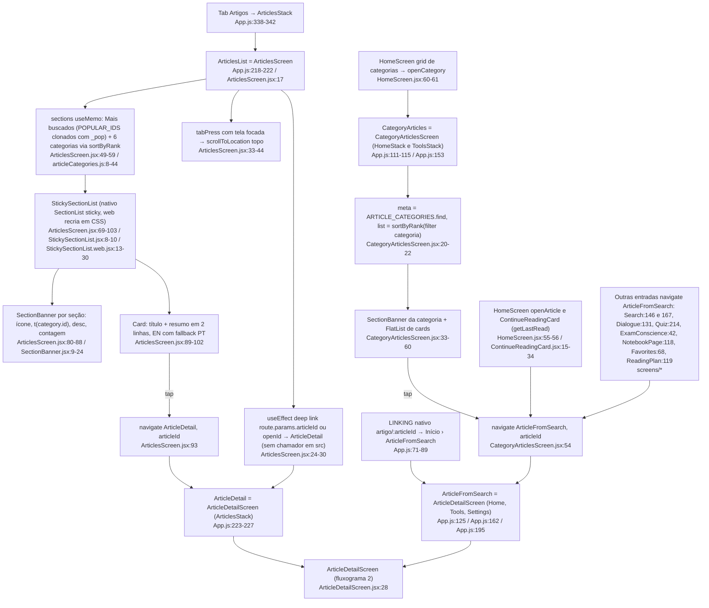
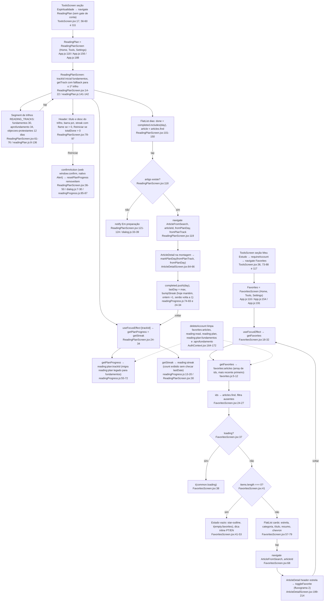

# 04. Artigos: lista, categorias, detalhe, favoritos e plano de leitura (F4)

Data: 2026-09-23. Base: commit `6e2b9f8` (branch `claude/funny-cray-ret9a0`, `src/` e `App.js` intocados, mesma árvore de código do `00-features.md`). Levantamento somente leitura. Todo `arquivo:linha` abaixo foi conferido no código atual. Caminhos relativos a `src/` salvo `App.js`.

## Escopo

Telas: `screens/ArticlesScreen.jsx` (125 linhas), `CategoryArticlesScreen.jsx` (81), `ArticleDetailScreen.jsx` (409, lida inteira), `FavoritesScreen.jsx` (98), `ReadingPlanScreen.jsx` (185).
Componentes: `components/MarkdownText.jsx`, `RelatedArticles.jsx`, `RelatedDialogues.jsx`, `ImageZoomModal.jsx`, `ReadingProgressBar.jsx`, `SectionBanner.jsx`, mais `GuestGate.jsx`/`AccountPrompt.jsx` (só o que o favoritar usa) e `StickySectionList(.web).jsx` (só como é usado).
Utilitários: `utils/favorites.js`, `lastRead.js`, `readingProgress.js`, `ttsVoice.js` (só `resolveVoice`/`getSavedRate`), `share.js` (`shareArticle`/`doShare`), `dialog.js` (`confirmAction`/`notify`).
Dados: `data/articles/index.js` (83 artigos em 6 arquivos por categoria, mescla `articles-en.js`), `articleCategories.js`, `articleRelations.js`, `readingPlan.js` (estrutura, 3 trilhos).
Registros em `App.js`: `ArticlesList` `:218-222`, `ArticleDetail` `:223-227`, `ArticleFromSearch` `:125` / `:162` / `:195`, `CategoryArticles` `:111-115` / `:153`, `Favorites` `:116` / `:154` / `:191`, `ReadingPlan` `:118` / `:156` / `:188`. Tab `Artigos` → `ArticlesStackScreen` `:338-342`.

Foram feitos três diagramas em vez de dois: o detalhe do artigo sozinho tem 50 nós e ficaria ilegível junto com a lista.

## Fluxograma 1: lista, categoria e entradas para o detalhe

## Fluxograma 2: detalhe do artigo (abrir, ler, header)

```mermaid
flowchart TD
  D0["ArticleDetailScreen: article = articles.find(route.params.articleId)<br/>ArticleDetailScreen.jsx:28-33"] --> D1{"article existe?<br/>ArticleDetailScreen.jsx:236"}
  D1 -->|não| D2["Tela vazia: Artigo não encontrado. (string inline PT/EN)<br/>ArticleDetailScreen.jsx:236-242"]
  D1 -->|sim| D3["useEffect [article.id]: setLastRead + crédito do plano + isFavorite, cleanup Speech.stop<br/>ArticleDetailScreen.jsx:59-73"]
  D3 --> D4["setLastRead → AsyncStorage lastRead:article (articleId, at)<br/>lastRead.js:5-9"]
  D3 --> D5{"route.params fromPlanTrack e fromPlanDay?<br/>ArticleDetailScreen.jsx:64-65"}
  D5 -->|sim| D6["markPlanDay(fromPlanTrack, fromPlanDay)<br/>ArticleDetailScreen.jsx:66"]
  D5 -->|não| D7["planEntriesByArticle(id) → markPlanDay em todo trilho/dia que contém o artigo<br/>ArticleDetailScreen.jsx:68 / readingPlan.js:154-159"]
  D6 --> D8["markPlanDay → reading:plan:trackId (completed, lastDay) + bumpStreak<br/>readingProgress.js:74-83"]
  D7 --> D8
  D8 --> D9["bumpStreak → reading:streak (count, lastDate em data local)<br/>readingProgress.js:24-34"]
  D3 --> D10["isFavorite → lê favorites:articles → setFav<br/>favorites.js:14-17"]
  D1 -->|sim| D11["listener blur → Speech.stop + setSpeaking(false)<br/>ArticleDetailScreen.jsx:76-82"]
  D1 -->|sim| D12["headerRight: ouvir, compartilhar, favoritar (deps sem lang)<br/>ArticleDetailScreen.jsx:129-166"]
  D1 -->|sim| D13["headerTitle = t(header.article) - displayTitle<br/>ArticleDetailScreen.jsx:169-172"]
  D1 -->|sim| D14["useFocusEffect: restaura scroll salvo (rAF, 80ms, 220ms)<br/>ArticleDetailScreen.jsx:177-187"]
  D1 -->|sim| D16["ScrollView onScroll (throttle 16) → setProgress + scrollYRef + hintScroll.onScroll<br/>ArticleDetailScreen.jsx:216-222 e 257-264"]
  D16 --> D15["ReadingProgressBar (3px, progress 0..1)<br/>ArticleDetailScreen.jsx:246 / ReadingProgressBar.jsx:5-15"]
  D16 --> D17["ScrollHint up/down<br/>ArticleDetailScreen.jsx:233 e 358-359 / useScrollHints.js:20"]
  D1 -->|sim| D18{"article.image?<br/>ArticleDetailScreen.jsx:266"}
  D18 -->|sim| D19["Hero: onLayout mede largura, altura = largura / max(imageAspect, 1.3), crédito<br/>ArticleDetailScreen.jsx:40-44 e 266-289"]
  D19 -->|tap| D20["setZoomOpen(true)<br/>ArticleDetailScreen.jsx:271"]
  D20 --> D21["ImageZoomModal: imagem local + imageHd remota (wsrv.nl) com fade, pinch/pan/duplo toque, web via eventos DOM<br/>ImageZoomModal.jsx:20-250"]
  D1 -->|sim| D22["Badge categoria: isEn ? t(category.x) : x<br/>ArticleDetailScreen.jsx:290-294"]
  D1 -->|sim| D23["Título displayTitle = isEn ? titleEn ou title : title<br/>ArticleDetailScreen.jsx:47 e 296"]
  D1 -->|sim| D24{"isEn e sem bodyEn?<br/>ArticleDetailScreen.jsx:48-49"}
  D24 -->|sim| D25["Aviso t(articles.notAvailable) + corpo PT<br/>ArticleDetailScreen.jsx:297-306"]
  D24 -->|não| D26["MarkdownText text=displayBody<br/>ArticleDetailScreen.jsx:305-309"]
  D25 --> D26
  D26 --> D27["parseBlocks: h2, citação, lista, parágrafo<br/>MarkdownText.jsx:167-205"]
  D27 --> D28["linkify: termos manuais em colchetes duplos + autoScan da 1ª ocorrência por artigo (TERM_LOOKUP do glossário)<br/>MarkdownText.jsx:19-87 e 96-104"]
  D28 -->|tap termo| D29["onOpenGlossary → salva scroll → navigate Glossary, highlightTerm<br/>ArticleDetailScreen.jsx:308"]
  D1 -->|sim| D30{"article.tool? (só id 74 → Rosary)<br/>ArticleDetailScreen.jsx:311 / igreja-catolica.js:822"}
  D30 -->|sim| D31["Botão → navigate(tool.tab ou Ferramentas, screen: tool.screen)<br/>ArticleDetailScreen.jsx:312-319"]
  D1 -->|sim| D32{"article.references.length > 0?<br/>ArticleDetailScreen.jsx:322"}
  D32 -->|sim| D33["Lista refs: referenceById + referencesEn + translateRef, crédito autor/ano<br/>ArticleDetailScreen.jsx:323-351"]
  D33 -->|tap| D34["openReference → salva scroll → navigate RefDetail, highlightId<br/>ArticleDetailScreen.jsx:189-192"]
  D1 -->|sim| D35["RelatedDialogues: DIALOGUES.filter(relatedArticle === id)<br/>RelatedDialogues.jsx:11-38"]
  D35 -->|tap| D36["openDialogue → navigate Dialogue, dialogueId<br/>ArticleDetailScreen.jsx:224-226"]
  D1 -->|sim| D37["RelatedArticles: getRelatedArticles(RELATED_ARTICLES)<br/>RelatedArticles.jsx:11-38 / articleRelations.js:83-88"]
  D37 -->|tap| D38["openOtherArticle → navigation.push(route.name, articleId)<br/>ArticleDetailScreen.jsx:228-231"]
  D38 --> D0

  D12 -->|ouvir| T1{"Speech.isSpeakingAsync?<br/>ArticleDetailScreen.jsx:96-103"}
  T1 -->|sim| T2["Speech.stop + setSpeaking(false)<br/>ArticleDetailScreen.jsx:100-102"]
  T1 -->|não| T3["textLang = isEn e bodyEn ? en : pt, resolveVoice + getSavedRate<br/>ArticleDetailScreen.jsx:104-110 / ttsVoice.js:220-228 e 203-211"]
  T3 --> T4["stripMarkdownForTts(título + corpo)<br/>ArticleDetailScreen.jsx:85-94 e 111-114"]
  T4 --> T5["Speech.speak em 1 chamada, onDone/onStopped/onError → setSpeaking(false), sem aviso ao usuário<br/>ArticleDetailScreen.jsx:117-125"]

  D12 -->|compartilhar| S1["onShare → shareArticle(title, summary sempre PT)<br/>ArticleDetailScreen.jsx:194-197"]
  S1 --> S2["doShare: nativo Share.share, web navigator.share senão clipboard + notify Copiado<br/>share.js:54-57 e 15-33"]

  D12 -->|favoritar| F1["onToggleFav → requireAccount(cb, título e mensagem inline PT/EN)<br/>ArticleDetailScreen.jsx:199-214"]
  F1 --> F2{"auth user?<br/>GuestGate.jsx:16-22"}
  F2 -->|visitante| F3["AccountPromptModal Salvar nos favoritos? → Criar conta (exitGuest) ou Agora não<br/>AccountPrompt.jsx:28-31, 69-72 e 109-116"]
  F2 -->|logado| F4["toggleFavorite → favorites:articles (unshift ou splice) + setFav(!f)<br/>favorites.js:19-29 / ArticleDetailScreen.jsx:202-205"]
```

## Fluxograma 3: plano de leitura e favoritos

## Efeitos colaterais

Tudo local, exceto o item 5. Nenhuma escrita em Firestore nesta feature (favoritos e progresso são AsyncStorage por decisão registrada no `CLAUDE.md`).

| Efeito | Chave / API | Quando | Onde |
|---|---|---|---|
| AsyncStorage escrita | `lastRead:article` = `{ articleId, at }` | montagem do detalhe, todo artigo aberto | `ArticleDetailScreen.jsx:61` → `lastRead.js:5-9` |
| AsyncStorage escrita | `reading:plan:<trackId>` = `{ completed[], lastDay }` | montagem do detalhe (via `fromPlan*` ou `planEntriesByArticle`), não por scroll | `ArticleDetailScreen.jsx:64-69` → `readingProgress.js:74-83` |
| AsyncStorage escrita | `reading:streak` = `{ count, lastDate }` | dentro de todo `markPlanDay` | `readingProgress.js:24-34, 81` |
| AsyncStorage leitura + migração | `reading:plan` (legado) copiado para `reading:plan:fundamentos` na 1ª leitura | foco do ReadingPlan | `readingProgress.js:57-72` |
| AsyncStorage remoção | `reading:plan:<trackId>` | "Reiniciar progresso" confirmado | `ReadingPlanScreen.jsx:45-48` → `readingProgress.js:85-87` |
| AsyncStorage leitura/escrita | `favorites:articles` = `[ids]` | `isFavorite` na montagem, `toggleFavorite` no header, `getFavorites` no foco de Favoritos | `favorites.js:5-29`, `ArticleDetailScreen.jsx:70, 203`, `FavoritesScreen.jsx:22` |
| AsyncStorage leitura | `settings:ttsVoice` / `settings:ttsVoiceEn` / `settings:ttsRate` | ao iniciar narração | `ttsVoice.js:188-194, 203-211, 220-228` |
| expo-speech | `Speech.speak` (1 chamada, texto inteiro), `Speech.stop` na desmontagem, no blur e no toggle, `getAvailableVoicesAsync` via `resolveVoice` | header "ouvir" | `ArticleDetailScreen.jsx:72, 77-80, 96-126`, `ttsVoice.js:115-122, 159-182` |
| Share sheet / clipboard | nativo `Share.share`, web `navigator.share` senão `navigator.clipboard.writeText` + `notify('Copiado')` | header "compartilhar" | `share.js:15-33, 54-57` |
| Rede (única) | `Image source={{ uri: article.imageHd }}` (URL `wsrv.nl` → Wikimedia, presente nos 83 artigos) carregada ao abrir o zoom, fade quando pronta, `onError` só marca `hdFailed` | tap no hero | `ImageZoomModal.jsx:36-42, 203-210`, `data/articles/*.js` campo `imageHd` |
| Alert / window.confirm | `confirmAction` (reset do plano), `notify` (dia "em preparação", "Copiado") | plano e share | `dialog.js:7-39` |
| Modal de conta | `AccountPromptModal` com título/mensagem/ícone vindos da tela, botão "Criar conta" chama `exitGuest()` | visitante toca na estrela | `AccountPrompt.jsx:28-31, 69-72, 109-116` |
| Navegação com estado | `savedScrollRef` guardado antes de `RefDetail` e `Glossary`, restaurado no `useFocusEffect` em 3 tentativas (rAF, 80 ms, 220 ms) | tap em ref ou termo | `ArticleDetailScreen.jsx:174-192, 308` |

Correção da premissa recebida: não existe `markRead` no scroll. `markAsRead`/`getReadSet` (chave `reading:read`) existem em `readingProgress.js:37-51` mas não têm chamador em `src/` (o único uso da chave é a limpeza em `AuthContext.jsx:165`). O `onScroll` do detalhe (`ArticleDetailScreen.jsx:216-222`) só alimenta a barra de progresso, o `scrollYRef` e as setinhas. O crédito do plano acontece na montagem (`:59-73`), ou seja, abrir o artigo já conta como dia lido.

## Ramos

| Ramo | Condição | Comportamento | Onde |
|---|---|---|---|
| Artigo não encontrado | `articles.find` retorna `undefined` (id inválido em params ou deep link) | tela centralizada com "Artigo não encontrado." (string inline PT/EN), sem header customizado, sem efeitos (os `useEffect` retornam cedo em `!article`) | `ArticleDetailScreen.jsx:33, 60, 130, 170, 236-242` |
| EN sem tradução | `isEn && !article.bodyEn && article.body` | aviso `t('articles.notAvailable')` e corpo em PT, título usa `titleEn` se houver, TTS narra em PT (`useEnText=false`) | `ArticleDetailScreen.jsx:47-49, 106-113, 297-306`, `strings.js:123, 361` |
| Visitante ao favoritar | `useAuth().user` nulo | `requireAccount` não executa o callback, abre `AccountPromptModal` com "Salvar nos favoritos?" e mensagem inline, "Criar conta" chama `exitGuest()` (sai do modo visitante para o AuthStack), "Agora não" fecha | `ArticleDetailScreen.jsx:199-214`, `GuestGate.jsx:16-22`, `AccountPrompt.jsx:69-72, 109-116` |
| TTS erro | `onError` do `Speech.speak` | só `setSpeaking(false)`, ícone volta ao normal, nenhuma mensagem | `ArticleDetailScreen.jsx:124` |
| TTS já tocando | `Speech.isSpeakingAsync()` true | para e sai | `ArticleDetailScreen.jsx:98-103` |
| Sem voz salva ou lista vazia | `resolveVoice` devolve `voices[0]` ou `null` | `Speech.speak` recebe `language: 'pt-BR'`/`'en-US'` e `voice: undefined` | `ttsVoice.js:220-228`, `ArticleDetailScreen.jsx:115-119` |
| Web sem Web Share nem clipboard | ambos `undefined` ou exceção | retorna em silêncio, sem feedback | `share.js:16-31` |
| Sem imagem | `!article.image` | hero e zoom não renderizam (o `ImageZoomModal` ainda é montado com `source` undefined) | `ArticleDetailScreen.jsx:266, 360-367` |
| HD falha no zoom | `onError` da imagem remota | `hdFailed=true`, fica só a imagem local | `ImageZoomModal.jsx:203-210` |
| Sem `tool`, sem `references`, sem relacionados | campos ausentes ou vazios | seção omitida (`RelatedArticles`/`RelatedDialogues` retornam `null`) | `ArticleDetailScreen.jsx:311, 322`, `RelatedArticles.jsx:17`, `RelatedDialogues.jsx:17` |
| Referência inexistente no artigo | `referenceById(refId)` nulo | item pulado sem aviso | `ArticleDetailScreen.jsx:327-328` |
| Dia do plano sem artigo | `articles.find(item.articleId)` nulo | card mostra o tema + "(em preparação)", tap abre `notify` em vez de navegar | `ReadingPlanScreen.jsx:113, 118-125, 137-144` |
| Plano vazio para o trilho | sem chave salva | `{ completed: [], lastDay: 0 }`, barra em 0, sem streak e sem botão de reset | `readingProgress.js:68-71`, `ReadingPlanScreen.jsx:86-97` |
| Favoritos: carregando / vazio | `loading` / `items.length === 0` | "Carregando..." / estado vazio com estrela e dica | `FavoritesScreen.jsx:37-53` |
| Favorito de artigo removido | id em `favorites:articles` sem artigo | filtrado (`filter(Boolean)`), não é limpo do storage | `FavoritesScreen.jsx:24-26` |
| Lista de artigos vazia | `sections` vazio ou categoria sem artigos | `ListEmptyComponent` "Nenhum artigo encontrado." (inline, duplicado nas duas telas) | `ArticlesScreen.jsx:74`, `CategoryArticlesScreen.jsx:46` |

## Dependências externas (file:line)

- `expo-speech`: `ArticleDetailScreen.jsx:6, 72, 78, 98-100, 117`, `ttsVoice.js:3, 117, 162`. Na web usa `window.speechSynthesis` (`node_modules/expo-speech/build/ExponentSpeech.web.js:7-85`). `Speech.maxSpeechInputLength` existe na API (`Speech.js:143`) e não é consultado.
- `@react-native-async-storage/async-storage`: `favorites.js:1`, `lastRead.js:1`, `readingProgress.js:1`, `ttsVoice.js:2`.
- `react-native` `Share`: `share.js:1, 32`. Web Share API e Clipboard API: `share.js:18-25`.
- `react-native-gesture-handler` + `react-native-reanimated`: `ImageZoomModal.jsx:3-4, 157-190` (nativo), eventos DOM `wheel/dblclick/mouse*/touch*` na web `:45-154`.
- `react-native-safe-area-context`: `ArticleDetailScreen.jsx:4, 31`, `ImageZoomModal.jsx:6, 22`.
- `@react-navigation/native`: `useFocusEffect` (`ArticleDetailScreen.jsx:5, 177`, `FavoritesScreen.jsx:4, 18`, `ReadingPlanScreen.jsx:4, 24`), `useNavigation` (`ArticlesScreen.jsx:4`, `CategoryArticlesScreen.jsx:2`), `navigation.push` (`ArticleDetailScreen.jsx:230`), `navigation.setOptions` (`:131, 171`), `addListener('blur')` (`:77`), `getParent().addListener('tabPress')` (`ArticlesScreen.jsx:34-36`).
- `@expo/vector-icons` Ionicons em todas as telas, `AppIcon` (Ionicons/MCI) só no `SectionBanner.jsx:3, 15`.
- Rede: `article.imageHd` (`https://wsrv.nl/?url=...commons.wikimedia.org...`) em `ImageZoomModal.jsx:204`. Nenhuma outra chamada de rede no escopo.
- Dados de outras features: `references.js` (`referenceById`, `translateRef`) e `references-en.js` em `ArticleDetailScreen.jsx:8-9, 327, 336-342`; `glossary.js` (`glossary`, `glossaryByTerm`) em `MarkdownText.jsx:4, 21, 76`; `dialogues.js` (`DIALOGUES`) em `RelatedDialogues.jsx:5, 16`.
- Contextos: `useTheme` e `useLanguage` em todas as telas e componentes, `useAuth` via `GuestGate.jsx:1, 13`, `useAccountPrompt` via `GuestGate.jsx:2, 14`.
- Firestore: nenhum uso direto nesta feature. `AuthContext.deleteAccount` (`AuthContext.jsx:164-172`) é quem apaga as chaves locais dela.

## Duplicações observadas no escopo

1. **`ArticleDetailScreen` sob dois nomes de rota.** `ArticleDetail` (`App.js:223-227`, só ArticlesStack) e `ArticleFromSearch` (`App.js:125, 162, 195`, Home/Tools/Settings). `ArticleDetailScreen.jsx:230` faz `navigation.push(route.name, …)` para o "Ver também" funcionar nos dois nomes. `navigate('ArticleFromSearch', { articleId })` aparece em 9 arquivos (`HomeScreen.jsx:56`, `SearchScreen.jsx:146, 167`, `DialogueScreen.jsx:131`, `QuizScreen.jsx:214`, `ExamConscienceScreen.jsx:42`, `NotebookPageScreen.jsx:118`, `CategoryArticlesScreen.jsx:54`, `FavoritesScreen.jsx:68`, `ReadingPlanScreen.jsx:119`) e `navigate('ArticleDetail', …)` em `ArticlesScreen.jsx:27, 93`. O `LINKING` nativo aponta para `ArticleFromSearch` no stack de Início (`App.js:79`).

2. **Quatro telas listando artigos com cards parecidos e nenhum componente de card compartilhado.** Comparação dos JSX/estilos:

| Tela | Container do card | Conteúdo | Estilos que divergem |
|---|---|---|---|
| `ArticlesScreen.jsx:89-102, 114-122` | `card`: bg `c.card`, radius 12, padding 16, **marginTop 12**, envolto em `itemWrap` paddingHorizontal 16 | linha título + chevron `textSubtle`, resumo 2 linhas | título fs(16) bold `primaryText`, resumo fs(13) `textMuted` lh 18 |
| `CategoryArticlesScreen.jsx:52-58, 71-78` | `card`: bg `c.card`, radius 12, padding 16, **marginBottom 12**, padding via `contentContainerStyle` | título, resumo 2 linhas, **sem chevron** | título fs(16) bold mb 4, resumo fs(13) lh 18 (iguais ao anterior) |
| `FavoritesScreen.jsx:66-77, 91-97` | `card`: **row**, gap 12, bg `c.card`, radius 12, **padding 14, marginBottom 8** | estrela `accent`, categoria uppercase, título 2 linhas, resumo 2 linhas, chevron | categoria fs(10) `accentText`, título **fs(14) 600**, resumo **fs(12) lh 17** |
| `ReadingPlanScreen.jsx:115-147, 176-184` | `card`: row, gap 12, bg `c.card`, radius 12, **padding 13, marginBottom 8**, `opacity 0.7` quando feito | bolha do dia, label "Dia N" uppercase, título 2 linhas, chevron | label fs(11) `accentText`, título fs(14) 600 lh 18 |
| `RelatedArticles.jsx:23-34, 51-81` | `card`: row, bg `c.card`, **radius 10, padding 12, marginBottom 8, borderWidth 1 divider**, gap 10 | badge de categoria, título 2 linhas, chevron `accent` | badge fs(10), título **fs(13)** 600 lh 18 |
| `ContinueReadingCard.jsx:34-44, 49-57` (F3, mesmo padrão) | row, gap 12, bg `c.card`, radius 12, padding 13, **borderLeft 3 accent** | ícone play, label uppercase, título 2 linhas, chevron | label fs(10), título fs(14) 600 lh 18 |

   Em todas, o mesmo ternário de fallback de idioma: `isEn ? (a.titleEn || a.title) : a.title` (`ArticlesScreen.jsx:96, 99`, `CategoryArticlesScreen.jsx:56-57`, `FavoritesScreen.jsx:73-74`, `ReadingPlanScreen.jsx:139`, `RelatedArticles.jsx:32`, `ContinueReadingCard.jsx:40`, `ArticleDetailScreen.jsx:47`) e o mesmo rótulo de categoria `isEn ? t(\`category.${x}\`) : x` (`ArticlesScreen.jsx:84`, `CategoryArticlesScreen.jsx:36`, `FavoritesScreen.jsx:72`, `RelatedArticles.jsx:30`, `ArticleDetailScreen.jsx:292`, `App.js:114, 153`).

3. **`ArticlesScreen` e `CategoryArticlesScreen` repetem a mesma lógica.** `sortByRank(articles.filter((a) => a.category === …))` (`ArticlesScreen.jsx:56` / `CategoryArticlesScreen.jsx:22`), `countLabel` PT/EN singular/plural (`ArticlesScreen.jsx:64-65` / `CategoryArticlesScreen.jsx:27-29`), string vazia "Nenhum artigo encontrado." (`:74` / `:46`), `SectionBanner` com os mesmos props (`:81-87` / `:33-39`), e os dois navegam para nomes de rota diferentes do mesmo componente.

4. **Busca de artigo por id sem helper.** `articles.find((a) => a.id === id)` em 6 arquivos: `ArticlesScreen.jsx:50`, `ArticleDetailScreen.jsx:33`, `FavoritesScreen.jsx:25`, `ReadingPlanScreen.jsx:113`, `ContinueReadingCard.jsx:21`, `DialogueScreen.jsx:78`, mais `articleRelations.js:86` recebendo `allArticles` por parâmetro. Não existe `articleById` em `data/articles/index.js`.

5. **TTS por artigo vs TTS por capítulo.** `ArticleDetailScreen.jsx:96-126` e `BibleScreen.jsx:570-627` repetem o mesmo esqueleto: `isSpeakingAsync` → stop, `resolveVoice(textLang)` + `getSavedRate()` em `Promise.all`, `defaultLang` `'en-US'`/`'pt-BR'`, o mesmo objeto de opções (`language`, `voice`, `rate`, `pitch: 1.0`, callbacks). Diferenças: a Bíblia usa `speakingRef` e divide em versículos quando o texto passa de 4000 caracteres (`:608-626`, comentário cita limite do Android), e no `onError` mostra `notify` com dica de ir em Ajustes → Voz (`:588-597`). O artigo manda o texto inteiro numa chamada e no erro só apaga o estado (`:124`). Os `useEffect` de parar no blur e na desmontagem também são duplicados (`ArticleDetailScreen.jsx:59-82` vs `BibleScreen.jsx:631-641`).

6. **`requireAccount` com mensagem inline.** `ArticleDetailScreen.jsx:206-212` e `ToolsScreen.jsx:80-86` montam título/mensagem/ícone PT/EN na chamada, em vez de `t()`. O `AccountPrompt.jsx:18-22, 95-100` ainda carrega um par default PT/EN por comparação de string.

7. **`RelatedArticles.jsx` e `RelatedDialogues.jsx`** têm `container`, `label` e `card` idênticos (`:40-61` nos dois) e a mesma estrutura de lista com `onOpen(id)`.

8. **Bloco `useScrollHints` + dois `<ScrollHint>` + as 4 props de scroll** repetido nas 5 telas (`ArticlesScreen.jsx:61, 75-78, 104-105`, `CategoryArticlesScreen.jsx:24, 47-50, 61-62`, `FavoritesScreen.jsx:34, 61-64, 80-81`, `ReadingPlanScreen.jsx:52, 107-110, 151-152`, `ArticleDetailScreen.jsx:233, 260-263, 358-359`).

9. **Salvar scroll antes de navegar** repetido em `ArticleDetailScreen.jsx:190` e `:308` (`savedScrollRef.current = scrollYRef.current`).

## Fatos observados sem solução proposta

1. `shareArticle` recebe `article.title` e `article.summary` sempre em PT, mesmo com a interface em EN (`ArticleDetailScreen.jsx:196`). O rodapé `APP_PROMO` também é só PT (`share.js:8-10`).
2. A mensagem do gate de favoritos promete "sincronizados entre dispositivos" (`ArticleDetailScreen.jsx:209-210`) e o `AccountPrompt` lista "Seus favoritos protegidos" e "sincronizado" (`AccountPrompt.jsx:20, 99, 104-106`), mas favoritos vivem só em `favorites:articles` no AsyncStorage (`favorites.js:3-29`), sem espelho no Firestore.
3. Corpo dos artigos: 20 dos 83 passam de 4000 caracteres (máximo 8043, id 31), medido nos template literals `body:` de `data/articles/*.js`. O TTS do artigo envia tudo numa chamada (`ArticleDetailScreen.jsx:117`), enquanto a Bíblia fatia nesse limite (`BibleScreen.jsx:608-626`).
4. O ramo "EN sem tradução" (`ArticleDetailScreen.jsx:49, 297-304`) não é alcançável com os dados atuais: `articles-en.js` tem `bodyEn` para os 83 ids, nenhum vazio ou abaixo de 200 caracteres.
5. O `useEffect` do deep link em `ArticlesScreen.jsx:24-30` (`route.params.articleId`/`openId`) não tem chamador: nenhum `navigate('Artigos', …)` em `src/`, e o `LINKING` nativo vai para `ArticleFromSearch` no stack de Início (`App.js:79`).
6. Exports sem consumidor: `readingPlan` legado (`readingPlan.js:139`), `planDayByArticle` (`:145-151`), `markAsRead`/`getReadSet` (`readingProgress.js:37-51`).
7. `deleteAccount` limpa `reading:plan:fundamentos` e `reading:plan:aprofundamento` (`AuthContext.jsx:165-166`) mas não `reading:plan:objecoes-protestantes` (trilho em `readingPlan.js:116`), nem `reading:streak`, nem `lastRead:article`.
8. O streak exibido é `getStreak().count` sem olhar `lastDate` (`ReadingPlanScreen.jsx:29-30, 86-90`). Um streak quebrado há dias continua aparecendo como "N dias seguidos" até o próximo `bumpStreak` zerar (`readingProgress.js:27-30`).
9. O crédito do plano é dado ao abrir o artigo, por qualquer entrada (busca, favoritos, "Ver também"), para todos os trilhos que o contêm (`ArticleDetailScreen.jsx:67-69`), sem depender de chegar ao fim do texto. Abrir o artigo 56 pela busca marca o dia 1 de "fundamentos".
10. `headerRight` depende de `[navigation, fav, speaking, article?.id, colors.accent]` (`ArticleDetailScreen.jsx:166`) e usa `isEn` nos `accessibilityLabel` (`:137-139, 150, 157-159`): trocar o idioma não refaz os rótulos até `fav` ou `speaking` mudar. O `headerTitle` tem `lang` nas deps (`:172`).
11. Registros sem chamador no código atual: `Favorites` e `ReadingPlan` no HomeStack (`App.js:116, 118`) e no SettingsStack (`:188, 191`), e `CategoryArticles` no ToolsStack (`:153`). Os únicos `navigate` para essas rotas são `ToolsScreen.jsx:17, 36` (resolvem no ToolsStack) e `HomeScreen.jsx:61` (HomeStack). `HomeScreen` e `SettingsScreen` não navegam para `Tools`, `Favorites` nem `ReadingPlan`.
12. `Favorites` só é alcançável pelo card "Meu Estudo" do `ToolsScreen`, que exige conta (`ToolsScreen.jsx:73-88, 117`). A tela em si não tem gate e lê o storage local (`FavoritesScreen.jsx:18-32`).
13. `setProgress` roda a cada evento de scroll com `scrollEventThrottle={16}` (`ArticleDetailScreen.jsx:216-219, 263`), re-renderizando a tela inteira. `MarkdownText` memoiza só o parse (`MarkdownText.jsx:96-104`), o JSX é refeito.
14. O `ImageZoomModal` é sempre montado, mesmo sem `article.image` (`ArticleDetailScreen.jsx:360-367`).
15. `RELATED_ARTICLES` cobre 44 ids e um comentário registra que os ids 56 a 83 (exceto 76) não têm relações, então "Ver também" fica vazio em um terço do corpus (`articleRelations.js:78-81`).
16. Só um artigo usa `tool` (id 74, `igreja-catolica.js:822`, abre `Ferramentas › Rosary`), com `tab`, `screen`, `icon`, `labelPt`, `labelEn` dentro do dado.
17. O mesmo `article.category` em PT é chave de i18n (`category.Igreja Católica`), id de categoria (`articleCategories.js:9-14`), param de rota (`App.js:114`) e filtro (`ArticlesScreen.jsx:56`).

## Confiança e lacunas

Alta: `ArticleDetailScreen.jsx` (409 linhas lidas inteiras), as outras 4 telas (lidas inteiras), os 6 componentes, os 5 utilitários, `GuestGate.jsx`, `AccountPrompt.jsx:1-120`, `dialog.js`, `articles/index.js`, `articleCategories.js`, `articleRelations.js` (cabeçalho, trecho 78-88 e contagem de chaves), `readingPlan.js` (estrutura e helpers, dias contados por regex), registros em `App.js:71-89, 100-245, 333-346`, `AuthContext.jsx:150-182`, `ToolsScreen.jsx:10-90, 111-117`, `HomeScreen.jsx:50-65`, `BibleScreen.jsx:560-650`.

Média: `StickySectionList.web.jsx` (só linhas 1-30), `useScrollHints.js` (1-40), `ScrollHint.jsx` (1-20), `ContinueReadingCard.jsx` (1-58), `SearchScreen`/`DialogueScreen`/`QuizScreen`/`ExamConscienceScreen`/`NotebookPageScreen` (só as linhas do `navigate` via grep).

Não verificado: comportamento em runtime (nada foi executado), o corpo dos artigos além de contagem de caracteres, `RefDetailScreen`/`GlossaryScreen`/`DialogueScreen` como destinos, `expo-speech` nativo além da leitura da build web, o efeito real do `navigation.push` num stack que não registra `route.name` (não há caso: os 4 stacks registram o nome que usam).

## Fontes consultadas

`src/screens/ArticlesScreen.jsx`, `CategoryArticlesScreen.jsx`, `ArticleDetailScreen.jsx`, `FavoritesScreen.jsx`, `ReadingPlanScreen.jsx`, `ToolsScreen.jsx` (10-90, 111-117), `HomeScreen.jsx` (50-65), `BibleScreen.jsx` (3-20, 560-650), `SettingsScreen.jsx` (grep de `navigate`).
`src/components/MarkdownText.jsx`, `RelatedArticles.jsx`, `RelatedDialogues.jsx`, `ImageZoomModal.jsx`, `ReadingProgressBar.jsx`, `SectionBanner.jsx`, `GuestGate.jsx`, `AccountPrompt.jsx` (1-120), `StickySectionList.jsx`, `StickySectionList.web.jsx` (1-30), `ScrollHint.jsx` (1-20), `ContinueReadingCard.jsx`.
`src/utils/favorites.js`, `lastRead.js`, `readingProgress.js`, `ttsVoice.js`, `share.js`, `dialog.js`, `src/hooks/useScrollHints.js` (1-40).
`src/data/articles/index.js`, `articles/*.js` (grep de `id:`, `tool:`, `imageHd:`, tamanho de `body`), `articles-en.js` (contagem de `bodyEn`), `articleCategories.js`, `articleRelations.js`, `readingPlan.js`, `glossary.js` (242-247), `dialogues.js` (exports), `src/i18n/strings.js` (chaves citadas).
`App.js` (71-89, 100-245, 333-346), `src/context/AuthContext.jsx` (150-182), `docs/design/PATHFINDER-2026-09-23/00-features.md`, `CLAUDE.md`, `node_modules/expo-speech/build/ExponentSpeech.web.js` e `Speech.js` (grep).
