# 05. Fluxograma F5: Referências

Data: 2026-09-23. Base: commit `d54a5f2` (branch `claude/funny-cray-ret9a0`, `src/` intocado). Levantamento somente leitura, com todos os `file:line` conferidos no código atual.

## Escopo

- Telas: `src/screens/ReferencesScreen.jsx` (371 linhas, inclui `translateFullSource` em `:17-74`), `src/screens/RefDetailScreen.jsx` (215 linhas, exporta `SearchedRefScreen` em `:18`).
- Componentes: `src/components/RefSourceBlock.jsx`, `StickySectionList.jsx` (nativo) e `StickySectionList.web.jsx`, `SectionBanner.jsx`.
- Dados: `src/data/references.js` (cabeçalho `:1-16`, helpers `:2365-2535`), `src/data/referenceSources.js`, `src/data/references-en.js` (130 entradas).
- Registros: `References` só no HomeStack (`App.js:106`); `RefDetail` em 4 stacks (`App.js:126`, `:163`, `:196`, `:228-232`); deep link nativo `referencia/:highlightId` (`App.js:80`, `LINKING` é `undefined` na web em `:71`).

Volumes contados por regex em `references.js` (margem de 1): 205 referências, sendo 102 Bíblia, 20 Catecismo, 21 Documentos, 30 Teólogos, 32 Outros, 0 Ciência e 0 Mídia. 101 têm `bibleNav`, 1 tem `bibleNavEn` (`jl-2-31`, `:2121`), 59 têm `url`, 14 têm `originalLanguage`, 0 têm `citation` e 0 têm `media`. Em `references-en.js`: 130 entradas com `textEn` e `topicEn`, 35 `refEn`, 35 `fullSourceEn`, 27 `authorEn`, 14 `meaningEn`, 10 `urlEn`, 7 `yearEn`.

## Correções ao roteiro pedido

Dois pontos do enunciado não batem com o código:

1. **A lista não navega para `RefDetail`.** O tap no card chama `handleToggle` (`ReferencesScreen.jsx:229-231`) e expande o card no lugar (`:114-164`). Nenhuma linha de `ReferencesScreen.jsx` chama `navigate('RefDetail')`. `RefDetail` é alcançado só por Artigo, Busca, Caderno e deep link.
2. **Não há filtro nem busca na lista.** A "seleção" é o estado `expanded` com um único id (`:173`, `:230`). O agrupamento é fixo pela ordem de `REFERENCE_SOURCES` (`:181-187`).

## Fluxograma

```mermaid
flowchart TD
  subgraph ENTRADAS["Entradas"]
    E1["Início: card Referências<br/>HomeScreen.jsx:148"]
    E2["Artigo: tap na lista de referências do artigo<br/>ArticleDetailScreen.jsx:189-191"]
    E3["Busca: resultado do tipo reference<br/>SearchScreen.jsx:174-176"]
    E4["Caderno: token de referência no texto<br/>NotebookPageScreen.jsx:119-120"]
    E5["Deep link nativo referencia/:highlightId<br/>App.js:80"]
  end

  R1["Rota References, só HomeStack<br/>App.js:106"]
  R2["Rota RefDetail em 4 stacks<br/>App.js:126,163,196,228-232"]

  E1 -->|"navigate('References') sem params"| R1
  E2 -->|"navigate('RefDetail', highlightId)"| R2
  E3 -->|"navigate('RefDetail', highlightId)"| R2
  E4 -->|"navigate('RefDetail', highlightId)"| R2
  E5 -->|"só nativo, LINKING undefined na web em App.js:71"| R2

  subgraph LISTA["ReferencesScreen: lista por fonte"]
    L1["ReferencesScreen monta, styles memoizados<br/>ReferencesScreen.jsx:169-178"]
    L2["refsWithEn: references + referencesEn por id, calculado no módulo<br/>ReferencesScreen.jsx:76-79"]
    L3["sections: REFERENCE_SOURCES filtrado por source, seções vazias descartadas<br/>ReferencesScreen.jsx:181-187"]
    L3a{"source está em SOURCE_IDS?<br/>referenceSources.js:9-17,34"}
    L3b["Referência invisível na lista, sem erro nem warning<br/>referenceSources.js:5-7"]
    L3c["Ciência e Mídia têm 0 refs: 5 das 7 seções aparecem<br/>ReferencesScreen.jsx:185"]
    L4["StickySectionList: SectionList sticky no nativo, ScrollView + position sticky na web<br/>StickySectionList.jsx:8-10 / StickySectionList.web.jsx:13-107"]
    L5["SectionBanner: ícone, translateSource, t('source.id.desc'), contagem<br/>ReferencesScreen.jsx:275-285 / SectionBanner.jsx:9-24"]
    L6["RefCard colapsado: badge, ref, fullSource, autor e ano, topic<br/>ReferencesScreen.jsx:84-112"]
    L7["Tap no card: handleToggle, expanded = id ou null<br/>ReferencesScreen.jsx:229-231"]
    L8["Card expandido: textEn ou text<br/>ReferencesScreen.jsx:114-116"]
    L8a["EN sem textEn: badge 'Content available in Portuguese only'<br/>ReferencesScreen.jsx:118-123"]
    L9["originalLanguage: palavra, transliteração, significado, rótulo 'Strong Concordance'<br/>ReferencesScreen.jsx:125-142"]
    L10["RefSourceBlock<br/>ReferencesScreen.jsx:144"]
    L11{"item.bibleNav existe?<br/>ReferencesScreen.jsx:147"}
    L11n["Sem botão Ler no app<br/>ReferencesScreen.jsx:147"]
    L12["Botão Ler no app: nav = bibleNavEn se EN, senão bibleNav<br/>ReferencesScreen.jsx:148-154"]
    L13["handleOpenInBible: navigate('Bíblia', bookId, chapter, highlightVerse, highlightVerseEnd)<br/>ReferencesScreen.jsx:239-250"]
    L14{"resolveRefUrl(item, item, isEn) retorna url?<br/>ReferencesScreen.jsx:156"}
    L14n["Sem botão Abrir fonte oficial<br/>ReferencesScreen.jsx:156"]
    L15["Botão Abrir fonte oficial, resolveRefUrl chamado de novo no onPress<br/>ReferencesScreen.jsx:157-160"]
    L16["handleOpenUrl: Linking.openURL(url).catch(noop)<br/>ReferencesScreen.jsx:234-237"]
    L17["route.params.highlightId: setExpanded + scrollToLocation em 50/300/600 ms + listener focus. Sem chamador encontrado<br/>ReferencesScreen.jsx:190-224"]
    L18["Lista vazia: 'Nenhuma referência encontrada.' fixo em PT<br/>ReferencesScreen.jsx:296"]
  end

  R1 --> L1
  L1 --> L2
  L2 --> L3
  L3 --> L3a
  L3a -->|"não"| L3b
  L3a -->|"sim"| L4
  L3 -.->|"fato"| L3c
  L1 -.->|"deep link interno, nunca chamado hoje"| L17
  L17 -.-> L7
  L4 --> L5
  L4 --> L6
  L4 -.->|"sections vazio"| L18
  L6 --> L7
  L7 --> L8
  L8 -->|"EN sem textEn"| L8a
  L8 -->|"originalLanguage presente"| L9
  L8 --> L10
  L10 --> L11
  L11 -->|"não (ex.: sl-22, references.js:1905-1913)"| L11n
  L11 -->|"sim"| L12
  L12 --> L13
  L10 --> L14
  L14 -->|"não"| L14n
  L14 -->|"sim"| L15
  L15 --> L16

  subgraph DETALHE["RefDetailScreen: uma referência"]
    D1["RefDetailScreen (export SearchedRefScreen) lê route.params.highlightId<br/>RefDetailScreen.jsx:18-21"]
    D2{"references.find(id) encontrou? Não usa referenceById<br/>RefDetailScreen.jsx:22"}
    D2n["Tela vazia: 'Referência não encontrada.'<br/>RefDetailScreen.jsx:30-36"]
    D3["en = referencesEn[id] ou objeto vazio, fallback campo a campo<br/>RefDetailScreen.jsx:25"]
    D4["Card: badge, ref, fullSource (sem translateFullSource), autor e ano, topic<br/>RefDetailScreen.jsx:76-91"]
    D5["Texto: textEn ou text, sem badge de PT<br/>RefDetailScreen.jsx:94"]
    D6["originalLanguage, rótulo Strong's<br/>RefDetailScreen.jsx:96-113"]
    D7["RefSourceBlock<br/>RefDetailScreen.jsx:115"]
    D8{"item.bibleNav existe?<br/>RefDetailScreen.jsx:118"}
    D8n["Sem botão Ler no app<br/>RefDetailScreen.jsx:118"]
    D9["Botão Ler no app: openInBible, nav = bibleNavEn se EN, senão bibleNav<br/>RefDetailScreen.jsx:38-49,119-125"]
    D10{"id começa com cic-?<br/>RefDetailScreen.jsx:61"}
    D11["Botão Abrir no Catecismo: item.url cru ou VATICAN_BASE_PT/EN, ignora resolveRefUrl e urlEn<br/>RefDetailScreen.jsx:12-13,62-65,127-135"]
    D12{"sourceUrl = resolveRefUrl(item, en, isEn) e não é cic-?<br/>RefDetailScreen.jsx:58,136"}
    D13["Botão Abrir fonte oficial: openUrl, Linking.openURL(url).catch(noop)<br/>RefDetailScreen.jsx:51-54,137-140"]
    D14["Sem botão de fonte<br/>RefDetailScreen.jsx:136"]
  end

  R2 --> D1
  D1 --> D2
  D2 -->|"não"| D2n
  D2 -->|"sim"| D3
  D3 --> D4
  D4 --> D5
  D5 -->|"originalLanguage presente"| D6
  D5 --> D7
  D7 --> D8
  D8 -->|"não"| D8n
  D8 -->|"sim"| D9
  D7 --> D10
  D10 -->|"sim (20 refs, todas com url)"| D11
  D10 -->|"não"| D12
  D12 -->|"sim"| D13
  D12 -->|"não"| D14

  subgraph HELPERS["Helpers compartilhados"]
    H1["translateRef: BOOK_PT_TO_EN + vírgula vira dois pontos<br/>references.js:2367-2404"]
    H2["translateAuthor: AUTHOR_DIRECT_MAP + Apóstolo X<br/>references.js:2406-2434"]
    H3["translateYear: séculos, meses, d.C./a.C.<br/>references.js:2436-2462"]
    H4["translateSource, REFERENCE_SOURCES, SOURCE_LABELS_EN, SOURCE_IDS<br/>referenceSources.js:9-34"]
    H5["translateFullSource: local, só a lista usa<br/>ReferencesScreen.jsx:17-74"]
    H6["resolveRefUrl: urlEn, url, citationUrl, media.viewUrl, reescrita vatican.va e Wikipédia em EN<br/>references.js:2522-2535"]
    H7["citationUrl: arxiv, depois doi, depois pmid<br/>references.js:2508-2514"]
    H8["formatCitation e citationKindLabel<br/>references.js:2486-2504"]
    H9["RefSourceBlock devolve null sem citation e media (0 entradas usam hoje)<br/>RefSourceBlock.jsx:12-19"]
  end

  L6 --> H1
  L6 --> H2
  L6 --> H3
  L6 --> H4
  L6 --> H5
  L5 --> H4
  D4 --> H1
  D4 --> H2
  D4 --> H3
  D4 --> H4
  L14 --> H6
  D12 --> H6
  H6 --> H7
  L10 --> H9
  D7 --> H9
  H9 --> H8

  subgraph EXTERNO["Efeitos colaterais"]
    X1["Aba Bíblia lê bookId, chapter, highlightVerse, highlightVerseEnd e limpa com setParams<br/>BibleScreen.jsx:131-149"]
    X2["Navegador ou app externo via Linking.openURL, erro engolido<br/>ReferencesScreen.jsx:236 / RefDetailScreen.jsx:53,64"]
  end

  L13 --> X1
  D9 --> X1
  L16 --> X2
  D11 --> X2
  D13 --> X2
```

## Caminhos felizes

### (a) Lista por fonte

1. `HomeScreen.jsx:148` chama `navigate('References')` sem params. A rota existe só no HomeStack (`App.js:106`), então a lista é inalcançável a partir das outras abas.
2. No carregamento do módulo, `refsWithEn` funde `references` com `referencesEn[id]` via spread (`ReferencesScreen.jsx:76-79`). Dentro do componente, `sections` mapeia `REFERENCE_SOURCES` na ordem declarada (`referenceSources.js:9-17`), filtra `r.source === s.id` e descarta seções vazias (`ReferencesScreen.jsx:181-187`). Como Ciência e Mídia têm 0 entradas, aparecem 5 seções.
3. `StickySectionList` (`:289-307`) recebe `sections`, `renderItem` (`:252-270`) e `renderSectionHeader` (`:275-285`). No nativo é `SectionList` com `stickySectionHeadersEnabled` (`StickySectionList.jsx:9`). Na web é um `ScrollView` com um wrapper `position: 'sticky'` por seção (`StickySectionList.web.jsx:86-103`), sem virtualização e ignorando `initialNumToRender`, `windowSize` etc. (`:10-12`, `:26-27`).
4. Cada seção abre com `SectionBanner` (ícone de `REFERENCE_SOURCES`, título por `translateSource`, subtítulo por `t('source.<id>.desc')` em `strings.js:235-241` e `:473-479`, contagem por `countLabel` inline em `:272-273`).
5. `RefCard` (`:84-167`, memoizado) mostra badge da fonte, `ref` (EN: `refEn || translateRef`), `fullSource` (EN: `fullSourceEn || translateFullSource`), autor e ano (EN: `authorEn || translateAuthor`, `yearEn || translateYear`) e `topic` (EN: `topicEn || topic`).
6. Tap no topo do card → `handleToggle` (`:229-231`) alterna `expanded` entre o id e `null`, um card aberto por vez. O card aberto ganha borda de destaque (`:88`, `:323`).
7. O bloco expandido (`:114-164`) mostra o texto, o bloco `originalLanguage` se existir, `RefSourceBlock` e as ações.

### (b) Detalhe de uma referência (RefDetail)

1. `RefDetailScreen.jsx:21-22` lê `highlightId` e faz `references.find`. Sem item, a tela mostra "Referência não encontrada." (`:30-36`).
2. `en = referencesEn[item.id] || {}` (`:25`) e cada campo resolve com `||` para o PT: `refEn || translateRef` (`:80`), `fullSourceEn || fullSource` (`:81`, aqui sem `translateFullSource`), `authorEn || translateAuthor` e `yearEn || translateYear` (`:83-84`), `topicEn || topic` (`:91`), `textEn || text` (`:94`), `meaningEn || meaning` (`:108`).
3. `originalLanguage` (`:96-113`) e `RefSourceBlock` (`:115`) seguem a mesma estrutura da lista.
4. Ações (`:117-142`):
   - "Ler no app" quando `item.bibleNav` existe (`:118`). `openInBible` (`:38-49`) usa `bibleNavEn` se `isEn`, senão `bibleNav`, e chama `navigate('Bíblia', { bookId, chapter, highlightVerse, highlightVerseEnd })`.
   - "Abrir no Catecismo" quando `id` começa com `cic-` (`:61`, `:127-135`). `openInCatechism` (`:62-65`) abre `item.url` cru, com fallback nas constantes `VATICAN_BASE_PT/EN` (`:12-13`). As 20 refs `cic-` têm `url`, então o fallback nunca é atingido.
   - "Abrir fonte oficial" quando `sourceUrl = resolveRefUrl(item, en, isEn)` é truthy e a ref não é `cic-` (`:58`, `:136-141`).
5. `resolveRefUrl` (`references.js:2522-2535`) escolhe `urlEn` (só em EN) → `url` → `citationUrl(citation)` → `media.viewUrl`. Em EN, reescreve `cathechism_po` para o índice `ENG0015`, `_po.html` para `_en.html`, `/pt/` para `/en/` e `pt.wikipedia.org` para `en.wikipedia.org`.

### (c) Chegada por `highlightId`

Todas as quatro entradas passam `{ highlightId }` para `RefDetail`, nunca para `References`:

- Artigo: `ArticleDetailScreen.jsx:189-191` (`openReference`, guarda o scroll antes de navegar).
- Busca: `SearchScreen.jsx:174-176` (`openReference`).
- Caderno: `NotebookPageScreen.jsx:119-120` (`openRef`).
- Deep link nativo: `App.js:80` (`referencia/:highlightId` sob `Início`), inexistente na web (`App.js:71`).

Como `RefDetail` está nos 4 stacks (`App.js:126`, `:163`, `:196`, `:228-232`), o tap resolve dentro da aba ativa. O tratamento de `highlightId` em `ReferencesScreen.jsx:190-224` (expandir + `scrollToLocation` em três tentativas + listener de `focus`) não tem chamador hoje: o único `navigate('References')` do app (`HomeScreen.jsx:148`) não passa params.

## Efeitos colaterais

- **Navegação para a aba Bíblia** com `{ bookId, chapter, highlightVerse, highlightVerseEnd }` (`ReferencesScreen.jsx:242-247`, `RefDetailScreen.jsx:43-48`). Consumido em `BibleScreen.jsx:131-149`, que seta livro, capítulo, destaque e `fromDeepLink`, e limpa os params com `setParams` (`:146`).
- **Linking externo**: `Linking.openURL(url).catch(() => {})` em `ReferencesScreen.jsx:236`, `RefDetailScreen.jsx:53` e `:64`. Falha de abertura é silenciosa nos três.
- **Listener e timers**: `navigation.addListener('focus', handleHighlight)` (`ReferencesScreen.jsx:218`) e três `setTimeout` (`:212-214`), ambos limpos no cleanup (`:220-223`). `onScrollToIndexFailed` é no-op (`:302`).
- **Nenhum storage**: nada de AsyncStorage, Firestore ou rede nas duas telas e nos componentes do escopo. `useScrollHints` (`useScrollHints.js:20`) só mantém estado local para as setinhas.

## Ramos e casos de borda

| Caso | Onde | Comportamento |
|---|---|---|
| Ref não encontrada (id inválido) | `RefDetailScreen.jsx:22`, `:30-36` | `find` devolve `undefined`, tela mostra texto inline bilíngue "Referência não encontrada." / "Reference not found.", sem botão de voltar próprio (fica o header do stack). |
| `highlightId` sem card na lista | `ReferencesScreen.jsx:197-205` | `setExpanded(id)` é chamado antes de checar se existe. Sem match, `sectionIndex < 0` retorna cedo e nenhum card abre. Sem chamador hoje. |
| Sem `url` (e sem citation/media) | `references.js:2524-2526`, `ReferencesScreen.jsx:156`, `RefDetailScreen.jsx:136` | `resolveRefUrl` devolve `null`, botão "Abrir fonte oficial" não renderiza. Dívida contada por `check-refs.mjs:106-109` (44 refs não bíblicas sem url). |
| Sem `bibleNav` | `ReferencesScreen.jsx:147`, `RefDetailScreen.jsx:118` | Botão "Ler no app" não renderiza. Caso real: `sl-22` (`references.js:1905-1913`) é Bíblia sem `bibleNav` e sem `url`, então fica com zero ações nas duas telas. |
| EN sem tradução (75 refs) | `ReferencesScreen.jsx:100-116`, `RefDetailScreen.jsx:80-94` | Cada campo cai para o PT via `\|\|`. Só a lista avisa com o badge "Content available in Portuguese only" (`:118-123`); o detalhe mostra o PT sem aviso. |
| EN com `refEn`/`fullSourceEn` ausentes | `ReferencesScreen.jsx:100-101` vs `RefDetailScreen.jsx:80-81` | A lista traduz `fullSource` por `translateFullSource` (`:17-74`); o detalhe mostra `fullSource` em PT. Mesma referência, texto diferente conforme a tela. |
| `source` fora de `SOURCE_IDS` | `ReferencesScreen.jsx:183-185`, `referenceSources.js:5-7` | Não entra em nenhuma seção, sem erro. `RefDetail` ainda renderiza a ref (não filtra por fonte; `translateSource` devolve a string crua em `referenceSources.js:31`). Guardado por `check-refs.mjs:63-64`. |
| Fonte declarada sem refs (Ciência, Mídia) | `ReferencesScreen.jsx:185` | Seção descartada. Os `source.Ciência.desc` e `source.Mídia.desc` (`strings.js:239-240`, `:477-478`) existem mas não aparecem. |
| `bibleNavEn` | `references.js:2121`, `ReferencesScreen.jsx:150`, `RefDetailScreen.jsx:41` | Só `jl-2-31`. Em EN abre Joel 2,31 (Douay-Rheims), em PT Joel 3,4 (Ave Maria). |
| Catecismo em EN | `RefDetailScreen.jsx:63` vs `references.js:2527` | Pela lista, `resolveRefUrl` leva ao índice EN do Vaticano. Pelo detalhe, `openInCatechism` abre `item.url` PT cru (`cathechism_po/..._po.html`). Contradiz o comentário "fonte única para as duas telas" em `references.js:2517-2519` e `RefDetailScreen.jsx:55-57`. |
| `urlEn` (10 refs) | `references.js:2524`, `references-en.js:382-635` | Só vale via `resolveRefUrl`. No detalhe, refs `cic-` nunca passam por ele. Nenhuma `cic-` tem `urlEn`, então hoje o impacto é só da reescrita. |
| Web | `App.js:71`, `StickySectionList.web.jsx:10-12` | Deep link `referencia/:id` não é parseado. Lista renderiza tudo de uma vez; `scrollToLocation` é reimplementado por `getBoundingClientRect` (`:44-68`). |
| `Linking.openURL` falha | `ReferencesScreen.jsx:236`, `RefDetailScreen.jsx:53,64` | `.catch(() => {})`, usuário não recebe feedback. |
| Lista vazia | `ReferencesScreen.jsx:296` | Texto fixo em PT "Nenhuma referência encontrada.", inatingível com os dados atuais. |

## Dependências externas (file:line)

- Navegação: `useNavigation` (`ReferencesScreen.jsx:4`, `:170`); prop `navigation` (`RefDetailScreen.jsx:18`); rotas `App.js:106`, `:126`, `:163`, `:196`, `:228-232`; `LINKING` `App.js:71-89`.
- Consumidor de `navigate('Bíblia')`: `BibleScreen.jsx:131-149` (`setBook`, `setChapter`, `setHighlightVerse`, `setHighlightVerseEnd`, `setFromDeepLink`, `setParams`).
- `Linking` de `react-native` (`ReferencesScreen.jsx:2`, `RefDetailScreen.jsx:1`).
- Contextos: `useTheme` (`ThemeContext.jsx:157`), `useLanguage` (`LanguageContext.jsx:63`), usados em `ReferencesScreen.jsx:171-172`, `RefDetailScreen.jsx:19-20`, `RefSourceBlock.jsx:13-14`, `SectionBanner.jsx:10`.
- i18n (`src/i18n/strings.js`): `tab.references` (`:19`, `:257`), `header.reference` (`:35`, `:273`), `ref.readInApp`/`ref.openSource`/`ref.openCatechism` (`:202-204`, `:440-442`), `source.<id>.desc` (`:235-241`, `:473-479`).
- Scroll hints: `useScrollHints` (`useScrollHints.js:20`), `ScrollHint` (`ScrollHint.jsx:9`), em `ReferencesScreen.jsx:226,308-309` e `RefDetailScreen.jsx:27,146-147`.
- Ícones: `Ionicons` (`ReferencesScreen.jsx:3`, `RefDetailScreen.jsx:2`, `RefSourceBlock.jsx:2`); `AppIcon` (`SectionBanner.jsx:3` → `AppIcon.jsx:6-10`).
- Dados: `references`, `translateRef`, `translateAuthor`, `translateYear`, `resolveRefUrl` (`references.js:16`, `:2394`, `:2428`, `:2446`, `:2522`); `referencesEn` (`references-en.js:5`); `REFERENCE_SOURCES`, `translateSource` (`referenceSources.js:9`, `:31`); `formatCitation`, `citationKindLabel` (`references.js:2490`, `:2486`).
- Validação fora do runtime: `scripts/check-refs.mjs:63-64` (source fechado), `:75-89` (citation/media), `:91-109` (url), `:111-123` (EN obrigatório por fonte estrita).
- Componentes compartilhados com outras features: `StickySectionList` e `SectionBanner` também em `ArticlesScreen.jsx` e `CategoryArticlesScreen.jsx` (F4).

## Duplicações observadas (fatos, sem solução)

1. **`translateFullSource` local vs helpers de `references.js`.** `ReferencesScreen.jsx:17-74` mantém `FS_GOSPEL` e uma tabela de 22 prefixos PT→EN para `fullSource`. `references.js:2367-2392` já tem `BOOK_PT_TO_EN` com 60 livros para `translateRef`. As duas tabelas cobrem livros diferentes e ninguém além da lista usa `translateFullSource`; `RefDetailScreen.jsx:81` e `ArticleDetailScreen.jsx:342` mostram `fullSource` PT quando falta `fullSourceEn` (35 de 130 entradas EN têm esse campo).
2. **Card duplicado entre lista e detalhe.** O JSX de `RefCard` expandido (`ReferencesScreen.jsx:88-165`) e do card em `RefDetailScreen.jsx:76-144` têm a mesma sequência (badge, ref, fullSource, meta, topic, texto, originalLanguage, `RefSourceBlock`, ações). Os `makeStyles` também são quase idênticos (`ReferencesScreen.jsx:314-371` vs `RefDetailScreen.jsx:152-215`: `card`, `badge`, `cardRef`, `cardFullSource`, `cardMeta`, `cardTopic`, `expanded`, `cardText`, `origBox`, `origHeader`, `origLabel`, `origWord`, `origTransliteration`, `origMeaning`, `origStrongs`, `actions`, `actionBtn`, `actionBtnPrimary`, `actionText`, `actionTextPrimary`). `RefSourceBlock.jsx:10-11` foi extraído "para o JSX não virar uma quarta cópia", o restante continua em duas cópias.
3. **Divergências visíveis entre as duas cópias.** Rótulo Strong: `'Strong Concordance'` (`ReferencesScreen.jsx:139`) vs `` `Strong's ${...}` `` (`RefDetailScreen.jsx:110`). Badge de "PT only" só na lista (`:118-123`). Botão "Abrir no Catecismo" só no detalhe (`RefDetailScreen.jsx:127-135`). Card sempre com borda no detalhe (`:162-163`) vs só quando aberto na lista (`:323`).
4. **Fusão PT+EN feita de 4 jeitos.** Spread no módulo (`ReferencesScreen.jsx:76-79`), objeto `en` campo a campo (`RefDetailScreen.jsx:25`), spread inline por item (`ArticleDetailScreen.jsx:336`), e `refLabel` só para `refEn` (`ReferencePickerModal.jsx:39-45`). Por isso `resolveRefUrl` é chamado como `(item, item, isEn)` na lista (`:156-157`) e `(item, en, isEn)` no detalhe (`:58`).
5. **Lookup por id.** `referenceById` existe em `references.js:2365` e é usado por `ArticleDetailScreen.jsx:327`, mas `RefDetailScreen.jsx:22` refaz `references.find((r) => r.id === refId)`.
6. **Contrato `navigate('Bíblia', {...})` escrito à mão.** `ReferencesScreen.jsx:242-247` e `RefDetailScreen.jsx:43-48` são cópias literais. O mesmo objeto é montado em mais 7 arquivos (`SearchScreen.jsx:149,171`, `NotebookPageScreen.jsx:116`, `TodayScreen.jsx:45`, `HighlightsScreen.jsx:40-43`, `LiturgyScreen.jsx:260-261`, `RosaryScreen.jsx:157`, `BibleMapScreen.jsx:32-36`), com e sem `highlightVerseEnd`. Consumidor único: `BibleScreen.jsx:131-149`.
7. **Escolha `bibleNavEn`/`bibleNav` repetida.** `(isEn && item.bibleNavEn) || item.bibleNav` em `ReferencesScreen.jsx:150` e `RefDetailScreen.jsx:41`, com o comentário explicativo só no detalhe (`:39-40`).
8. **Catecismo resolvido em dois lugares.** `RefDetailScreen.jsx:12-13` (constantes `VATICAN_BASE_PT/EN`) e `:62-65` (`openInCatechism` abre `item.url` cru) coexistem com `resolveRefUrl` (`references.js:2527`), que já devolve o índice EN para `cathechism_po`. Resultado: em EN a mesma ref `cic-` abre destinos diferentes conforme a tela, o exato problema que o comentário em `references.js:2516-2519` diz ter resolvido.
9. **`Linking.openURL(url).catch(() => {})` em 3 pontos.** `ReferencesScreen.jsx:234-237`, `RefDetailScreen.jsx:51-54` e `:62-65`.
10. **Strings fora do i18n.** `ReferencesScreen.jsx:121` (EN fixo), `:130` e `:139` (ternário inline), `:272-273` (`countLabel`), `:296` (PT fixo); `RefDetailScreen.jsx:33`, `:101`, `:110`. Convive com `t('ref.*')` nas mesmas telas.
11. **Tratamento de `highlightId` sem chamador.** `ReferencesScreen.jsx:190-224` (35 linhas: `setExpanded`, busca de índices, três `scrollToLocation`, listener `focus`) não é alcançado por nenhum `navigate('References', {...})` nem por `LINKING`. `StickySectionList.web.jsx:42-68` reimplementa `scrollToLocation` em parte para servir esse caminho (comentário em `:43`).
12. **Nomes.** O arquivo é `RefDetailScreen.jsx`, a rota é `RefDetail`, o componente exportado chama-se `SearchedRefScreen` (`:18`) e o comentário (`:15-17`) ainda descreve a chegada "vindo da Search".
13. **Esquema sem dados.** `citation` e `media` (`references.js:6-14`, `RefSourceBlock.jsx`, `formatCitation`/`citationUrl`/`citationKindLabel` em `references.js:2464-2514`, validação em `check-refs.mjs:75-89`) têm 0 entradas usando. `RefSourceBlock` devolve `null` para as 205 refs hoje.

## Confiança e lacunas

- **Alta** para `ReferencesScreen.jsx`, `RefDetailScreen.jsx`, `RefSourceBlock.jsx`, `StickySectionList(.web).jsx`, `SectionBanner.jsx`, `referenceSources.js` e os helpers de `references.js` (`:2365-2535`): lidos por inteiro.
- **Média** para o corpo de `references.js` e `references-en.js`: só cabeçalho, entradas `mt-16-18`, `sl-22`, `cic-309`, `jl-2-31`, `occam-navalha`, `bgv-teorema` e contagens por regex (margem de 1 a 2).
- **Não verificado em runtime**: comportamento do `scrollToLocation` em três tentativas, sticky na web, `Linking.openURL` na web. Nada foi executado (`/run` fora do escopo deste levantamento).
- Chamadores foram levantados por grep em `src/` e `App.js`; um `navigate` construído dinamicamente não seria pego.

## Fontes consultadas

- `src/screens/ReferencesScreen.jsx:1-371`
- `src/screens/RefDetailScreen.jsx:1-215`
- `src/components/RefSourceBlock.jsx:1-94`
- `src/components/StickySectionList.jsx:1-12`, `StickySectionList.web.jsx:1-109`
- `src/components/SectionBanner.jsx:1-45`, `AppIcon.jsx:1-10`
- `src/data/references.js:1-40`, `:1904-1913`, `:2105-2122`, `:2340-2535`, e contagens por regex no arquivo inteiro
- `src/data/referenceSources.js:1-34`
- `src/data/references-en.js:1-30`, cauda e contagem de chaves
- `App.js:70-92`, `:100-130`, `:155-170`, `:185-240`
- `src/screens/BibleScreen.jsx:128-150`, `HomeScreen.jsx:145-150`, `ArticleDetailScreen.jsx:185-195`, `:320-345`, `SearchScreen.jsx:140-180`, `NotebookPageScreen.jsx:105-125`, `src/components/ReferencePickerModal.jsx:30-50`
- `src/i18n/strings.js` (linhas citadas), `src/hooks/useScrollHints.js:1-60`, `src/components/ScrollHint.jsx:1-30`, `src/context/LanguageContext.jsx:63,70`, `ThemeContext.jsx:157`
- `scripts/check-refs.mjs:55-125`
- `docs/design/PATHFINDER-2026-09-23/00-features.md` (linha F5 e fatos 7 e 10)
