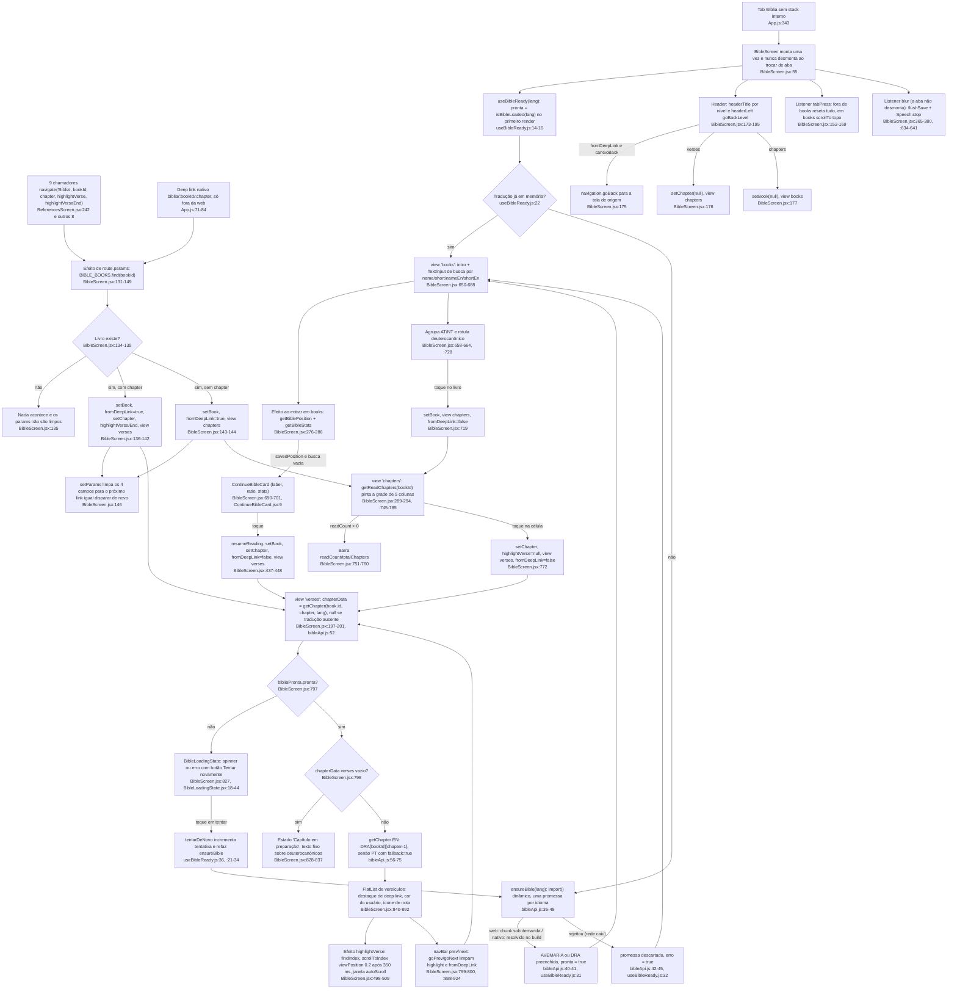
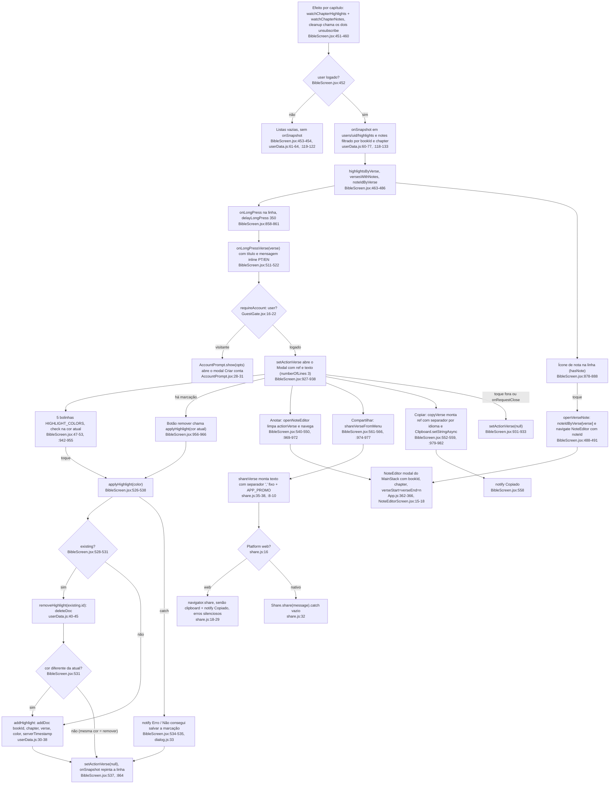

# 06. Fluxograma F6: Bíblia

Data: 2026-09-23. Base: commit `d54a5f2` (working tree com `src/` intocado). Levantamento somente leitura, feito por um subagente do Pathfinder. Todo nó dos diagramas traz `arquivo:linha` conferido no código atual. Sem opinião nem proposta: só o que existe.

## Escopo

- Tela: `src/screens/BibleScreen.jsx` (1093 linhas, lida inteira). Três views num único componente sem stack próprio: livros (`:650-742`), capítulos (`:745-788`) e versículos (`:791-988`). Handlers em `:488-645`, `makeStyles` em `:993-1093`.
- Dados e carga: `src/services/bibleApi.js` (`ensureBible` `:35-48`, `getChapter` `:52-90`, `searchBible` `:101-135`), `src/hooks/useBibleReady.js`, `src/data/bible.js` (metadados dos 73 livros `:5-96`, `getBook` `:98`, `bookName` `:103`, `bookShort` `:108`).
- Componentes: `src/components/BibleLoadingState.jsx`, `ContinueBibleCard.jsx`, `ReadingProgressBar.jsx`, `ScrollHint.jsx` + `src/hooks/useScrollHints.js`.
- Utilitários: `src/utils/bibleProgress.js` (posição e capítulos lidos, AsyncStorage), `ttsVoice.js` (voz e velocidade, AsyncStorage), `verseRange.js` (`verseEndFromRef`), `share.js` (`shareVerse`), `dialog.js` (`notify`).
- Dados do usuário: `src/services/userData.js` (`addHighlight` `:30`, `removeHighlight` `:40`, `watchChapterHighlights` `:60`, `watchChapterNotes` `:118`).
- Registro: `App.js:343` (`<Tab.Screen name="Bíblia" component={BibleScreen} />`, sem stack interno), deep link nativo `biblia/:bookId/:chapter` (`App.js:84`, `LINKING` só fora da web `App.js:71`), `NoteEditor` como modal do `MainStack` (`App.js:362-366`).
- Não abertos: `src/data/bibleAveMaria.js` e `bibleDouayRheims.js` (4 MB cada).

Chamadores de `navigate('Bíblia', …)` (9 arquivos, 10 chamadas):

| Arquivo:linha | Passa `highlightVerseEnd`? | Origem do intervalo |
|---|---|---|
| `src/screens/ReferencesScreen.jsx:242-247` | sim (`nav.verseEnd`) | `bibleNav` da referência |
| `src/screens/RefDetailScreen.jsx:43-48` | sim (`nav.verseEnd`) | `bibleNavEn` ou `bibleNav` (`:41`) |
| `src/screens/LiturgyScreen.jsx:260-262` | sim (`nav.verseEnd`) | `parseReadingRef` usa `verseEndFromRef` (`:47`) |
| `src/screens/RosaryScreen.jsx:157` | sim | `verseEndFromRef(ref)` inline |
| `src/screens/BibleMapScreen.jsx:32-37` | sim | `verseEndFromRef(ref)` inline |
| `src/screens/SearchScreen.jsx:149` e `:171` | não | resultado de busca |
| `src/screens/TodayScreen.jsx:45` | não | versículo do dia |
| `src/screens/HighlightsScreen.jsx:40-44` | não | marcação salva |
| `src/screens/NotebookPageScreen.jsx:116` | não | token `@` do caderno |

## Fluxograma 1: carga, livros, capítulos, versículos e chegada por params

## Fluxograma 2: menu do versículo (long-press)

## Fluxograma 3: TTS por capítulo e progresso de leitura

```mermaid
flowchart TD
  subgraph TTS ["Narração do capítulo"]
    D0["Botão volume/stop no verseHeader<br/>BibleScreen.jsx:806-820"] --> D1["toggleChapterTts: Speech.isSpeakingAsync<br/>BibleScreen.jsx:570-571"]
    D1 -->|"tocando ou speaking"| D1s["speakingRef=false, Speech.stop, setSpeaking(false)<br/>BibleScreen.jsx:572-577"]
    D1 -->|"parado e há versículos"| D2["resolveVoice(textLang) + getSavedRate em paralelo<br/>BibleScreen.jsx:581-582, ttsVoice.js:220-228, :203-211"]
    D2 --> D2a["AsyncStorage settings:ttsVoice / settings:ttsVoiceEn / settings:ttsRate<br/>ttsVoice.js:5-7, :188-194"]
    D2 --> D3["fullText = 'Livro cap. ' + 'n. texto' de cada versículo<br/>BibleScreen.jsx:584-586"]
    D3 --> D3q{"fullText até 4000 chars?<br/>BibleScreen.jsx:608"}
    D3q -->|"sim"| D3a["Speech.speak único com onDone<br/>BibleScreen.jsx:609-612"]
    D3q -->|"não (limite Android)"| D3b["Fila intro + um versículo por utterance, speakNext encadeado por onDone, speakingRef como freio<br/>BibleScreen.jsx:613-626"]
    D3a --> D4e
    D3b --> D4e
    D4e["onError: reseta e notify 'Erro na narração' apontando Ajustes / Voz<br/>BibleScreen.jsx:588-597"]
    D3a --> D4s["onStopped / onDone: speakingRef=false, setSpeaking(false)<br/>BibleScreen.jsx:598, :611, :619-621"]
    D3b --> D4s
    D5["Três efeitos param a fala: unmount, blur da aba, troca de chapter ou book<br/>BibleScreen.jsx:631-633, :634-641, :642-645"] --> D1s
  end

  subgraph PROG ["Progresso: posição e capítulos lidos"]
    E0["onVerseScroll: ratio = offset / (content - layout), clamp 0..1<br/>BibleScreen.jsx:397-409"] --> E0q{"scroll nosso? janela autoScroll e alvo a menos de 8 px<br/>BibleScreen.jsx:415-419"}
    E0q -->|"não e offset > 0"| E0u["userScrolled = true (consulta vira leitura)<br/>BibleScreen.jsx:419"]
    E3["onScrollBeginDrag / onTouchMove: marcarLeitura cancela restauração e marca userScrolled<br/>BibleScreen.jsx:392-395, :848-849"] --> E0u
    E0 --> E0p["setProgresso chave + ratio alimenta ReadingProgressBar<br/>BibleScreen.jsx:409, :824, ReadingProgressBar.jsx:5"]
    E0 --> E1q{"!fromDeepLink ou userScrolled?<br/>BibleScreen.jsx:421"}
    E1q -->|"sim"| E1["queueSave: debounce 500 ms<br/>BibleScreen.jsx:209-217"]
    E1 --> E1w["saveBiblePosition grava bible:position com bookId, chapter, ratio, lang, at<br/>bibleProgress.js:47-55"]
    E2["flushSave grava na hora: troca de capítulo, blur, AppState != active, pagehide na web, unmount<br/>BibleScreen.jsx:221-227, :300, :366-374, :382"] --> E1w

    E4["Timer de permanência MARK_DWELL_MS 2500 por capítulo<br/>BibleScreen.jsx:45, :337-342"] --> E5
    E0p --> E5{"Marcar lido? chave igual, ratio >= 0.9, passou tempo, não é deep link sem arrasto, markedKey inédito<br/>BibleScreen.jsx:346-358, bibleProgress.js:39"}
    E5 -->|"sim"| E5w["markChapterRead: lê e saneia bible:read, insere ordenado, regrava<br/>bibleProgress.js:77-84, :92-101, :24-35"]
    E5w --> E5s["setReadChapters repinta a grade e o contador<br/>BibleScreen.jsx:360, :768"]

    E6["Efeito de troca de capítulo: flushSave, zera progresso, markedKey, userScrolled, autoScroll<br/>BibleScreen.jsx:299-304"] --> E6q{"shouldRestore: mesmo livro e capítulo, ratio > 0.01, sem highlightVerse, mesmo lang<br/>BibleScreen.jsx:305-310"}
    E6q -->|"não"| E6z["scrollToOffset 0 (se não há highlightVerse)<br/>BibleScreen.jsx:320-326"]
    E6q -->|"sim"| E6p["pendingRestore com janela RESTORE_WINDOW_MS 1500 + timers 150/400/900/1600 ms<br/>BibleScreen.jsx:34, :313-315, :331-333"]
    E6p --> E7["tryRestore: mede (web: measureFromNode lê clientHeight), scrollToOffset ratio x scrollable, consome a pendência<br/>BibleScreen.jsx:239-273"]
    E7a["onVerseLayout e onVerseContentSize também chamam tryRestore<br/>BibleScreen.jsx:424-434"] --> E7
    E7 -->|"scrollable de até 4 px"| E7s["Capítulo curto: ratio = 1 direto<br/>BibleScreen.jsx:272"]
    E7s --> E5

    E8["Volta a books: getBiblePosition + getBibleStats para o card Continue lendo<br/>BibleScreen.jsx:276-286, bibleProgress.js:57-68, :117-125"]
    E1w --> E8
    E5w --> E8
  end
```

## Efeitos colaterais

| Efeito | Onde | Detalhe |
|---|---|---|
| `import()` dinâmico | `bibleApi.js:40-41` | Um chunk por idioma na web (`bibleDouayRheims` ou `bibleAveMaria`). No nativo o import é resolvido no build (`:15-16`). A promessa fica em `carregando[lang]` (`:22`) e é apagada no catch (`:43`) para permitir retry. |
| AsyncStorage `bible:position` | `bibleProgress.js:13, :47-68` | Escrito por `saveBiblePosition` via `queueSave` (debounce 500 ms, `BibleScreen.jsx:209-217`) e `flushSave` (`:221-227`). Lido em `getBiblePosition` ao voltar para books (`:280`). Posição sem `lang` é tratada como de versão antiga (`:310`). Removido em `deleteAccount` (`AuthContext.jsx:171`). |
| AsyncStorage `bible:read` | `bibleProgress.js:14, :77-101` | `markChapterRead` regrava o mapa inteiro `{ bookId: [caps] }`. Toda leitura passa por `sanearMapaLido` (`:24-35`): descarta livro desconhecido, capítulo fora de faixa, duplicata e formato corrompido. |
| AsyncStorage `settings:ttsVoice`, `settings:ttsVoiceEn`, `settings:ttsRate` | `ttsVoice.js:5-7` | Só leitura a partir da Bíblia (`resolveVoice` `:220`, `getSavedRate` `:203`, default 0.95). Gravação fica em Ajustes. Não são limpos em `deleteAccount` (fato já listado em `00-features.md` item 8). |
| Firestore `users/{uid}/highlights` | `userData.js:30-45, :60-77` | `addDoc` com `serverTimestamp`, `deleteDoc` por id, `onSnapshot` filtrado por `bookId` + `chapter`. Assinado a cada capítulo aberto, desassinado no cleanup (`BibleScreen.jsx:459`). |
| Firestore `users/{uid}/notes` | `userData.js:118-133` | Só leitura na Bíblia (`watchChapterNotes`). Escrita fica no `NoteEditorScreen` (via `addNote`/`updateNote`, `NoteEditorScreen.jsx:8`, que também lê `getDoc` direto `:5-6, :33-47`). |
| `expo-speech` | `BibleScreen.jsx:5, :571-626` | `isSpeakingAsync`, `speak`, `stop`. Quatro pontos de `stop` (`:574, :632, :637, :643`). Na web usa `speechSynthesis` (vozes listadas com retry em `ttsVoice.js:115-155`). |
| `expo-clipboard` | `BibleScreen.jsx:4, :556` | `Clipboard.setStringAsync` no copiar. O compartilhar na web sem Web Share usa `navigator.clipboard` (`share.js:22-24`), outro caminho para o mesmo efeito. |
| `Share` / `navigator.share` | `share.js:15-33` | Falhas silenciosas (`catch` vazio `:27-29`, `:32`). |
| Navegação | `BibleScreen.jsx:146, :153, :179, :366, :490, :544, :635` | `setParams` (limpa params), `addListener('tabPress')`, `setOptions` (header a cada mudança de view/book/chapter/idioma), `addListener('blur')` duas vezes (progresso e TTS), `navigate('NoteEditor')`. |
| `AppState` e `window.pagehide` | `BibleScreen.jsx:367-374` | `flushSave` ao ir para background e ao fechar a aba no Safari (web). |
| `Alert` / `window.alert` | `dialog.js:33-39` | `notify` no erro de marcação (`:535`), no copiar (`:558`) e no erro de TTS (`:591`). |

## Ramos e estados de erro

1. **Chunk falhou** (web, rede caiu no meio): `ensureBible` rejeita e apaga a promessa (`bibleApi.js:42-45`), `useBibleReady` vira `erro=true` (`:32`). A view de versículos mostra `BibleLoadingState` com `cloud-offline-outline` e botão `common.tryAgain` (`BibleLoadingState.jsx:18-35`), que incrementa `tentativa` (`useBibleReady.js:36`) e refaz o efeito. A lista de livros e a grade de capítulos **não** dependem da tradução (metadados de `bible.js`), então continuam navegáveis.
2. **Visitante no long-press**: `useRequireAccount` (`GuestGate.jsx:16-22`) não executa o callback e chama `show(opts)` do `AccountPromptProvider` (`AccountPrompt.jsx:28-31`) com título/mensagem/ícone inline de `BibleScreen.jsx:515-519`. `watchChapter*` já devolvem `[]` sem `onSnapshot` para visitante (`userData.js:61-64, :119-122`), e o efeito nem os chama sem `user` (`BibleScreen.jsx:452`). Copiar, compartilhar e TTS não passam pelo gate.
3. **Capítulo ausente** (`isEmpty`, `BibleScreen.jsx:798`): `getChapter` devolve `null` quando `bookData[chapter-1]` não existe (`bibleApi.js:60, :81-82`). A mensagem é fixa: "Este capítulo dos livros deuterocanônicos ainda não foi adicionado" (`:833-835`), mesmo se a causa for outra (ex.: `chapter` fora de faixa vindo de deep link, já que o efeito de params não valida contra `totalChapters`, `:138-139`). Não foi possível confirmar quais capítulos faltam sem abrir os dados de 4 MB.
4. **EN sem o livro/capítulo**: `getChapter('en')` cai para PT com `fallback: true` (`bibleApi.js:69-74`) só se `AVEMARIA` já estiver carregado. Ninguém lê a flag `fallback` (grep: única ocorrência é a própria origem `bibleApi.js:73`), então a tela não sinaliza que está mostrando português. Se PT não estiver em memória, devolve `null` e a tela cai no ramo 3 com a mensagem sobre deuterocanônicos.
5. **TTS erro**: `onError` (`BibleScreen.jsx:588-597`) reseta estado e mostra `notify` mandando para "Ajustes / Voz". Na fila de versículos, `speakingRef=false` interrompe o encadeamento na próxima chamada de `speakNext` (`:618`). Sem voz encontrada (`resolveVoice` devolve `null`, `ttsVoice.js:227`), `speak` recebe `voice: undefined` e `language` default `pt-BR`/`en-US` (`:583, :600-601`).
6. **Deep link com livro inexistente**: `BIBLE_BOOKS.find` falha, nada muda de view e os params ficam sujos (`:134-135`, `setParams` só roda dentro do `if (b)`, `:146`).
7. **highlightVerse não encontrado no capítulo**: `findIndex < 0`, sem scroll (`:500-501`). A linha destacada segue a regra `item.n >= highlightVerse && item.n <= (highlightVerseEnd || highlightVerse)` (`:854`), então um intervalo que passa do fim do capítulo destaca até o último versículo existente. `onScrollToIndexFailed` é no-op (`:846`).
8. **Posição salva de livro removido**: `getBiblePosition` devolve `null` (`bibleProgress.js:63`), o card some (`BibleScreen.jsx:690-692`).
9. **Posição salva em outro idioma**: `shouldRestore` exige `pos.lang === lang` ou `lang` ausente (`:310`). Sem restauração o capítulo abre no topo (`:324`), mas o card "Continue lendo" ainda mostra a porcentagem do outro idioma (`:696`).
10. **Marcação de lido é irreversível pela UI**: comentário em `:44` ("Não existe forma de desmarcar"). `unmarkChapterRead` (`bibleProgress.js:103`), `clearBiblePosition` (`:70`) e `resetBibleProgress` (`:127`) existem sem chamador (grep em `src/` e `App.js`), assim como as strings `bible.markUnread`, `bible.resetProgress*` (`strings.js:174-178, :412-416`).

## Dependências externas (file:line)

- `react-native`: `FlatList`, `ScrollView`, `TextInput`, `Modal`, `Platform`, `AppState` (`BibleScreen.jsx:2`), `Share` (`share.js:1`), `Alert` (`dialog.js:1`).
- `expo-speech` (`BibleScreen.jsx:5`, `ttsVoice.js:3`), `expo-clipboard` (`BibleScreen.jsx:4`), `@expo/vector-icons` Ionicons (`BibleScreen.jsx:6`, `BibleLoadingState.jsx:2`, `ContinueBibleCard.jsx:2`).
- `@react-native-async-storage/async-storage` (`bibleProgress.js:1`, `ttsVoice.js:2`).
- `firebase/firestore` (`userData.js:1-5`, e direto em `NoteEditorScreen.jsx:5-6`).
- `@react-navigation` via props `route`/`navigation` (`BibleScreen.jsx:55`): `setParams :146`, `addListener('tabPress') :153`, `isFocused :154`, `setOptions :179`, `canGoBack/goBack :175`, `addListener('blur') :366, :635`, `navigate :490, :544`. Registro `App.js:343`, linking `App.js:71-84`.
- Contextos internos: `useTheme` (`:10`), `useAuth` (`:11`), `useLanguage` (`:12`), `useRequireAccount` (`:13`) e `useAccountPrompt` (`GuestGate.jsx:2`).
- `window` (web): `pagehide` (`BibleScreen.jsx:373-374`), `getScrollableNode().clientHeight/scrollHeight` (`:240-243`), `navigator.share/clipboard` (`share.js:18-22`), `window.alert` (`dialog.js:35`), `outlineStyle` no input (`BibleScreen.jsx:1007`).

## Duplicações observadas (fatos, sem solução)

1. **ContinueBibleCard vs ContinueReadingCard**: mesma estrutura visual (linha com `iconBox` play, label maiúsculo, título, chevron) e estilos quase idênticos (`ContinueBibleCard.jsx:46-60` vs `ContinueReadingCard.jsx:49-57`). Diferenças: o card da Bíblia recebe dados prontos por props e tem barra + stats (`:28-37`), o de artigos carrega `getLastRead` por conta própria (`ContinueReadingCard.jsx:15-28`).
2. **Título do capítulo duas vezes na tela**: `headerTitle` do navigator recebe `${bn(book)} ${chapter}` (`BibleScreen.jsx:180`) e o conteúdo repete o mesmo texto em `verseHeaderTitle` (`:805`). Idem para o livro: header `:181` e `bookHeader` `:750`.
3. **Três barras de progresso**: `ReadingProgressBar` (`:824`, componente compartilhado com `ArticleDetailScreen.jsx:246`), a barra da grade de capítulos com estilos próprios `bookProgressTrack/Fill` (`:752-759`, `:1039-1040`) e o `track/fill` dentro do `ContinueBibleCard` (`:28-30`, `:61-65`). Todas são `View` de altura 3-4 px com `width: pct%` e cor `accent`.
4. **TTS por capítulo vs por artigo**: `toggleChapterTts` (`BibleScreen.jsx:570-627`) e `onToggleSpeak` (`ArticleDetailScreen.jsx:96-125`) repetem `isSpeakingAsync` + `stop`, `Promise.all([resolveVoice, getSavedRate])`, `defaultLang` `en-US`/`pt-BR`, o objeto de opções (`language`, `voice`, `rate`, `pitch: 1.0`) e os três efeitos de parada (unmount `:631-633` vs `ArticleDetailScreen.jsx:72`, blur `:634-641` vs `:76-82`). Só a Bíblia tem o corte em 4000 chars com fila e o `speakingRef`; só o artigo tem `stripMarkdownForTts`. `SettingsScreen.jsx:97-110` tem um terceiro `Speech.speak` de prévia.
5. **TextInput de busca de livros vs outras buscas**: bloco `searchRow` + ícone `search-outline` + `TextInput` com `searchFocused` (`BibleScreen.jsx:677-688`, estilos `:1000-1007`) repete-se em `GlossaryScreen.jsx:59` (`searchRow :112`), `DebateStrategiesScreen.jsx:52` (`:132`) e `SearchScreen.jsx:257` (`:350`). O filtro de livros é substring em 4 campos (`:651-656`), sem o `norm()` de acentos que `searchBible` usa (`bibleApi.js:93-95`).
6. **Contrato de params de 'Bíblia' repetido em 9 chamadores**: cada um monta `{ bookId, chapter, highlightVerse, highlightVerseEnd? }` à mão (tabela no Escopo). Cinco passam `highlightVerseEnd`, quatro não. `verseEndFromRef` é chamado inline em `RosaryScreen.jsx:157` e `BibleMapScreen.jsx:36`, e dentro de `parseReadingRef` em `LiturgyScreen.jsx:47`. A tela lê os quatro campos em `BibleScreen.jsx:133-141` e limpa os quatro em `:146`. O deep link nativo só cobre `bookId`/`chapter` (`App.js:84`).
7. **Estilos mortos**: `backRow` e `backText` em `BibleScreen.jsx:1023-1024` não são referenciados na tela (grep: as únicas referências a esses nomes estão em `ReferencePickerModal.jsx:204-206, :262-263` e `DialogueScreen.jsx:140, :266`, com estilos próprios). Sobra do botão de voltar que migrou para o header (`:171-172`).
8. **Separador de referência por idioma** (`isEn ? ':' : ','`): `BibleScreen.jsx:554` e `:936`, `bibleApi.js:107`, `HighlightsScreen.jsx:124`, `NotesScreen.jsx:34`, `NoteEditorScreen.jsx:54`, `ReferencePickerModal.jsx:95`. `shareVerse` usa `,` fixo (`share.js:36`), então o versículo compartilhado em EN sai como `Matthew 16,18` enquanto o copiado sai `Matthew 16:18`.
9. **Mensagens do gate de conta inline**: `BibleScreen.jsx:515-519` repete o padrão de `ToolsScreen.jsx:78` e `ArticleDetailScreen.jsx:201` (já listado em `00-features.md`).
10. **Dois listeners de blur e dois efeitos de cleanup** no mesmo componente: progresso (`:365-380`, `:382`) e TTS (`:631-633`, `:634-641`), cada um com seu `navigation.addListener('blur')`.
11. **Bilíngue inline vs `t()`** na mesma tela: intro (`:669-674`), placeholder (`:681`), grupos AT/NT (`:660-661`), "capítulos"/"deuterocanônico" (`:727-728`), labels de acessibilidade e mensagens de erro usam `isEn ? … : …`, enquanto `bible.markColor`, `bible.annotate`, `bible.copy`, `bible.chaptersRead` etc. vivem em `strings.js:163-178`.
12. **`t` sombreado**: dentro do efeito de permanência `const t = setTimeout(...)` (`:340`) esconde o `t` de `useLanguage` (`:58`). Inofensivo no trecho, mas é o único lugar da tela em que `t` não é a função de tradução.
13. **Tabela de livros paralela**: `EN_BOOK_ID` em `LiturgyScreen.jsx:14-41` mapeia nome EN para `bookId` ao lado de `nameEn` em `bible.js:5-96` (fato já em `00-features.md` item 7, relevante aqui por ser entrada da Bíblia).
14. **Regra de "meu scroll vs do usuário" em três gatilhos** (`:388-395`, `:415-419`, `:848-849`) e restauração por quatro caminhos (`onLayout`, `onContentSizeChange`, timers, `measureFromNode`): tudo dentro da tela, sem hook próprio, com sete `useRef` de coordenação (`:102-123`).

## Confiança e lacunas

- **Alta**: `BibleScreen.jsx` (lido inteiro, 1093 linhas), `bibleApi.js`, `useBibleReady.js`, `bibleProgress.js`, `ttsVoice.js`, `verseRange.js`, `BibleLoadingState.jsx`, `ContinueBibleCard.jsx`, `ContinueReadingCard.jsx`, `ReadingProgressBar.jsx`, `useScrollHints.js`, `GuestGate.jsx`, `share.js`, `dialog.js`, trechos de `userData.js` e de `App.js`.
- **Média**: `AccountPrompt.jsx` (lido até `:60`, o corpo do modal e o `exitGuest` não foram acompanhados), `ArticleDetailScreen.jsx` (`:60-140` para a comparação de TTS), `NoteEditorScreen.jsx` (`:1-70`), os 9 chamadores (só o trecho do `navigate`).
- **Não verificado**: quais capítulos deuterocanônicos faltam de fato nos dados (arquivos de 4 MB não abertos). Comportamento em runtime (scroll, restauração, TTS na web) não foi executado. Os diagramas Mermaid não foram renderizados nesta sessão (sem renderizador disponível), a sintaxe foi conferida à mão.
- Contagem de nós (definições com rótulo): fluxograma 1 = 40, fluxograma 2 = 31, fluxograma 3 = 33, total 104.

## Fontes consultadas

`src/screens/BibleScreen.jsx`, `src/services/bibleApi.js`, `src/hooks/useBibleReady.js`, `src/components/BibleLoadingState.jsx`, `src/components/ContinueBibleCard.jsx`, `src/components/ContinueReadingCard.jsx`, `src/components/ReadingProgressBar.jsx`, `src/components/GuestGate.jsx`, `src/components/AccountPrompt.jsx` (parcial), `src/hooks/useScrollHints.js`, `src/utils/bibleProgress.js`, `src/utils/ttsVoice.js`, `src/utils/verseRange.js`, `src/utils/share.js`, `src/utils/dialog.js`, `src/services/userData.js` (`:1-78`, `:118-136`), `src/data/bible.js` (`:1-60`, `:95-111`), `src/i18n/strings.js` (chaves `bible.*`, grep), `src/context/AuthContext.jsx` (`:160-175`), `App.js` (`:70-100`, `:280-370`), `src/screens/ArticleDetailScreen.jsx` (`:60-140`), `src/screens/NoteEditorScreen.jsx` (`:1-70`), `src/screens/HighlightsScreen.jsx` (`:36-50`, `:100-135`), `src/screens/SearchScreen.jsx` (`:105-125`, `:145-175`), `src/screens/ReferencesScreen.jsx` (`:236-252`), `src/screens/RefDetailScreen.jsx` (`:38-52`), `src/screens/LiturgyScreen.jsx` (`:12-16`, `:255-270`), `src/screens/RosaryScreen.jsx` (`:150-160`), `src/screens/BibleMapScreen.jsx` (`:28-40`), `src/screens/TodayScreen.jsx` (`:40-50`), `src/screens/NotebookPageScreen.jsx` (`:108-120`), `src/components/ReferencePickerModal.jsx` (`:85-100`), `docs/design/PATHFINDER-2026-09-23/00-features.md`. Greps: `navigate('Bíblia'`, `verseEndFromRef`, `Speech.`, `useBibleReady|ensureBible|searchBible|getChapter(`, `bible:position|bible:read`, `unmarkChapterRead|resetBibleProgress|clearBiblePosition|isBibleLoaded`, `backRow|backText`, `.fallback`, `isEn ? ':' : ','`, `searchRow:`, `useRequireAccount()`, `ReadingProgressBar`, `onScrollToIndexFailed`.
