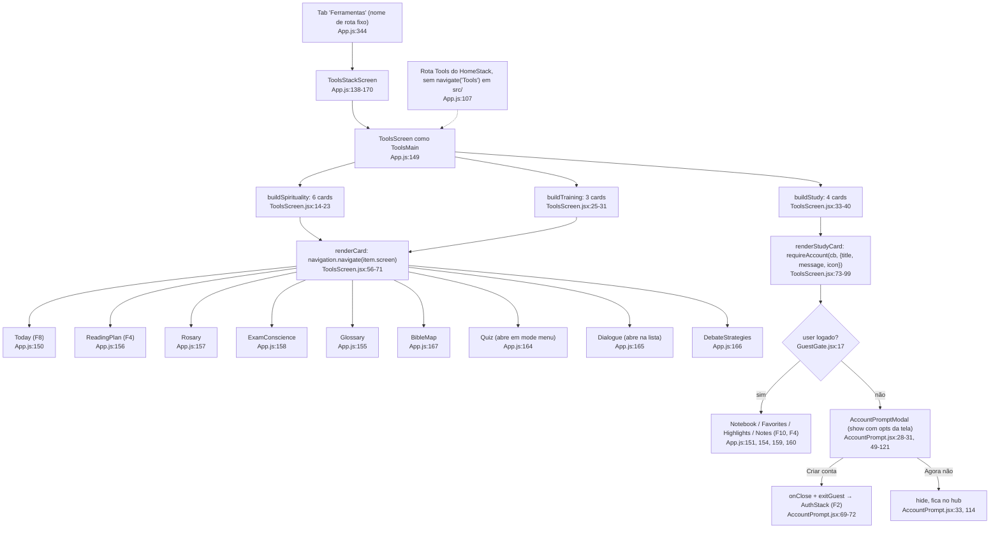
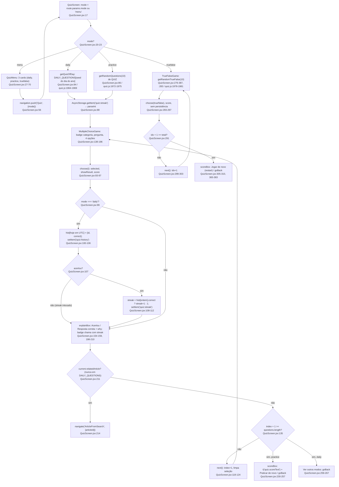
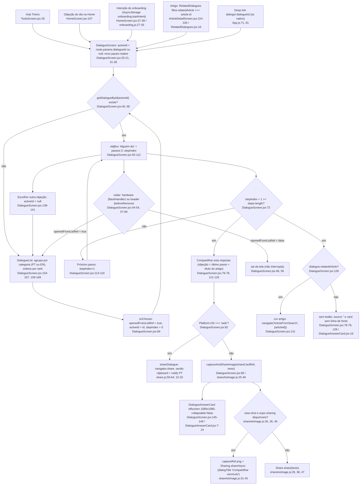
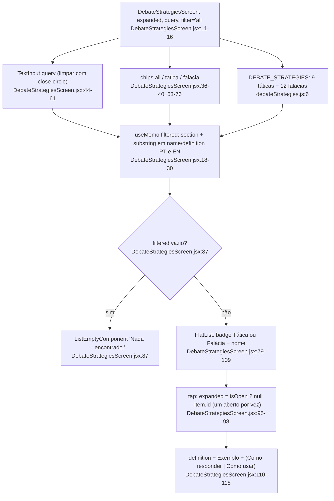
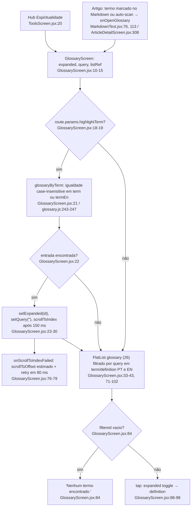
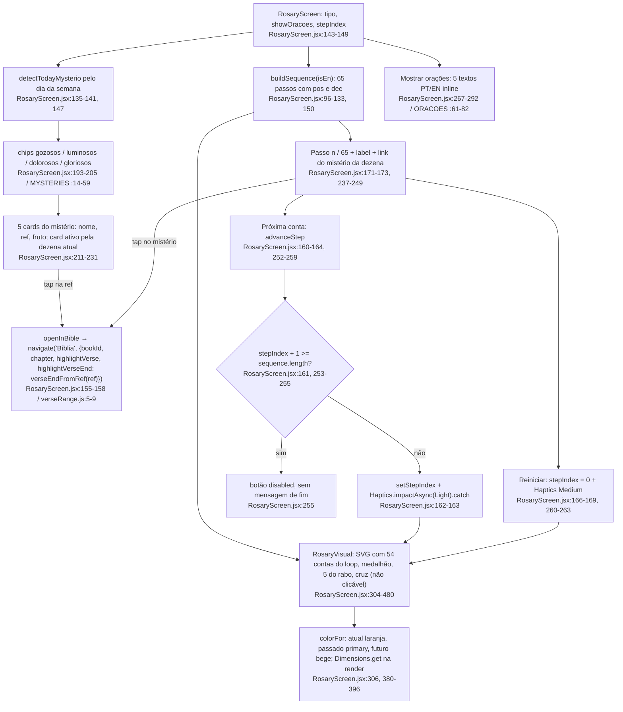
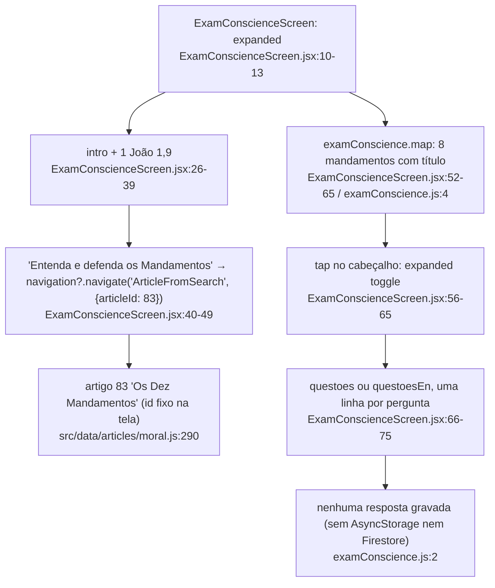
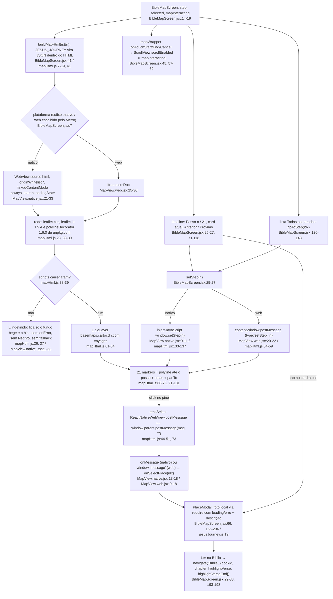

# 07. Ferramentas (hub, treino, espiritualidade)

Data: 2026-09-23. Base: commit `f6a5858` (branch `claude/funny-cray-ret9a0`, `src/` intocado). Mapa feito por um subagente somente leitura. Toda linha citada foi conferida no código atual.

## Escopo

Feature F7 do inventário (`00-features.md`): o hub `ToolsScreen` e as sete ferramentas que ele abre e que não pertencem a outra feature.

| Tela | Arquivo | Registros em `App.js` |
|---|---|---|
| Hub | `src/screens/ToolsScreen.jsx` | `ToolsMain` `:149` (raiz do ToolsStack) e `Tools` `:107` (HomeStack, sem chamador em `src/`) |
| Quiz | `src/screens/QuizScreen.jsx` | `:127` (Home), `:164` (Tools) |
| Diálogo | `src/screens/DialogueScreen.jsx` + `src/components/DialogueAnswerCard.jsx` | `:128` (Home), `:165` (Tools), `:200` (Settings), `:234-238` (Articles) |
| Debate | `src/screens/DebateStrategiesScreen.jsx` | `:129`, `:166` |
| Glossário | `src/screens/GlossaryScreen.jsx` | `:117`, `:155`, `:187`, `:239-243` |
| Rosário | `src/screens/RosaryScreen.jsx` | `:119`, `:157`, `:189` |
| Exame | `src/screens/ExamConscienceScreen.jsx` | `:120`, `:158`, `:190` |
| Mapa | `src/screens/BibleMapScreen.jsx` + `src/screens/bibleMap/{MapView.native.jsx, MapView.web.jsx, mapHtml.js}` | `:130`, `:167` |

Dados (só por estrutura, corpos não lidos): `quiz.js` (`QUIZ` `:6` 100 perguntas, 54 com `relatedArticle`; `TRUE_FALSE` `:1753` 100; `DAILY_QUESTIONS` `:1860`, nenhuma com `relatedArticle`), `dialogues.js` (`DIALOGUES` `:6` 53, todas com `relatedArticle`, 20 com `rank`; `getDialogueById` `:698-700`; `getDialoguesByCategory` `:702-704`), `debateStrategies.js` (`:6`, 9 `tatica` + 12 `falacia` = 21; `getStrategyById` `:212`), `glossary.js` (`:5` 26 termos; `glossaryById` `:242`; `glossaryByTerm` `:243-247`), `examConscience.js` (`:4` 8 seções; "Nao armazena respostas" `:2`), `jesusJourney.js` (`:8` 21 paradas, todas com `photo: require(...)` local e `nav`). Os mistérios do Rosário e as orações não estão em `src/data/`: vivem dentro da tela (`RosaryScreen.jsx:14-59` e `:61-82`).

Fora do escopo, só citados como destino: `Today`, `ReadingPlan` (F8/F4), `Notebook`/`Favorites`/`Highlights`/`Notes` (F10/F4), `ArticleFromSearch` (F4), `Bíblia` (F6), `AccountPrompt`/`GuestGate` (F2), `share.js`/`shareAsImage(.web).js` (F12).

## Fluxogramas

### 1. Hub: tab Ferramentas até cada ferramenta, com gate de conta

Espiritualidade (6 cards) e Treino (3 cards) navegam direto (`ToolsScreen.jsx:60`). Meu Estudo (4 cards) passa por `requireAccount` (`:78-87`) e mostra cadeado quando `!user` (`:94-96`). Todos os destinos existem no ToolsStack (`App.js:150-167`), então a tab bar segue visível.

### 2. Quiz: menu, pergunta diária com streak, praticar, verdadeiro ou falso

Uma única rota `Quiz` com `route.params.mode` (`QuizScreen.jsx:17`). O menu faz `navigation.push('Quiz', { mode })` (`:56`), então cada modo é uma nova entrada na pilha e "Outros modos" é `goBack` (`:251`, `:262`, `:377`). Só o modo `daily` grava algo.

### 3. Diálogo: lista de objeções, conversa guiada em 4 passos, compartilhar como imagem

A mesma tela é lista e conversa: `activeId` nulo mostra `DialogueList` (`DialogueScreen.jsx:68-70`). Cinco entradas diferentes chegam aqui. `openedFromListRef` (`:26`) decide o que o "voltar" faz.

### 4. Debate: busca + filtro por chip + card expansível

### 5. Glossário: lista com busca e destaque por `highlightTerm`

### 6. Rosário: mistério do dia, sequência de 65 contas, SVG, haptics, "Ler na Bíblia"

`buildSequence` (`RosaryScreen.jsx:96-133`) gera 65 passos: 2 na cruz, 5 no rabo, medalhão, 5 dezenas de 11 (Pai-Nosso + 10 Aves, slots 1..54), Glória final, Salve Rainha, cruz. Nada é persistido: fechar a tela zera `stepIndex`.

### 7. Exame de consciência: 8 seções expansíveis e um link fixo ao artigo 83

### 8. Mapa "Nos Passos de Jesus": WebView/iframe, rede e mensagens

`MapView` é escolhido pelo Metro pelo sufixo (`BibleMapScreen.jsx:7` importa `./bibleMap/MapView`). Os dois renderizadores recebem o mesmo HTML de `buildMapHtml` (`mapHtml.js:7-142`) e trocam mensagens em direções opostas: passo desce para o mapa, clique no pino sobe para a tela.

## Efeitos colaterais

| Tipo | Onde | Detalhe |
|---|---|---|
| AsyncStorage (leitura) | `QuizScreen.jsx:88` | `quiz:streak` como string, `parseInt(v) || 0`, só nos modos `daily` e `practice` |
| AsyncStorage (escrita) | `QuizScreen.jsx:103-106` | `quiz:history` = `{ 'AAAA-MM-DD': { id, correct } }`; a data é `toISOString().slice(0,10)`, isto é, UTC |
| AsyncStorage (escrita) | `QuizScreen.jsx:108-112` | `quiz:streak` só quando acertou; "ontem" também em UTC (`Date.now() - 86400000`) |
| AsyncStorage (leitura indireta) | `HomeScreen.jsx:37-38` | `consumeStartIntent` lê e apaga `onboarding:startIntent` e abre `Dialogue` (F2/F3, citado porque desemboca aqui) |
| Haptics | `RosaryScreen.jsx:163`, `:168` | `impactAsync(Light)` a cada conta, `Medium` no reiniciar, ambos com `.catch(() => {})`. Único uso de `expo-haptics` no app (grep) |
| Rede | `mapHtml.js:23`, `:38`, `:39` | `unpkg.com/leaflet@1.9.4` (css + js) e `unpkg.com/leaflet-polylinedecorator@1.6.0` |
| Rede | `mapHtml.js:62` | tiles `https://{s}.basemaps.cartocdn.com/rastertiles/voyager/...` (subdomínios a-d). É a única rede da feature; fotos das paradas são `require` local (`jesusJourney.js:19`) |
| Share (nativo) | `DialogueScreen.jsx:85` → `shareAsImage.js:31-43` | `react-native-view-shot` `captureRef` (png, tmpfile) + `expo-sharing` `shareAsync`; fallback `Share.share(texto)` em `:28`, `:38`, `:47` |
| Share (web) | `DialogueScreen.jsx:83` → `share.js:15-33` | `navigator.share`, senão `navigator.clipboard.writeText` + `notify('Copiado', ...)` em PT fixo (`:24`); acrescenta `APP_PROMO` (`:6-10`) |
| BackHandler | `DialogueScreen.jsx:44-54` | `hardwareBackPress` dentro de `useFocusEffect`; retorna `true` (consome) só se `activeId !== null && openedFromListRef.current` |
| Header back | `DialogueScreen.jsx:57-66` | `navigation.addListener('beforeRemove')` com `e.preventDefault()` na mesma condição |
| JS em WebView | `MapView.native.jsx:10` | `injectJavaScript` a cada `step`; `originWhitelist={['*']}` `:23`, `mixedContentMode="always"` `:31` |
| postMessage | `mapHtml.js:49`, `MapView.web.jsx:21` | target `'*'` nos dois sentidos; o listener web aceita qualquer origem e só filtra por `type` (`MapView.web.jsx:13`) |
| Timers | `GlossaryScreen.jsx:27-30`, `:78` | `setTimeout` 150 ms (com cleanup) e 80 ms (sem cleanup) para `scrollToIndex` |
| Navegação para fora | `RosaryScreen.jsx:157`, `BibleMapScreen.jsx:32` | `navigate('Bíblia', {...})`, sobe até o Tab (`App.js:343`) |
| Navegação para fora | `QuizScreen.jsx:214`, `DialogueScreen.jsx:131`, `ExamConscienceScreen.jsx:42` | `navigate('ArticleFromSearch', { articleId })` |
| Pilha | `QuizScreen.jsx:56` | `push('Quiz')` empilha a mesma rota; `goBack` em `:251`, `:262`, `:377` |
| Scroll | `BibleMapScreen.jsx:45`, `:57-62` | desliga o scroll da página enquanto o dedo está no mapa |

Sem efeitos: Debate, Glossário (além dos timers), Exame e Rosário (além de haptics) não gravam nada. Nenhuma tela desta feature toca Firestore, Sentry ou notificações (grep em `src/screens/{Exam,Rosary,BibleMap,DebateStrategies,Glossary,Dialogue}*`: 0 ocorrências de `AsyncStorage|firestore|userData`).

## Ramos

**Visitante em itens gated (Meu Estudo).** `renderStudyCard` (`ToolsScreen.jsx:73-99`) chama `requireAccount` com título/mensagem/ícone inline em PT e EN (`:81-85`). `GuestGate.jsx:16-22`: com `user`, executa o `navigate`; sem `user`, `show(opts)`. O modal (`AccountPrompt.jsx:49-121`) tem "Criar conta" (`exitGuest`, `:69-72`, o app cai no `AuthStack` por F2) e "Agora não" (`:114`, só fecha). Os cards de Espiritualidade e Treino não passam pelo gate: Quiz, Diálogo, Rosário etc. funcionam em modo visitante, inclusive o streak do quiz (AsyncStorage local).

**Mapa sem rede.** O HTML é inline (`source={{ html }}` `MapView.native.jsx:24`, `srcDoc` `MapView.web.jsx:28`), então a página abre, mas `<script src="https://unpkg.com/...">` (`mapHtml.js:38-39`) falha e `L.map` (`:61`) lança `ReferenceError`. Resultado: fundo `#e8dcb8` (`:26`, e o mesmo em `BibleMapScreen.jsx:236-237`) com o hint "Pinça pra zoom" (`:37`), sem pinos e sem rota. Não há `onError`/`onHttpError` no `WebView`, `NetInfo`, nem timeout (grep em `bibleMap/` e `BibleMapScreen.jsx`: só o `onError` da foto em `:188`). A timeline, a lista de paradas, o modal com foto local e o "Ler na Bíblia" continuam funcionando sem rede. Com rede parcial (scripts em cache, tiles não), Leaflet roda e os tiles ficam cinza.

**Diálogo sem `relatedArticle`.** Botão "Ler artigo" só renderiza com `dialogue.relatedArticle` (`DialogueScreen.jsx:128`). `relArticle`/`source` (`:78-79`) usam `articles.find`, então um id ausente vira `source = ''`, e o card omite a linha de fonte (`DialogueAnswerCard.jsx:16`) e o texto compartilhado omite o parêntese (`:85`). Hoje as 53 objeções têm `relatedArticle` (contagem por regex), então o ramo "não" só ocorre se um id apontar para artigo inexistente.

**Diálogo: origem determina o "voltar".** `openedFromListRef` fica `true` só em `onChoose` (`:69`); qualquer chegada por `route.params.dialogueId` zera para `false` (`:34`). Com `true`, hardware back (`:46-50`) e header back (`:59-63`) voltam à lista; com `false`, saem da tela. Chegar por `navigate` quando a tela já está montada dispara o `useEffect` de `:31-38` e troca o diálogo aberto sem passar pela lista.

**Diálogo aberto pela aba Artigos e "Ler artigo".** `ArticlesStack` registra `Dialogue` (`App.js:234-238`) mas não `ArticleFromSearch` (`:218-243`). O `navigate('ArticleFromSearch')` de `DialogueScreen.jsx:131` não é tratado pelo ArticlesStack nem pelo Tab; em `@react-navigation/core` 6.4.17 a ação passa então aos navegadores filhos montados (`node_modules/@react-navigation/core/lib/module/useOnAction.js:70-79`), ou seja, um stack irmão (Home, Tools ou Settings, o que estiver montado) trata e a aba muda. Confiança média: lido no código da lib, não executado.

**Quiz diário.** Não há guarda de "já respondido hoje": `choose` (`:99-115`) sobrescreve `hist[hoje]` e, ao acertar, soma `streak + 1` de novo (`:110`). Errar não zera nem grava o streak (`:107`); no dia seguinte, `had.correct === false` leva a `newStreak = 1`. Dia em UTC (`:100`, `:108`): entre 21h e 0h em Brasília a "pergunta do dia" já é a de amanhã. `DAILY_QUESTIONS` não tem `relatedArticle` (0 ocorrências após `quiz.js:1860`), então o botão "Ler artigo" (`:211`) nunca aparece no modo diário, só em `practice` (54 de 100 em `QUIZ`).

**Quiz sem perguntas.** `if (!current) return null` (`:129`, `:287`): tela vazia enquanto o `useEffect` (`:82-89`, `:283`) não popula. Com os bancos atuais é só o primeiro render.

**Glossário.** `highlightTerm` sem correspondência (`:22`) ou fora do índice (`:26`) cai na lista normal sem aviso. `scrollToIndex` sem layout medido dispara `onScrollToIndexFailed` (`:76-79`). A busca é reiniciada (`setQuery('')` `:24`) ao chegar por link.

**Debate e Glossário sem resultado.** `ListEmptyComponent` (`DebateStrategiesScreen.jsx:87`, `GlossaryScreen.jsx:84`).

**Rosário.** Fim da sequência desativa "Próxima conta" (`:253-255`) sem mensagem; "Reiniciar" continua ativo. `Haptics` na web ou em dispositivo sem motor rejeita e é engolido pelo `.catch` (`:163`, `:168`). Trocar o mistério (`:198`) não reinicia `stepIndex`: a dezena atual passa a apontar para o mistério do novo grupo (`:173`).

**Exame.** Único ramo: `navigation?.navigate` com optional chaining (`:42`); `articleId: 83` está fixo na tela, sem ligação com `examConscience.js`.

## Dependências externas (file:line)

| Pacote / host | Versão (`package.json`) | Uso |
|---|---|---|
| `@react-native-async-storage/async-storage` | 2.2.0 | `QuizScreen.jsx:4`, `:88`, `:103-112` |
| `expo-haptics` | ~15.0.8 | `RosaryScreen.jsx:6`, `:163`, `:168` |
| `react-native-svg` | 15.12.1 | `RosaryScreen.jsx:3`, `:400-477` (`Svg`, `Ellipse`, `Circle`, `Line`, `G`, `Defs`, `LinearGradient`, `Stop`) |
| `react-native-webview` | 13.15.0 | `MapView.native.jsx:2`, `:21-33` |
| `react-native-view-shot` | 4.0.3 | `shareAsImage.js:14`, `:31-35` (require dinâmico com try/catch) |
| `expo-sharing` | ~14.0.8 | `shareAsImage.js:20`, `:36-43` |
| `@react-navigation/native` | ^6.1.17 (core 6.4.17) | `useFocusEffect` `DialogueScreen.jsx:4`; `useNavigation` `ToolsScreen.jsx:3`, `RosaryScreen.jsx:5`; `beforeRemove` `DialogueScreen.jsx:58` |
| `@expo/vector-icons` (Ionicons) | (Expo SDK 54) | todas as telas do escopo |
| `unpkg.com` | leaflet 1.9.4, leaflet-polylinedecorator 1.6.0 | `mapHtml.js:23`, `:38`, `:39` (sem SRI, sem cópia local) |
| `basemaps.cartocdn.com` | rastertiles/voyager | `mapHtml.js:62-64` (atribuição "© OSM, © CARTO") |
| `react-native` `Share`, `BackHandler`, `Platform`, `Dimensions` | RN do SDK 54 | `shareAsImage.js:8`; `DialogueScreen.jsx:2`; `RosaryScreen.jsx:2`, `:306` |
| Web APIs | navegador | `navigator.share`/`clipboard` (`share.js:18-26`, `shareAsImage.web.js:7-13`), `window.postMessage`/`addEventListener('message')` (`MapView.web.jsx:16`, `:21`), `iframe srcDoc` (`:28`) |

Internas a outras features, consumidas aqui: `useRequireAccount` (`GuestGate.jsx:12`), `AccountPromptProvider` (`AccountPrompt.jsx:24`), `articles` (`DialogueScreen.jsx:8`), `verseEndFromRef` (`verseRange.js:5`), `shareDialogue` (`share.js:59`), `captureAndShareImage` (`shareAsImage.js:25` / `.web.js:5`), `useScrollHints` + `ScrollHint` (todas as telas menos `TrueFalseGame` e `BibleMapScreen`), `t()`/`isEn` (`LanguageContext`), `colors`/`fs` (`ThemeContext`).

## Duplicações observadas (fatos, sem solução)

1. **Hub registrado duas vezes.** `ToolsScreen` é `ToolsMain` no ToolsStack (`App.js:149`) e `Tools` no HomeStack (`App.js:107`). Não há `navigate('Tools')` em `src/` (grep por `'Tools'` e `"Tools"` só encontra os `t('header.tools')`/`t('tab.tools')`). Os 9 destinos do hub estão registrados nos dois stacks (`:108-130` e `:150-167`).
2. **Barra de busca e card expansível iguais em Debate e Glossário.** `DebateStrategiesScreen.jsx:44-61` e `GlossaryScreen.jsx:51-68` (mesmo JSX: ícone, `TextInput`, `focused`, botão limpar); estilos `searchRow`/`searchRowFocused`/`input`/`card`/`cardOpen`/`headRow`/`empty` repetidos (`:132-139`, `:148-150`, `:161` vs `:112-125`); filtro `useMemo` com o mesmo `toLowerCase().includes` em 4 campos (`:18-30` vs `:33-43`); `expanded = isOpen ? null : id` em Debate `:97`, Glossário `:90` e Exame `:57`.
3. **Cards de lista com chevron.** `ToolsScreen.jsx:56-71`, `QuizMenu` `:53-66`, `DialogueList` `:195-198`, lista de paradas `BibleMapScreen.jsx:127-146`, cards de mistério `RosaryScreen.jsx:211-231`: cinco layouts de "ícone + rótulo + subtítulo + chevron" com `StyleSheet` próprio.
4. **Dois streaks com regras diferentes.** Quiz: `quiz:streak` string + `quiz:history` JSON, dia em UTC, lógica inline na tela (`QuizScreen.jsx:11-12`, `:99-115`). Plano de leitura: `reading:streak` objeto `{count, lastDate}`, dia local (`readingProgress.js:5`, `:9-11`, `:13-34`), em `utils/`, exibido em `ReadingPlanScreen.jsx:29-30`, `:86-89`. Ambos exibem "N dias" com ícone `flame` (`QuizScreen.jsx:156`, `ReadingPlanScreen.jsx:87-89`).
5. **Persistência inline vs `utils/`.** O quiz é a única tela da feature que chama `AsyncStorage` direto; favoritos, progresso, último lido e Bíblia têm módulos em `src/utils/`. O `00-features.md` (fato 8) registra que `deleteAccount` não limpa `quiz:*`.
6. **Compartilhar como imagem: dois cards, um utilitário.** `DialogueScreen.jsx:27`, `:81-87`, `:145-149` + `DialogueAnswerCard.jsx` e `VerseOfDayCard.jsx:16`, `:29-30`, `:56-60` + `ShareVerseCard.jsx` seguem o mesmo padrão (ref, view offscreen `collapsable={false}` de 1080x1080, `Platform.OS !== 'web'`, `captureAndShareImage`). Diferenças: `DialogueScreen` decide web/nativo na tela (`:82`) enquanto `VerseOfDayCard` esconde o botão na web (`:56`); `shareAsImage.js:42` usa `dialogTitle: 'Compartilhar versículo'` também para o diálogo; `DialogueAnswerCard.jsx:11`, `:14` têm "Objeção"/"Resposta" só em PT, sem `isEn`.
7. **`openInBible` idêntico em Rosário e Mapa.** `RosaryScreen.jsx:155-158` e `BibleMapScreen.jsx:29-38` montam o mesmo objeto `{ bookId, chapter, highlightVerse, highlightVerseEnd: verseEndFromRef(ref) }` (o Mapa também fecha o modal). São 2 dos 9 chamadores de `navigate('Bíblia')` listados no `00-features.md`.
8. **"Sequência com Próximo" em quatro telas.** Estado de índice + botão avançar + condição de fim: `QuizScreen.jsx:118-124` e `:299-303`, `DialogueScreen.jsx:114-119`, `RosaryScreen.jsx:160-164`, `BibleMapScreen.jsx:25-27`. Barra ou contador "n / total": `QuizScreen.jsx:161`, `:316`, `RosaryScreen.jsx:239`, `BibleMapScreen.jsx:73-78`.
9. **Chips de filtro com dois estilos.** `DebateStrategiesScreen.jsx:63-76` (`:141-147`) e `RosaryScreen.jsx:193-205` (`:496-500`): mesmo widget, cores e raios diferentes.
10. **Caixa de introdução repetida.** `intro` com `borderLeftWidth: 3, borderLeftColor: accent` em `ExamConscienceScreen.jsx:88`, `BibleMapScreen.jsx:233`, `RosaryScreen.jsx:493`, e o mesmo traço em `objBox` (`DialogueScreen.jsx:223-226`) e `explainBox` (`QuizScreen.jsx:417-420`).
11. **Dados fora de `src/data/`.** `MYSTERIES` e `ORACOES` vivem em `RosaryScreen.jsx:14-82`, enquanto o conteúdo equivalente das outras ferramentas está em `src/data/*.js`.
12. **Helpers de dados sem consumidor de tela.** `getStrategyById` (`debateStrategies.js:212`) e `glossaryById` (`glossary.js:242`) não são importados fora de `src/data/`; `getDialoguesByCategory` (`dialogues.js:702-704`) só em `OnboardingScreen.jsx:34`.
13. **Bilíngue por dois caminhos na mesma tela.** `QuizScreen.jsx:32-44`, `:157`, `:254` usam `isEn ? :` inline e `:217`, `:225`, `:232-234` usam `t()`; idem `DialogueScreen.jsx:95` (`t`) vs `:124`, `:183-187` (inline). Já contado no `00-features.md` como transversal.
14. **`scrollEventThrottle={32}` + `useScrollHints`.** Mesmo bloco em `ToolsScreen.jsx:105-108`, `QuizScreen.jsx:142-145`, `DialogueScreen.jsx:177-180`, `DebateStrategiesScreen.jsx:83-86`, `GlossaryScreen.jsx:80-83`, `RosaryScreen.jsx:179-182`, `ExamConscienceScreen.jsx:21-24`; ausente em `TrueFalseGame` (`QuizScreen.jsx:314`) e `BibleMapScreen.jsx:45`.
15. **Rota Dialogue registrada em 4 stacks e ArticleFromSearch em 3.** `App.js:128`, `:165`, `:200`, `:234-238` vs `:125`, `:162`, `:195`. É o que produz o ramo "Diálogo aberto pela aba Artigos" acima.

## Confiança e lacunas

- **Alta**: `ToolsScreen.jsx`, `QuizScreen.jsx`, `DialogueScreen.jsx`, `DebateStrategiesScreen.jsx`, `GlossaryScreen.jsx`, `ExamConscienceScreen.jsx`, `BibleMapScreen.jsx`, os três arquivos de `bibleMap/`, `DialogueAnswerCard.jsx`, `GuestGate.jsx`, `AccountPrompt.jsx`, `shareAsImage(.web).js`, `share.js`, `verseRange.js`, trechos de `App.js` (`:55-90`, `:90-260`, `:286-345`): lidos por inteiro com número de linha.
- **Alta** para `RosaryScreen.jsx:1-13` e `:60-520` (lidos); as linhas `:14-59` (tabela `MYSTERIES`) foram lidas só por `grep` (4 grupos, 20 itens, cada um com `nav`).
- **Média** para os dados: `quiz.js`, `dialogues.js`, `debateStrategies.js`, `glossary.js`, `examConscience.js`, `jesusJourney.js` lidos por cabeçalho, exports e contagem por regex (margem de 1). O `00-features.md` fala em 20 estratégias; a contagem por `section:` deu 21 (9 + 12).
- **Média** para o bubbling do `navigate('ArticleFromSearch')` a partir do ArticlesStack: confirmado em `useOnAction.js:70-79` da lib instalada, não executado.
- **Não verificado em execução**: comportamento real do WebView/iframe sem rede (deduzido do HTML), rejeição de `Haptics` na web, e se `Sharing.isAvailableAsync` retorna falso em algum simulador. Nenhum app foi rodado; nenhum lint foi executado (não houve mudança em `src/`).
- **Fora do mapa**: `TodayScreen` e `ReadingPlanScreen` (destinos do hub, pertencem a F8/F4), consumo da notificação `objection-of-day` (`notifications.js:167` grava `dialogueId`, não achei `addNotificationResponseReceivedListener` em `App.js`/`notifications.js`; é F13).

## Fontes consultadas

`App.js` (`:55-90`, `:90-260`, `:286-345`), `src/screens/ToolsScreen.jsx`, `src/screens/QuizScreen.jsx`, `src/screens/DialogueScreen.jsx`, `src/screens/DebateStrategiesScreen.jsx`, `src/screens/GlossaryScreen.jsx`, `src/screens/RosaryScreen.jsx`, `src/screens/ExamConscienceScreen.jsx`, `src/screens/BibleMapScreen.jsx`, `src/screens/bibleMap/MapView.native.jsx`, `src/screens/bibleMap/MapView.web.jsx`, `src/screens/bibleMap/mapHtml.js`, `src/components/DialogueAnswerCard.jsx`, `src/components/GuestGate.jsx`, `src/components/AccountPrompt.jsx`, `src/components/VerseOfDayCard.jsx` (`:1-60`), `src/components/ShareVerseCard.jsx` (`:1-30`), `src/components/RelatedDialogues.jsx` (`:11-33`), `src/components/MarkdownText.jsx` (grep), `src/utils/shareAsImage.js`, `src/utils/shareAsImage.web.js`, `src/utils/share.js`, `src/utils/verseRange.js`, `src/utils/readingProgress.js` (`:1-40`, `:75-85`), `src/utils/onboarding.js`, `src/screens/HomeScreen.jsx` (`:30-45`, `:100-112`, grep), `src/screens/ArticleDetailScreen.jsx` (grep), `src/screens/ReadingPlanScreen.jsx` (grep), `src/services/notifications.js` (`:155-175`), `src/i18n/strings.js` (`:485-495`), `src/data/quiz.js`, `dialogues.js`, `debateStrategies.js`, `glossary.js`, `examConscience.js`, `jesusJourney.js` (estrutura, exports, contagens), `src/data/articles/moral.js:288-294`, `package.json`, `node_modules/@react-navigation/core/lib/module/useOnAction.js`, `docs/design/PATHFINDER-2026-09-23/00-features.md`.
