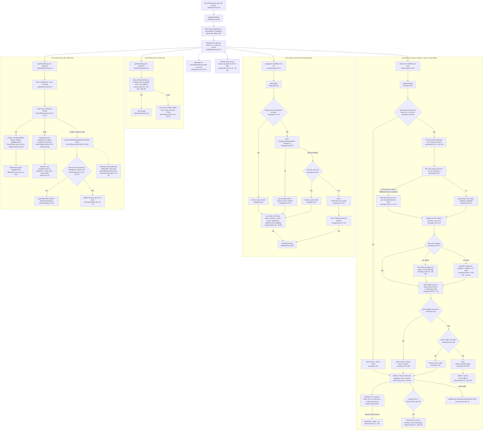
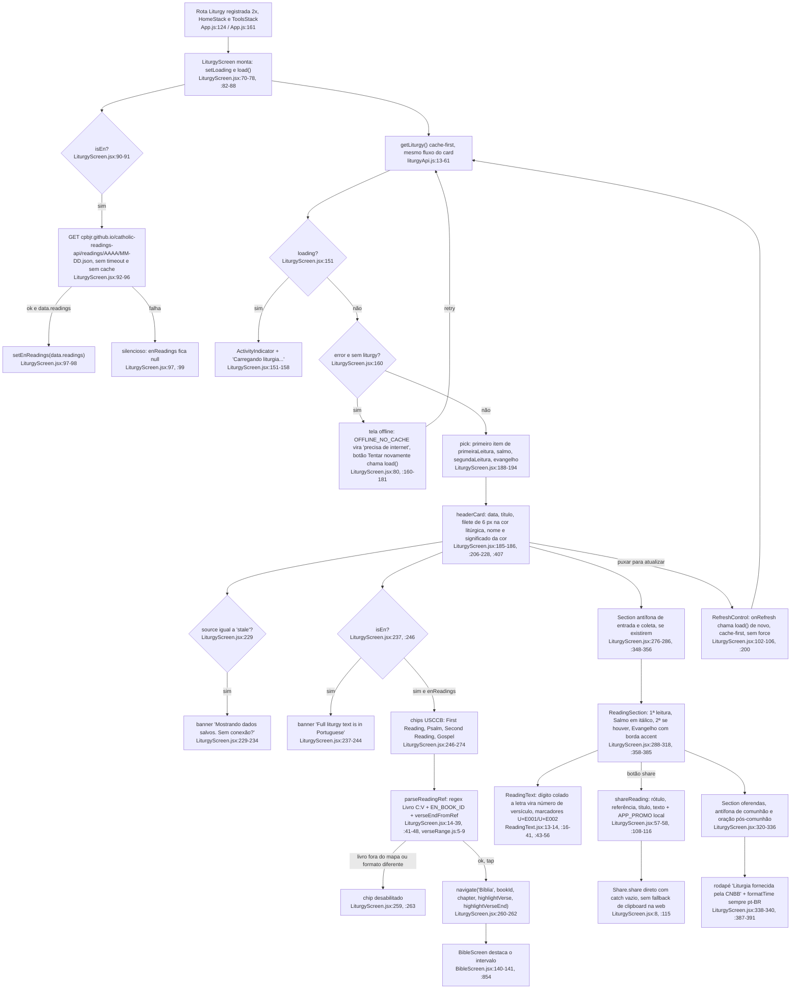

# 08. Conteúdo do dia (F8): Today, Liturgia, Notícias, Santo, Versículo

Data: 2026-09-23. Base: commit `f6a5858` (branch `claude/funny-cray-ret9a0`, `src/` intocado). Levantamento somente leitura, feito por subagente. Todo `arquivo:linha` foi conferido no código atual, não no inventário anterior. Diferença relevante em relação ao `00-features.md`: o fetch das leituras EN está em `LiturgyScreen.jsx:96` (o inventário citava `:88`).

## Escopo

| Arquivo | Linhas | Papel |
|---|---|---|
| `src/screens/TodayScreen.jsx` | 93 | Agregador: data por extenso + 4 cards em coluna (`:66-72`) |
| `src/screens/LiturgyScreen.jsx` | 450 | Liturgia completa: PT via `liturgyApi`, leituras EN por fetch direto (`:96`), share direto (`:115`) |
| `src/components/NewsCard.jsx` | 211 | Carrossel de notícias, auto-play 3 s (`:55-65`), abre no `WebBrowser` (`:69`) |
| `src/components/LiturgyCard.jsx` | 101 | Resumo da liturgia com cor litúrgica, abre a tela (`onOpen`) |
| `src/components/SaintTodayCard.jsx` | 54 | Santo do dia, 100% local |
| `src/components/VerseOfDayCard.jsx` | 132 | Versículo do dia, 100% local, Ler / Texto / Imagem |
| `src/components/ReadingText.jsx` | 57 | Destaca números de versículo no texto da CNBB |
| `src/services/liturgyApi.js` | 121 | `getLiturgy()` cache-first + cores litúrgicas (hex, nome, significado) |
| `src/services/newsApi.js` | 204 | `getNews(lang)` via rss2json, cache 3 h por idioma, 4 proxies de imagem (web), CDN wsrv.nl |
| `src/data/dailyVerses.js` | 105 | 89 versículos, `getVerseOfDay()` determinístico (`:98-104`) |
| `src/data/saints.js` | 294 | 131 datas fixas + 11 festas móveis pela Páscoa, `getSaintToday()` (`:284-293`) |

**Entradas.** Só existe uma porta para o "Dia de hoje": o item `screen: 'Today'` na seção Espiritualidade do hub (`ToolsScreen.jsx:16`), que faz `navigation.navigate(item.screen)` (`:60`). O hub está registrado nos dois stacks (`Tools` em `App.js:107`, `ToolsMain` em `:149`), e por isso `Today` (`App.js:108`, `:150`) e `Liturgy` (`:124`, `:161`) também estão nos dois. A tela de Liturgia só é alcançada pelo card (`TodayScreen.jsx:69`). Não há deep link para nenhuma das duas (o `LINKING` em `App.js:71-89` cobre só artigo, referência, diálogo e bíblia) e a notificação `sunday-liturgy` (`notifications.js:127-140`) não tem nenhum handler de resposta no código (zero ocorrências de `addNotificationResponseReceivedListener`).

**Fora do escopo, citado só onde F8 encosta:** `utils/share.js` e `shareAsImage(.web).js` (F12), `notifications.js` (F13), `utils/liturgicalSeason.js` (F3), `BibleScreen.jsx` (F6, destino do "Ler").

## Caminhos felizes

### (a) Abrir "Dia de hoje"

1. Hub Ferramentas → `navigate('Today')` (`ToolsScreen.jsx:16`, `:60`) → rota `Today` (`App.js:108` ou `:150`).
2. `TodayScreen` monta a coluna (`TodayScreen.jsx:66-72`): `dateLabel` por `toLocaleDateString` em `pt-BR`/`en-US` (`:36-42`), depois `NewsCard` (`:68`), `LiturgyCard` com `onOpen` (`:69`), `SaintTodayCard` (`:70`) e `VerseOfDayCard` com `onOpen` (`:71`). No desktop web com gutter de 150 px ou mais, duas cruzes decorativas nas laterais (`:31-32`, `:49-58`).
3. **Notícias.** `NewsCard` chama `getNews(lang)` no mount e a cada troca de idioma (`NewsCard.jsx:41-50`). `getNews` (`newsApi.js:145-203`): cache `news:cache:v4:{lang}` com menos de 3 h e itens → devolve direto (`:149-156`). Senão, `Promise.all` dos 2 feeds do idioma (`:15-24`, `:162-163`) via `api.rss2json.com` com timeout de 8 s (`:33-37`), dedupe por link, ordena por data, corta em 6 (`:167-170`), completa a imagem de quem não tem (`:173-177`), roteia toda imagem por `wsrv.nl` (`:179`), grava o cache e devolve `source: 'network'` (`:181-186`). O card monta uma `FlatList` horizontal paginada (`NewsCard.jsx:135-147`) com setas (`:152-157`) e pontos (`:163-169`), e liga o `setInterval` de 3 s (`:55-65`).
4. **Liturgia.** `LiturgyCard` chama `getLiturgy()` uma vez (`LiturgyCard.jsx:15-22`). `getLiturgy` (`liturgyApi.js:13-61`): `liturgy:cache` com `dateKey` de hoje → devolve (`:17-24`). Senão GET em `liturgia.up.railway.app/v2/` com timeout de 8 s (`:30-36`), grava o cache e devolve `source: 'network'` (`:38-42`). O card mostra o título (em EN, deriva "Weekday – Week N" por regex em `liturgia` `:43-48`), a cor litúrgica como filete esquerdo e pílula (`:25`, `:28`, `:50-55`), a referência do Evangelho (`:56-62`) e o significado da cor (`:64-68`).
5. **Santo.** `getSaintToday()` em `useMemo` (`SaintTodayCard.jsx:16`): festa móvel do ano (calculada pela Páscoa e cacheada por ano, `saints.js:280-293`) tem prioridade sobre a entrada fixa `MM-DD` (`:292`). Nome e resumo com fallback EN → PT (`SaintTodayCard.jsx:20-22`).
6. **Versículo.** `getVerseOfDay()` em `useMemo` (`VerseOfDayCard.jsx:14`): `seed = (diaDoAno + ano × 7) mod 89` (`dailyVerses.js:98-104`). Texto e referência com fallback EN → PT (`VerseOfDayCard.jsx:18-19`).
7. **Ações do Today.**
   - Tap num slide de notícia → `WebBrowser.openBrowserAsync(item.link)` (`NewsCard.jsx:69`, `:92`).
   - Tap no card de liturgia → `navigate('Liturgy')` (`TodayScreen.jsx:69`), inclusive no estado de erro (`LiturgyCard.jsx:28` envolve tudo).
   - "Ler" no versículo → `onOpen({bookId, chapter, verse})` (`VerseOfDayCard.jsx:32-33`) → `navigate('Bíblia', {bookId, chapter, highlightVerse})` (`TodayScreen.jsx:44-45`) → `BibleScreen` lê os params (`BibleScreen.jsx:140-141`) e destaca a linha (`:854`).
   - "Texto" → `shareVerse` (`VerseOfDayCard.jsx:21-27` → `share.js:35-38` → `doShare` `:15-33`: na web `navigator.share`, senão clipboard + `notify`; no nativo `Share.share`).
   - "Imagem" (só nativo, `VerseOfDayCard.jsx:56`) → `captureAndShareImage(shareCardRef, texto)` (`:29-30`) → `captureRef` PNG em tmpfile + `Sharing.shareAsync` (`shareAsImage.js:31-43`), capturando o `ShareVerseCard` offscreen 1080×1080 (`VerseOfDayCard.jsx:65-67`, `ShareVerseCard.jsx:9`).

### (b) Tela Liturgia

1. Rota `Liturgy` (`App.js:124` ou `:161`) → `LiturgyScreen` faz `setLoading(true)`, `await load()`, `setLoading(false)` (`LiturgyScreen.jsx:82-88`). `load` chama `getLiturgy()` e guarda `liturgy` ou `error` (`:70-78`).
2. Em paralelo, se `isEn`, GET direto em `https://cpbjr.github.io/catholic-readings-api/readings/AAAA/MM-DD.json` (`:90-100`): `r.ok ? r.json() : null` (`:97`), `setEnReadings(data.readings)` (`:98`), erro engolido (`:99`). Sem timeout, sem AbortController, sem cache.
3. Render: `pick` pega o primeiro item de cada leitura, porque a API devolve arrays (`:188-194`). `headerCard` com data, título, filete de 6 px na cor litúrgica (`:206`, `:407`), nome e significado da cor (`:218-228`). Em EN o título vira "Weekday – Week N of {season}" combinando o regex `semana` do PT com `enReadings.season` (`:208-217`).
4. Em EN: banner explicando que o texto é PT (`:237-244`) e, se `enReadings` chegou, o bloco "Today's Readings (USCCB)" com até 4 chips (`:246-274`). Cada chip passa por `parseReadingRef` (`:41-48`): regex `^(.+?)\s+(\d+):(\d+)`, `EN_BOOK_ID` local (`:14-39`) e `verseEndFromRef` (`verseRange.js:5-9`). Tap → `navigate('Bíblia', {bookId, chapter, highlightVerse, highlightVerseEnd})` (`:260-262`). **Em PT não existe nenhum caminho da Liturgia para a Bíblia**: as leituras PT são só texto.
5. Seções: antífona de entrada e coleta (`:276-286`), `ReadingSection` para 1ª leitura, Salmo (itálico), 2ª leitura (se houver) e Evangelho (borda `accent`) (`:288-318`, `:358-385`), oferendas, antífona de comunhão e oração pós-comunhão (`:320-336`), rodapé com `formatTime(fetchedAt)` (`:338-340`, `:387-391`).
6. `ReadingText` (`:373-377`) marca como número de versículo todo dígito colado a uma letra (`ReadingText.jsx:19`), usando os marcadores U+E001/U+E002 (`:13-14`, bytes conferidos) e renderiza `Text` aninhado com `numberStyle` (`:43-56`).
7. Compartilhar leitura: botão em cada `ReadingSection` (`:365-367`) → `shareReading` monta rótulo + referência + título + texto + `APP_PROMO_PT/EN` (`:57-58`, `:108-114`) → `Share.share` direto com `catch` vazio (`:115`).
8. Puxar para atualizar: `RefreshControl` (`:200`) → `onRefresh` → `load()` (`:102-106`), que é cache-first: no mesmo dia devolve o cache sem ir à rede (`liturgyApi.js:21-22`). `getLiturgy` não recebe `force`.

## Fluxograma 1: Dia de hoje (Today)

## Fluxograma 2: Liturgia

## Efeitos colaterais

### Rede (todos os hosts)

| # | Host | Onde (file:line) | Uso | Quando dispara | Plataforma | Timeout | Cache |
|---|---|---|---|---|---|---|---|
| 1 | `liturgia.up.railway.app` | `liturgyApi.js:5` (const), `:33` (fetch) | GET `/v2/` | `LiturgyCard.jsx:17` e `LiturgyScreen.jsx:72`, só quando `liturgy:cache` não é de hoje | Android, iOS, web | 8 s via AbortController (`:31-32`) | `liturgy:cache` (`:6`, `:38-41`) |
| 2 | `cpbjr.github.io` | `LiturgyScreen.jsx:96` | GET `/catholic-readings-api/readings/AAAA/MM-DD.json` | Ao montar `LiturgyScreen` com `isEn` (`:90-100`) | Android, iOS, web | Nenhum | Nenhum |
| 3 | `api.rss2json.com` | `newsApi.js:13` (const), `:33`, `:37` | GET `/v1/api.json?rss_url={feed}` (sem `&count`, `:31`) | `NewsCard.jsx:45` quando o cache do idioma passou de 3 h ou está vazio | Android, iOS, web | 8 s (`:34-35`) | `news:cache:v4:{lang}` (`:28`, `:182-185`) |
| 4 | `www.acidigital.com`, `www.vaticannews.va`, `www.catholicnewsagency.com` | `newsApi.js:17-18` (feeds PT), `:21-22` (feeds EN) | Feeds RSS lidos pelo servidor do rss2json, não pelo app | Indireto, via host 3 | Indireto | Indireto | Indireto |
| 5 | Página da matéria (host do `item.link`, os mesmos domínios do item 4) | `newsApi.js:130-132` (`fetchText(articleUrl)`) | GET do HTML para extrair `og:image` (`:99-106`) | Nativo, para cada item sem thumbnail no RSS (`:173-177`) | Android, iOS | 12 s (`:109-110`) | Resultado fica dentro dos itens cacheados |
| 6 | `api.microlink.io` | `newsApi.js:68` | GET `/?url={link}` (JSON) | Web, 1º resolvedor para item sem imagem (`:134-141`) | Web | 12 s | Idem |
| 7 | `r.jina.ai` | `newsApi.js:72` | GET `/{link}` com header `X-Return-Format: html` | Web, se microlink não trouxe imagem | Web | 12 s | Idem |
| 8 | `api.allorigins.win` | `newsApi.js:76` | GET `/get?url={link}` (JSON `contents`) | Web, se jina falhou | Web | 12 s | Idem |
| 9 | `api.codetabs.com` | `newsApi.js:80` | GET `/v1/proxy/?quest={link}` (HTML) | Web, se allorigins falhou | Web | 12 s | Idem |
| 10 | `wsrv.nl` | `newsApi.js:87-91` (`proxyImg`), `:179`; consumido em `NewsCard.jsx:96` | `<Image source={{uri}}>` com `?url=&w=1000&output=jpg&q=80` | Todo slide com imagem, em toda renderização | Android, iOS, web | Do componente `Image` | A URL já gravada no cache aponta para o wsrv |
| 11 | Host da matéria (link do feed) | `NewsCard.jsx:69` | `WebBrowser.openBrowserAsync(url)` | Tap num slide (`:92`) | Android, iOS, web | n/a | n/a |

Observações de rede, todas do código:
- Os 4 proxies (itens 6 a 9) resolvem **apenas a imagem** na web (`newsApi.js:57-65` explica). Se o rss2json falhar, não há rota alternativa para o RSS: o feed devolve lista vazia (`:39-41`, `:51-54`) e o resultado é cache antigo ou `NEWS_UNAVAILABLE`.
- A resolução de imagem é sequencial por resolvedor e paralela por item (`:134-141` e `:173-177`), no pior caso 4 × 12 s por item na web.
- `liturgyApi.js:34` só limpa o timer no caminho de sucesso. `newsApi.js` limpa nos dois (`:38`, `:52`, `:113`, `:116`).
- `newsApi.getNews` aceita `{ force }` (`:145`, `:153`), mas o único chamador é `NewsCard.jsx:45`, sem `force`. `TodayScreen` não tem `RefreshControl` (`:59-65`).

### AsyncStorage

| Chave | Definida | Leitura | Escrita | Formato |
|---|---|---|---|---|
| `liturgy:cache` | `liturgyApi.js:6` | `:18` (tentativa 1), `:46` (fallback) | `:38-41` | `{ dateKey: 'AAAA-MM-DD', data, fetchedAt }` |
| `news:cache:v4:{lang}` | `newsApi.js:28` | `:150` (fresco), `:191` (fallback) | `:182-185` | `{ fetchedAt, items[] }` com `image` já apontando para o wsrv |

Nenhuma das duas chaves entra no `multiRemove` de `deleteAccount` (`AuthContext.jsx:164-172`). Versículo e santo não persistem nada.

### Timers

- `NewsCard.jsx:57-63`: `setInterval` de 3000 ms, condicionado a `items.length >= 2` e `width > 0` (`:56`), limpo no cleanup (`:64`), refeito quando `items` ou `width` mudam (`:65`). Enquanto `Date.now() < pauseUntil` o tick não faz nada (`:58`). Interação manual empurra `pauseUntil` em 6000 ms (`:77`, `:145`).
- `liturgyApi.js:32`: `setTimeout` 8000 ms → `controller.abort()`.
- `newsApi.js:35`: 8000 ms (feed). `newsApi.js:110`: 12000 ms (resolvedores de imagem e página do artigo).

### WebBrowser, Share, view-shot, navegação

- `expo-web-browser` (`package.json:36`): `NewsCard.jsx:4`, `:69`. Único uso no app fora do `useGoogleSignIn`.
- `Share` do react-native direto: `LiturgyScreen.jsx:8`, `:115`. Via utilitário: `share.js:32` (chamado por `VerseOfDayCard.jsx:22`) e os três fallbacks de `shareAsImage.js:28`, `:38`, `:47`.
- `react-native-view-shot` (`package.json:48`): `require` protegido em `shareAsImage.js:13-17`, `captureRef` em `:31-35` (PNG, `tmpfile`). `expo-sharing` (`package.json:33`): `:19-23`, `isAvailableAsync` `:36`, `shareAsync` `:40-43` com `dialogTitle` fixo em PT (`:42`). Na web, `shareAsImage.web.js:5-17` nunca captura (Web Share ou clipboard) e o botão fica oculto (`VerseOfDayCard.jsx:56`).
- Navegação: `navigate('Liturgy')` (`TodayScreen.jsx:69`), `navigate('Bíblia', …)` (`TodayScreen.jsx:45` sem `highlightVerseEnd`, `LiturgyScreen.jsx:260-262` com), `WebBrowser` sai do app (`NewsCard.jsx:69`).

## Ramos e degradação

| Situação | Comportamento observado (file:line) |
|---|---|
| Offline, sem nenhum cache | Notícias: `NEWS_UNAVAILABLE` (`newsApi.js:200-202`) → `t('news.offline')` (`NewsCard.jsx:129-130`). Card de liturgia: `OFFLINE_NO_CACHE` (`liturgyApi.js:57-59`) → "Liturgia precisa de internet" (`LiturgyCard.jsx:37-40`), card continua clicável (`:28`). Tela de liturgia: tela cheia com ícone `cloud-offline-outline`, texto longo e botão "Tentar novamente" (`LiturgyScreen.jsx:160-181`). Santo e versículo normais. |
| Offline, com caches | Notícias: `source: 'stale'` (`newsApi.js:194`) mostradas sem aviso, o card só lê `data.items` (`NewsCard.jsx:46`). Liturgia: `'stale'` (`liturgyApi.js:50`) sem aviso no card e com banner amarelo na tela (`LiturgyScreen.jsx:229-234`). |
| rss2json falha para 1 feed | Só aquele feed some, os outros seguem (`newsApi.js:39-41`, `:51-54`, comentário `:10-11`). |
| rss2json falha para todos | `items` vazio → cache antigo (`:190-195`) → senão erro (`:200-202`). Não há proxy alternativo para RSS, só para imagem (`:66-83`). |
| Item sem imagem no RSS | Nativo: GET da página + `og:image`/`twitter:image` nos primeiros 200 k chars (`:100-105`, `:130-132`). Web: 4 resolvedores em ordem (`:134-141`). Tudo falhou → `image: null` → slide com fundo `primary` e ícone (`NewsCard.jsx:87`, `:102-105`). |
| Imagem quebrada em runtime | `Image onError` (`NewsCard.jsx:99`) grava `failed[link]` → rerender sem foto, mesmo visual do item sem imagem (`:87`, `:102-105`). O cache não é corrigido. |
| Liturgia EN sem rede ou sem cache | O fluxo PT segue cache-first como sempre. O fetch EN (`LiturgyScreen.jsx:96`) falha em silêncio (`:99`) → `enReadings` null → sem chips (`:246`), título só com o dia da semana (`:216`), e o banner `:237-244` segue dizendo "Tap a reading below" sem leituras para tocar. |
| Referência EN não reconhecida | `parseReadingRef` devolve null se o nome não está em `EN_BOOK_ID` ou se o formato não é `Livro C:V` (`:41-48`) → chip com borda `divider` e `disabled` (`:259`, `:263`). Testado com Node: `Psalm`, `Psalms`, `Song of Songs`, `Sirach`, `1 Corinthians` casam com o regex e estão no mapa. |
| Sem segunda leitura (dias de semana) | `segunda` undefined → seção não renderiza (`:303-310`); `ReadingSection` com `reading` vazio devolve null (`:360`). |
| Data sem santo | `getSaintToday` devolve null (`saints.js:292`) → card omitido (`SaintTodayCard.jsx:19`). |
| Troca de idioma com a tela aberta | Notícias refazem o fetch (dep `[lang]`, `NewsCard.jsx:50`) com cache separado por idioma (`newsApi.js:28`). Card de liturgia não refaz (dep `[]`, `LiturgyCard.jsx:22`), só troca os rótulos. Tela de liturgia refaz apenas o fetch EN (dep `[isEn]`, `LiturgyScreen.jsx:100`). |
| Puxar para atualizar na Liturgia | `load()` → `getLiturgy()` cache-first: no mesmo dia devolve o cache sem rede (`liturgyApi.js:21-22`). Só rebusca se o cache for de outro dia ou não existir. |
| Timeout | Liturgia PT: 8 s → cai no ramo de erro → `stale` ou `OFFLINE_NO_CACHE`. Feed: 8 s → lista vazia. Leituras EN: sem timeout, a promessa fica pendente até o SO ou o navegador cortar. |
| Web desktop | Botão "Imagem" oculto (`VerseOfDayCard.jsx:56`). "Texto" copia para a área de transferência quando não há `navigator.share` (`share.js:22-25`). Share da Liturgia usa `Share.share` direto (`LiturgyScreen.jsx:115`): sem Web Share API a promessa rejeita e o `catch` vazio engole, sem feedback. Cruzes laterais só com gutter de 150 px ou mais (`TodayScreen.jsx:32`). |
| Virada do dia com a tela aberta | `useMemo` com `[]` em santo (`SaintTodayCard.jsx:16`) e versículo (`VerseOfDayCard.jsx:14`), `dateLabel` com `[isEn]` (`TodayScreen.jsx:42`), `getLiturgy` uma vez (`LiturgyCard.jsx:22`): nada recalcula até remontar. |
| Modo visitante | Nenhum arquivo de F8 toca Firestore ou `auth`. Tudo funciona deslogado. |

## Dependências externas

**Pacotes (file:line do import, versão em `package.json`):**
- `expo-web-browser` ~15.0.11: `NewsCard.jsx:4` (`package.json:36`).
- `react-native-view-shot` 4.0.3: `shareAsImage.js:14` (`package.json:48`).
- `expo-sharing` ~14.0.8: `shareAsImage.js:20` (`package.json:33`).
- `@react-native-async-storage/async-storage` 2.2.0: `liturgyApi.js:1`, `newsApi.js:1` (`package.json:16`).
- `react-native` `Share`: `LiturgyScreen.jsx:8`, `share.js:1`, `shareAsImage.js:8`. `Platform`: `newsApi.js:2`, `TodayScreen.jsx:2`, `VerseOfDayCard.jsx:1`, `share.js:1`.
- `@expo/vector-icons` Ionicons: `NewsCard.jsx:3`, `LiturgyCard.jsx:3`, `SaintTodayCard.jsx:3`, `VerseOfDayCard.jsx:2`, `LiturgyScreen.jsx:3`.
- `@react-navigation/native` `useNavigation`: `TodayScreen.jsx:3`, `LiturgyScreen.jsx:4`. `react-native-safe-area-context`: `TodayScreen.jsx:4`.

**Serviços de terceiros (sem contrato versionado no repo):**
- API comunitária de liturgia (scraping da CNBB, repo `Dancrf/liturgia-diaria` citado em `liturgyApi.js:3-5`). O formato da resposta (`data`, `liturgia`, `cor`, `leituras.{primeiraLeitura,salmo,segundaLeitura,evangelho}` como arrays de `{referencia,titulo,texto,refrao}`, `antifonas.{entrada,comunhao}`, `oracoes.{coleta,oferendas,comunhao}`) só é conhecido pelo consumo em `LiturgyScreen.jsx:185-194`, `:276-336` e `LiturgyCard.jsx:44-62`.
- `catholic-readings-api` em GitHub Pages de terceiro (`LiturgyScreen.jsx:96`): campos `readings.firstReading/psalm/secondReading/gospel/season` inferidos de `:213`, `:250-253`.
- rss2json plano gratuito (`newsApi.js:13`, nota sobre HTTP 422 com `&count` em `:31`).
- microlink, jina, allorigins, codetabs (`newsApi.js:66-83`, comentário `:57-65` admite que "os proxies gratuitos caem muito").
- wsrv.nl como CDN de imagem (`newsApi.js:85-91`).
- Feeds: ACI Digital, Vatican News PT/EN, CNA (`newsApi.js:15-24`).

**Módulos internos de outras features usados por F8:**
- `utils/share.js` (`VerseOfDayCard.jsx:5`), `utils/shareAsImage(.web).js` (`:6`), `components/ShareVerseCard.jsx` (`:7`): F12.
- `utils/verseRange.js` (`LiturgyScreen.jsx:12`): F6.
- `hooks/useScrollHints` + `ScrollHint` (`TodayScreen.jsx:11-12`, `LiturgyScreen.jsx:10-11`), `CrossMark` (`TodayScreen.jsx:13`), `ThemeContext`, `LanguageContext`: F1.
- Consumidores de F8 fora da feature: `notifications.js:4`, `:112`, `:192` usam `getVerseOfDay` (F13). `SearchScreen` indexa dados de F8 segundo o inventário (`00-features.md`, não reconferido aqui).

## Duplicações observadas (fatos, sem solução)

1. **Mapa de nomes de livro EN → id.** `EN_BOOK_ID` local em `LiturgyScreen.jsx:14-39` (75 chaves) paralelo ao `nameEn` de `BIBLE_BOOKS` em `bible.js` (ex.: `:7` Genesis → `gn`), e a um terceiro mapa PT → EN, `BOOK_PT_TO_EN`, em `references.js:2367-2392`. Os nomes não coincidem entre si: `EN_BOOK_ID` tem `'Psalm'` e `'Psalms'` (`:21`), `'Song of Songs'` e `'Song of Solomon'` (`:23`) e `'Sirach'` (`:24`), enquanto `bible.js` traz só `'Psalms'` (`:33`), `'Song of Solomon'` (`:36`) e `'Sirach (Ecclesiasticus)'` (`:38`). Um lookup por `nameEn` não cobriria o vocabulário da API.
2. **`APP_PROMO`.** `share.js:8-10` (só PT, com URL vazia `:6`) e `LiturgyScreen.jsx:57-58` (PT e EN). O texto PT é idêntico nos dois.
3. **`Share` direto vs `doShare`.** `LiturgyScreen.jsx:115` chama `Share.share` sem o fallback de clipboard + `notify` que `share.js:15-33` tem para a web.
4. **`verseEndFromRef` e o contrato de `navigate('Bíblia')`.** Mesmo objeto montado à mão em `LiturgyScreen.jsx:260-262`, `RosaryScreen.jsx:157`, `BibleMapScreen.jsx:32-37` (todos com `highlightVerseEnd`) e `TodayScreen.jsx:44-45` (sem). Os três primeiros importam `verseEndFromRef` (`LiturgyScreen.jsx:12`, `RosaryScreen.jsx:11`, `BibleMapScreen.jsx:9`).
5. **Cards com caixa de ícone e filete lateral.** `NewsCard.jsx:179-187` (filete 4, ícone 38 com `badgeBg`), `LiturgyCard.jsx:80-92` (filete 4 na cor litúrgica, ícone 38 `badgeBg`), `SaintTodayCard.jsx:40-50` (filete 3 em `primary`, ícone 36 em `primary`), `VerseOfDayCard.jsx:74-90` (filete 4, ícone redondo 26 `badgeBg`). O mesmo desenho aparece fora de F8 em `ContinueReadingCard.jsx:52-55` e `ContinueBibleCard.jsx:49-53` (filete 3, ícone redondo 36 `accent`). Cada card tem o seu `makeStyles` e o rótulo em caixa alta com `letterSpacing: 1` está repetido em `NewsCard.jsx:188`, `LiturgyCard.jsx:93`, `SaintTodayCard.jsx:51`, `VerseOfDayCard.jsx:91-97`.
6. **Padrão cache-first duplicado.** `liturgyApi.js:13-61` e `newsApi.js:145-203` têm a mesma forma em 4 passos (cache válido → rede → cache antigo com `source: 'stale'` → erro com `code` próprio), incluindo `AbortController` + `setTimeout(8000)` (`liturgyApi.js:31-32`, `newsApi.js:34-35`) e `AsyncStorage.setItem(...).catch(() => {})`.
7. **Algoritmo da Páscoa.** `easterDate` (Meeus/Jones/Butcher) e `addDays` existem em `saints.js:166-182`, `:184-188` e, idênticos, em `utils/liturgicalSeason.js:6-22`, `:24-28`.
8. **Semente diária.** `(diaDoAno + ano × 7) mod N` em `dailyVerses.js:99-103`, `HomeScreen.jsx:65-67` (objeção do dia) e `notifications.js:8-12`.
9. **`getLiturgy` chamado duas vezes por visita.** `LiturgyCard.jsx:17` e `LiturgyScreen.jsx:72`, cada um com o próprio `loading`/`error`. O regex `/(\d+)[aª°]?\s*semana/i` para montar o título EN está em `LiturgyCard.jsx:46` e `LiturgyScreen.jsx:211`.
10. **Rótulos bilíngues inline convivendo com `t()`.** `LiturgyScreen.jsx:118-146` (objeto `L`), `:155`, `:166`, `:172-174`; `LiturgyCard.jsx:39`; `SaintTodayCard.jsx:8-11`, `:30`; `NewsCard.jsx:17-18`. Ao mesmo tempo `strings.js` já tem `news.title` (`:155`), `news.offline` (`:156`), `liturgy.errorTitle` (`:210`), `common.tryAgain` (`:14`).
11. **Locale.** `formatTime` fixa `'pt-BR'` (`LiturgyScreen.jsx:390`) enquanto `dateLabel` (`TodayScreen.jsx:38`) e `relDate` (`NewsCard.jsx:19`) escolhem por idioma.
12. **Referência do versículo derivada da string de exibição.** `VerseOfDayCard.jsx:23-24` extrai `bookName` e `chapter` de `ref` por regex, embora `verse.bookId/chapter/verse` existam e sejam usados em `:33`. Simulação em Node com `share.js:36`: `"Salmo 23,1"` produz `"Salmo 23 1,1"`, `"1 Pedro 2,9"` produz `"1 Pedro 2 9,9"`, `"Psalm 23:1"` produz `"Psalm 23 1,1"`. A referência compartilhada sai com o número repetido.
13. **Formato PT em share EN.** `share.js:36` monta `${bookName} ${chapter},${verse}` com vírgula mesmo quando a interface está em EN (o card mostra `Psalm 23:1`, `VerseOfDayCard.jsx:19`).
14. **Strings fixas em PT em caminhos EN.** `dialogTitle: 'Compartilhar versículo'` (`shareAsImage.js:42`), `notify('Copiado', …)` (`share.js:24`), título das notificações (`notifications.js:116`, `:131-132`).
15. **`ShareVerseCard` fora do tema.** Cores fixas `#1a3a5c`/`#c9a84c` em `ShareVerseCard.jsx:32-49`, sem `useTheme`.
16. **Comentário desatualizado.** `TodayScreen.jsx:18-19` diz "(Versículo, Santo, Liturgia)", mas o primeiro card é o de notícias (`:68`).

## Confiança e lacunas

**Alta.** Lidos por inteiro: `TodayScreen.jsx`, `LiturgyScreen.jsx`, `NewsCard.jsx`, `LiturgyCard.jsx`, `SaintTodayCard.jsx`, `VerseOfDayCard.jsx`, `ReadingText.jsx`, `liturgyApi.js`, `newsApi.js`, `share.js`, `shareAsImage.js`, `shareAsImage.web.js`, `ShareVerseCard.jsx`, `verseRange.js`. De `dailyVerses.js` e `saints.js` foram lidos o cabeçalho e as funções, os corpos foram contados por grep (89 versículos, 131 datas fixas, 11 festas móveis em `saints.js:200-281`). Regexes de `VerseOfDayCard`, `verseEndFromRef` e `parseReadingRef` foram executados em Node com entradas reais dos dados.

**Média.** Comportamento de `Share.share` na web sem Web Share API (rejeição silenciosa) e de `WebBrowser.openBrowserAsync` na web (nova aba): vêm do conhecimento dos pacotes, não de código do repo. O formato das respostas das três APIs externas foi inferido dos consumidores, nenhuma foi chamada.

**Não feito.** O app não foi executado. Não foi medido o tempo real do pior caso de resolução de imagem. `SearchScreen` indexando dados de F8 foi tomado do `00-features.md` sem reconferir. `BibleScreen.jsx` foi aberto só nas linhas `140-141`, `146`, `149`, `854`.

## Fontes consultadas

- `src/screens/TodayScreen.jsx`, `src/screens/LiturgyScreen.jsx`, `src/screens/ToolsScreen.jsx:1-80`, `src/screens/HomeScreen.jsx:55-85`, `src/screens/RosaryScreen.jsx:1-30`, `:140-165`, `src/screens/BibleMapScreen.jsx:1-45`, `src/screens/BibleScreen.jsx` (grep de `highlightVerse`).
- `src/components/NewsCard.jsx`, `LiturgyCard.jsx`, `SaintTodayCard.jsx`, `VerseOfDayCard.jsx`, `ReadingText.jsx` (bytes dos marcadores via `od`), `ShareVerseCard.jsx`.
- `src/services/liturgyApi.js`, `newsApi.js`, `notifications.js:1-14`, `:100-140`, `:185-205`, `notifications.web.js:1-20`.
- `src/data/dailyVerses.js:1-12`, `:90-105`, `saints.js:1-20`, `:160-200`, `:197-282` (grep), `:280-294`, `bible.js:1-40`, `references.js:2370-2385`.
- `src/utils/share.js`, `shareAsImage.js`, `shareAsImage.web.js`, `verseRange.js`, `liturgicalSeason.js:1-25`.
- `src/context/AuthContext.jsx:160-175`, `src/i18n/strings.js` (grep das chaves), `src/hooks/useScrollHints.js:1-15`.
- `App.js:60-92`, `:95-170`, `package.json:16`, `:23`, `:33`, `:36`, `:48`.
- `docs/design/PATHFINDER-2026-09-23/00-features.md`, `brain/3-App/Funcionalidades/Conteúdo do Dia.md` (contexto, não fonte de fatos).
- Greps em `src/` por `https?://`, `Share`, `APP_PROMO`, `WebBrowser`, `verseEndFromRef`, `borderLeftWidth`, `width: 3[68], height: 3[68]`, `getLiturgy|getNews|getSaintToday|getVerseOfDay`, `addNotificationResponseReceivedListener`, `easterDate`, `liturgy:cache|news:cache`.
