# 09. F9 Busca global (fluxograma)

Data: 2026-09-23. Base: commit `f6a5858` (branch `claude/funny-cray-ret9a0`, `src/` intocado). Levantamento somente leitura, cada nó do fluxograma traz `arquivo:linha` conferido no código atual.

## Escopo

- Tela: `src/screens/SearchScreen.jsx` (402 linhas). Índices Fuse no escopo do módulo (`:24-73`), debounce (`:91-101`), busca por seção com cortes (`:113-123`), "você quis dizer" (`:129-151`), lista achatada (`:155-164`), cards (`:179-245`), histórico (`:87-89`, `:103-106`, `:278-297`), estado vazio (`:299-317`).
- Histórico: `src/utils/searchHistory.js` (27 linhas, AsyncStorage `search:history`, máximo 8).
- Bíblia: `src/services/bibleApi.js` (`ensureBible` `:35-48`, `searchBible` `:101-135`, `norm` `:93-95`) e `src/hooks/useBibleReady.js` (39 linhas).
- Entradas: `App.js:123` (rota `Search`, registrada só no HomeStack) e `HomeScreen.jsx:58`, `:97-100` (barra falsa que navega).
- Comparação factual com as outras buscas do app: `BibleScreen.jsx:651-688` (filtro de livros), `GlossaryScreen.jsx:33-66`, `DebateStrategiesScreen.jsx:18-59`, `ReferencePickerModal.jsx:47-70`, `:135-190`.

Dados indexados: 83 artigos (`src/data/articles/index.js:13-33`), 205 referências (`src/data/references.js:16`), 89 versículos curados (`src/data/dailyVerses.js:5`, os mesmos do "Versículo do dia") e, por varredura, a tradução inteira da Bíblia carregada em memória (`bibleApi.js:105`).

## Fluxograma

```mermaid
flowchart TD
    %% ===== ENTRADA =====
    E1["Home: barra falsa, t('home.search') = 'Buscar em todo o app...'<br/>HomeScreen.jsx:97-100"]
    E2["openSearch: navigate('Search')<br/>HomeScreen.jsx:58"]
    E3["Rota Search, registrada só no HomeStack<br/>App.js:123"]
    E4["SearchScreen monta: TextInput autoFocus, placeholder 'O que você procura?'<br/>SearchScreen.jsx:251-261"]
    E1 --> E2 --> E3 --> E4

    %% ===== MONTAGEM =====
    M1["Índices Fuse criados 1x no import do módulo: artigos, referências, DAILY_VERSES + 2 frouxos<br/>SearchScreen.jsx:24-73"]
    M2["getSearchHistory: AsyncStorage 'search:history'<br/>SearchScreen.jsx:87-89 / searchHistory.js:6-13"]
    M3["useBibleReady(isEn ? 'en' : 'pt')<br/>SearchScreen.jsx:111"]
    M4{"isBibleLoaded(lang)?<br/>useBibleReady.js:22"}
    M5["ensureBible(lang): import() do pedaço da tradução, web baixa, nativo já embutido<br/>bibleApi.js:35-48"]
    M6["pronta = true<br/>useBibleReady.js:23,31"]
    M7["erro = true, a tela de busca nunca lê este campo<br/>useBibleReady.js:32"]
    E3 -. "avaliado no import" .-> M1
    E4 --> M2
    E4 --> M3 --> M4
    M4 -- "sim" --> M6
    M4 -- "não" --> M5
    M5 -- "ok" --> M6
    M5 -- "falha" --> M7

    %% ===== DIGITAÇÃO =====
    D1["onChangeText: setQuery<br/>SearchScreen.jsx:254"]
    D2["Botão close-circle: setQuery('')<br/>SearchScreen.jsx:262-271"]
    D3["setBusy(true) + setTimeout 400 ms, limpo a cada tecla<br/>SearchScreen.jsx:91-101"]
    D7["setDebouncedQuery(query), setBusy(false)<br/>SearchScreen.jsx:94-95"]
    D4{"query.trim().length >= 3?<br/>SearchScreen.jsx:96"}
    D5["addSearchHistory: dedupe case-insensitive, unshift, slice(0, 8), setItem<br/>searchHistory.js:15-23"]
    D6["getSearchHistory de novo: setHistory<br/>SearchScreen.jsx:97"]
    D8["busy && query.length >= 3: ActivityIndicator<br/>SearchScreen.jsx:274-276"]
    E4 --> D1
    D2 --> D1
    D1 --> D3
    D3 -. "enquanto espera" .-> D8
    D3 --> D7 --> D4
    D4 -- "sim" --> D5 --> D6

    %% ===== HISTÓRICO =====
    H1["query.length < 3 && history.length > 0: bloco 'Buscas recentes'<br/>SearchScreen.jsx:278-297"]
    H2["Tap no item: setQuery(q)<br/>SearchScreen.jsx:290"]
    H3["Limpar: clearSearchHistory + setHistory([])<br/>SearchScreen.jsx:103-106 / searchHistory.js:25-27"]
    M2 --> H1
    D6 --> H1
    H1 --> H2 --> D1
    H1 --> H3

    %% ===== BUSCA =====
    B1{"q = debouncedQuery.trim(), q.length < 3?<br/>SearchScreen.jsx:114-115"}
    B2["results vazios, nada renderiza<br/>SearchScreen.jsx:115"]
    B3["articleIndex.search(q).slice(0, 8), campos PT: title, summary, body, category<br/>SearchScreen.jsx:117 / :24-35"]
    B4["referenceIndex.search(q).slice(0, 10), campos PT: ref, topic, text, fullSource<br/>SearchScreen.jsx:118 / :37-48"]
    B5["verseIndex.search(q).slice(0, 8), campos PT: text, ref<br/>SearchScreen.jsx:119 / :51-60"]
    B6{"biblia.pronta?<br/>SearchScreen.jsx:121"}
    B7["searchBible(q, language, limit 20)<br/>bibleApi.js:101-135"]
    B8["norm(): minúsculas + sem acento, substring em todos os versículos, para em 20<br/>bibleApi.js:93-95, 119, 129"]
    B9["bible: []<br/>SearchScreen.jsx:121"]
    B10["totalHits = artigos + referências + versículos + bíblia<br/>SearchScreen.jsx:125"]
    B11{"totalHits === 0 && !busy?<br/>SearchScreen.jsx:299"}
    D7 --> B1
    B1 -- "sim" --> B2
    B1 -- "não" --> B3
    B1 -- "não" --> B4
    B1 -- "não" --> B5
    B1 -- "não" --> B6
    B6 -- "sim" --> B7 --> B8
    B6 -- "não" --> B9
    M6 -. "dependência do useMemo, :123" .-> B6
    B3 --> B10
    B4 --> B10
    B5 --> B10
    B8 --> B10
    B9 --> B10
    B10 --> B11

    %% ===== RESULTADOS =====
    R1["flatData: cabeçalhos na ordem Artigos, Versículos, Na Bíblia, Referências<br/>SearchScreen.jsx:155-164"]
    R2["FlatList + renderItem por tipo<br/>SearchScreen.jsx:179-245, 320-333"]
    R3["Card artigo: titleEn/summaryEn em EN<br/>SearchScreen.jsx:183-197"]
    R4["Card versículo curado: refEn/textEn em EN<br/>SearchScreen.jsx:198-213"]
    R5["Card 'Na Bíblia': ref montado pelo searchBible<br/>SearchScreen.jsx:214-227"]
    R6["Card referência: ref e topic sempre PT, só source traduzido<br/>SearchScreen.jsx:228-243"]
    B11 -- "não" --> R1 --> R2
    R2 --> R3
    R2 --> R4
    R2 --> R5
    R2 --> R6

    %% ===== VAZIO =====
    V1{"biblia.pronta?<br/>SearchScreen.jsx:303"}
    V2["Título 'Nada encontrado', t('search.empty')<br/>SearchScreen.jsx:303 / strings.js:185"]
    V3["Título 'Carregando a Bíblia...', t('bible.loading')<br/>SearchScreen.jsx:303 / strings.js:168"]
    V4["suggestion: looseArticleIndex[0] vs looseVerseIndex[0], vence o menor score<br/>SearchScreen.jsx:129-141"]
    V5{"suggestion?<br/>SearchScreen.jsx:305"}
    V6["Botão 'Você quis dizer: label' + 'Toque para abrir'<br/>SearchScreen.jsx:305-310"]
    V7["'Tente palavras diferentes ou trechos exatos.'<br/>SearchScreen.jsx:311-315"]
    V8["openSuggestion<br/>SearchScreen.jsx:143-151"]
    B11 -- "sim" --> V1
    V1 -- "sim" --> V2
    V1 -- "não" --> V3
    V2 --> V4
    V3 --> V4
    V4 --> V5
    V5 -- "sim" --> V6 --> V8
    V5 -- "não" --> V7

    %% ===== TAP =====
    T1["openArticle: navigate('ArticleFromSearch', articleId)<br/>SearchScreen.jsx:166-169"]
    T2["openVerse: navigate('Bíblia', bookId, chapter, highlightVerse)<br/>SearchScreen.jsx:170-173"]
    T3["openReference: navigate('RefDetail', highlightId)<br/>SearchScreen.jsx:174-177"]
    T4["ArticleDetailScreen: articles.find(id)<br/>App.js:125 / ArticleDetailScreen.jsx:33"]
    T5["BibleScreen: consome params, setView('verses'), limpa com setParams<br/>App.js:343 / BibleScreen.jsx:131-149"]
    T6["RefDetailScreen: refId = route.params.highlightId<br/>App.js:126 / RefDetailScreen.jsx:21"]
    R3 --> T1 --> T4
    R4 --> T2
    R5 --> T2 --> T5
    R6 --> T3 --> T6
    V8 -- "type article" --> T1
    V8 -- "type verse" --> T2
```

53 nós. Caminho feliz em prosa: Início → barra falsa (`HomeScreen.jsx:97`) → `navigate('Search')` (`:58`) → tela abre com foco no campo (`SearchScreen.jsx:259`) e carrega o histórico (`:87-89`) → cada tecla reinicia um timer de 400 ms (`:91-101`) → ao vencer, a query vai para `debouncedQuery` e, se tiver 3+ caracteres, entra no histórico (`:96-98`) → `results` roda os três índices Fuse com cortes 8/10/8 e, se a Bíblia estiver em memória, a varredura por substring com corte 20 (`:113-123`) → a lista achatada intercala cabeçalhos na ordem Artigos, Versículos, Na Bíblia, Referências (`:155-164`) → tap navega para `ArticleFromSearch`, `Bíblia` ou `RefDetail` (`:166-177`).

## Efeitos colaterais

| Efeito | Onde | Detalhe |
|---|---|---|
| Leitura de AsyncStorage `search:history` | `SearchScreen.jsx:88` → `searchHistory.js:6-13` | Na montagem. JSON parse com `try/catch` que devolve `[]` |
| Escrita em AsyncStorage `search:history` | `SearchScreen.jsx:97` → `searchHistory.js:15-23` | A cada query debounced com 3+ caracteres, inclusive prefixos intermediários. Lê a lista, remove duplicata exata (case-insensitive), põe no topo, corta em 8 (`:4`), grava. Em seguida a tela lê de novo (`:97`), ou seja, duas idas ao storage por escrita |
| Remoção de AsyncStorage `search:history` | `SearchScreen.jsx:104` → `searchHistory.js:25-27` | Botão "Limpar" (`:282-284`) |
| `import()` do pedaço da Bíblia | `SearchScreen.jsx:111` → `useBibleReady.js:30` → `bibleApi.js:39-41` | Na web baixa `bibleAveMaria` ou `bibleDouayRheims` sob demanda, uma promessa por idioma (`bibleApi.js:22`). No nativo o `import()` é resolvido em build, sem rede (`:15-16`). A tela dispara o carregamento ao montar, mesmo antes de o usuário digitar |
| Construção dos índices Fuse | `SearchScreen.jsx:24-73` | Cinco `new Fuse(...)` no escopo do módulo, avaliados quando `App.js:22` importa a tela (no bundle inicial), não quando a tela abre. O índice de artigos inclui o `body` inteiro dos 83 artigos (`:28`) |
| Navegação | `SearchScreen.jsx:146, 149, 167, 171, 175` | `ArticleFromSearch`, `Bíblia` (troca de aba), `RefDetail` |
| Estado de `busy` a cada tecla | `SearchScreen.jsx:92` | Vira `true` em toda mudança de `query`, inclusive quando a query ainda tem menos de 3 caracteres, o indicador só aparece a partir de 3 (`:274`) |

Nenhuma escrita em Firestore e nenhuma chamada de rede além do `import()` na web.

## Ramos

**Bíblia ainda carregando (`biblia.pronta === false`).** `results.bible` vira `[]` (`SearchScreen.jsx:121`). Se as outras três seções tiverem resultado, a lista aparece normalmente e nada avisa que a seção "Na Bíblia" ainda não entrou. Se as três seções derem zero, o título do estado vazio troca para `t('bible.loading')` (`:303`), mas o subtítulo ("Você quis dizer" ou "Tente palavras diferentes", `:305-315`) aparece do mesmo jeito, porque não é condicionado a `pronta`. Quando o pedaço chega, `pronta` muda e `results` recalcula porque `biblia.pronta` é dependência do `useMemo` (`:123`).

**Falha no download do pedaço (web).** `useBibleReady` marca `erro = true` e `pronta` fica `false` (`useBibleReady.js:32`). `SearchScreen` só lê `biblia.pronta` (`:121`, `:123`, `:303`), nunca `erro` nem `tentarDeNovo`. Resultado: com zero hits, o título fica em "Carregando a Bíblia..." sem fim e sem botão de tentar de novo. Em contraste, `BibleScreen.jsx:827` e `HighlightsScreen.jsx:90` renderizam `BibleLoadingState` com `erro` e `onTentarDeNovo`.

**Zero resultados.** Condição `!busy && debouncedQuery.length >= 3 && totalHits === 0` (`:299`). O `suggestion` (`:129-141`) só é calculado quando `totalHits === 0`, com dois índices de threshold 0.55 sobre `title`/`summary` dos artigos e `text`/`ref` dos versículos curados (`:64-73`). Referências e a Bíblia inteira não participam da sugestão. O candidato de menor `score` vence (`:139-140`). Tap chama `openSuggestion` (`:143-151`), que navega direto para o artigo ou para o versículo.

**Query com menos de 3 caracteres.** `results` devolve tudo vazio (`:115`), `flatData` fica vazio, estado vazio não aparece (`:299` exige `>= 3`) e o histórico é mostrado se existir (`:278`). O `minMatchCharLength: 3` dos índices (`:34`, `:47`, `:59`) e o corte em `searchBible` (`bibleApi.js:103`) reforçam o mesmo piso.

**Inglês (`isEn`).** Não há índices por idioma. Os três índices Fuse e os dois frouxos apontam para campos PT (`title`, `summary`, `body`, `category` em `:25-30`, `ref`, `topic`, `text`, `fullSource` em `:38-43`, `text`, `ref` em `:52-55`, `:65`, `:70`), embora os artigos carreguem `titleEn`/`summaryEn`/`bodyEn` (`articles/index.js:24-33`) e `DAILY_VERSES` carregue `textEn`/`refEn` (`dailyVerses.js:6`). As traduções de referências ficam em `references-en.js` e não são mescladas em `references` (`references.js` não importa o arquivo, `ReferencePickerModal.jsx:8` importa à parte). Só `searchBible` troca de tradução (`:121`, `bibleApi.js:104-105`) e monta o `ref` com nome EN e separador `:` (`bibleApi.js:107`, `:114`, `:126`). Na exibição: card de artigo usa `titleEn`/`summaryEn` (`:192-193`) e `t('category.*')` (`:191`), card de versículo usa `refEn`/`textEn` (`:200-201`), card de referência mostra `r.ref` e `r.topic` em PT (`:238-239`) e traduz só a fonte (`:230`). Cabeçalhos de seção são ternários no código (`:156-162`).

**Acentos.** `searchBible` normaliza query e versículo com NFD e remove diacríticos (`bibleApi.js:93-95`). Os índices Fuse não definem `ignoreDiacritics` (`SearchScreen.jsx:24-73`), e o padrão em fuse.js 7.3.0 é `false` (`node_modules/fuse.js/dist/fuse.cjs`, `Config.ignoreDiacritics = false`). "oracao" acha "oração" na seção "Na Bíblia" por igualdade, e nas outras três só se o score fuzzy ficar abaixo de 0.35.

## Dependências externas

- `fuse.js` `^7.3.0` (`package.json:38`, instalado 7.3.0): `SearchScreen.jsx:4`, único arquivo do app que usa Fuse.
- `@react-native-async-storage/async-storage`: `searchHistory.js:1`.
- `@expo/vector-icons` Ionicons: `SearchScreen.jsx:3` (ícones `search-outline`, `close-circle`, `time-outline`, `book-outline`, `bookmark-outline`, `book`, `library-outline`).
- Dados internos: `articles` (`:5`), `references` (`:6`), `translateSource` (`:7`), `DAILY_VERSES` (`:8`).
- Serviços e hooks internos: `searchBible` (`:9`), `useBibleReady` (`:10`), `useTheme` (`:11`), `useLanguage` (`:12`), `useScrollHints` + `ScrollHint` (`:13-14`, `:126`, `:334-335`).
- Destinos de navegação: `ArticleFromSearch` (`App.js:125`, também em `:162` e `:195`), `RefDetail` (`App.js:126`), aba `Bíblia` (`App.js:343`, nome da rota em português, faz parte da API de navegação).
- `LINKING` (`App.js:71-89`) não tem caminho para `Search`: não existe deep link para a busca, só para artigo, referência, diálogo e capítulo.

## Duplicações observadas

**Campos de busca no app.** Sete `TextInput` de busca em cinco arquivos, mais a barra falsa da Home, cada um com estilo e comportamento próprios:

| Onde | Input | Estilo da caixa | Comportamento |
|---|---|---|---|
| Home (barra falsa) | `HomeScreen.jsx:97-100` (é um `TouchableOpacity` com `Text`) | `searchBar` `:190-194`: radius 10, sem borda de foco, `paddingVertical` 12 | Só navega (`:58`). Placeholder `t('home.search')` = "Buscar em todo o app..." (`strings.js:53`) / "Search in the app..." (`:291`) |
| Busca global | `SearchScreen.jsx:251-261` | `searchRow` `:350-357`: radius 12, `minHeight` 52, `margin` 16, borda 1.5 com foco `accent`, input `fs(15)` `:358-366` | Fuse fuzzy 0.35 + substring na Bíblia, debounce 400 ms, mínimo 3 caracteres, histórico, botão limpar (`:262-271`), `autoFocus`, `autoCorrect={false}`. Placeholder "O que você procura?" hardcoded (`:257`) |
| Bíblia (filtro de livros) | `BibleScreen.jsx:679-687` | `searchRow` `:1000-1006`: radius 10, sem `gap`, `marginHorizontal` 16, borda 1.5 com foco, input `height` 42 `fs(15)` `:1007` | Substring imediata em `name`, `short`, `nameEn`, `shortEn` (`:651-656`), sem mínimo, sem debounce, sem botão limpar, sem `autoCorrect={false}`. Placeholder "Buscar livro..." (`:681`) |
| Glossário | `GlossaryScreen.jsx:53-62` | `searchRow` `:112-118`: radius 12, `minHeight` 48, `margin` 16, borda 1.5 com foco, input `fs(14)` `:119` | Substring imediata em `term`, `definition`, `termEn`, `definitionEn` (`:33-43`), botão limpar (`:63-67`). Placeholder "Buscar termo..." (`:59`) |
| Debate | `DebateStrategiesScreen.jsx:46-55` | `searchRow` `:132-138`: igual ao Glossário mais `marginBottom` 8, input `:139` idêntico ao do Glossário | Substring imediata em `name`, `definition`, `nameEn`, `definitionEn` (`:18-30`) + chips de seção, botão limpar (`:56-60`). Placeholder `t('debate.search')` = "Buscar tática ou falácia..." (`strings.js:42`), único dos cinco que passa por `t()` |
| Seletor do caderno (3 abas) | `ReferencePickerModal.jsx:135-141` (artigo), `:157-163` (referência), `:182-188` (livro) | `input` `:254-258`: caixa única sem ícone, radius 10, `height` 46, sem borda de foco, `outlineWidth: 0` extra | Substring imediata: título (EN quando `isEn`, `:47-53`), `ref + topic + fullSource + source + refLabel` (`:55-62`), `bookName(b, isEn)` ou `b.id` (`:64-70`). Sem botão limpar. Placeholders "Buscar artigo...", "Buscar referência (versículo, Catecismo, documento...)", "Buscar livro..." (`:137`, `:159`, `:184`) |

Fatos que saem dessa tabela:

- "Buscar livro..." existe duas vezes com lógica diferente: `BibleScreen.jsx:651-656` compara `name/short/nameEn/shortEn`, `ReferencePickerModal.jsx:64-70` compara `bookName(b, isEn)` e `b.id`.
- Referências têm duas buscas com campos diferentes: `SearchScreen.jsx:37-48` (Fuse em `ref`, `topic`, `text`, `fullSource`) e `ReferencePickerModal.jsx:55-62` (substring em `ref`, `topic`, `fullSource`, `source` e no rótulo EN). Só o modal enxerga o rótulo EN (`refLabel`, `:39-45`).
- Artigos têm duas buscas: `SearchScreen.jsx:24-35` (Fuse em título, resumo, corpo e categoria, só PT) e `ReferencePickerModal.jsx:47-53` (substring só no título, EN quando `isEn`).
- Normalização: só `bibleApi.js:93-95` remove acentos. Os outros seis pontos fazem `trim().toLowerCase()` (`BibleScreen.jsx:651`, `GlossaryScreen.jsx:34`, `DebateStrategiesScreen.jsx:19`, `ReferencePickerModal.jsx:48`, `:56`, `:65`) e o Fuse fica no padrão.
- O supressor de outline na web `...(Platform.OS === 'web' ? { outlineStyle: 'none' } : null)` aparece em `SearchScreen.jsx:365`, `GlossaryScreen.jsx:119`, `DebateStrategiesScreen.jsx:139`, `BibleScreen.jsx:1007` e, com `outlineWidth: 0` a mais, em `ReferencePickerModal.jsx:257`.
- Botão limpar (`close-circle`) implementado três vezes: `SearchScreen.jsx:262-271` (com `accessibilityRole`, `accessibilityLabel` e `hitSlop`), `GlossaryScreen.jsx:63-67` e `DebateStrategiesScreen.jsx:56-60` (sem nenhum dos três).
- Placeholder da entrada e da tela não batem: a Home promete "Buscar em todo o app..." (`strings.js:53`) e a tela pergunta "O que você procura?" (`SearchScreen.jsx:257`).

**Versículo em dois lugares da mesma lista.** A seção "Versículos" vem dos 89 curados (`verseIndex`, `:51-60`) e a seção "Na Bíblia" da tradução inteira (`:121`). Não há dedupe entre elas: um versículo curado que também case por substring aparece nas duas seções, e os dois cards chamam o mesmo `openVerse` (`:203`, `:217`).

**Strings fora do `strings.js` dentro da própria tela.** Passam por `t()`: `search.recent` (`:281`), `search.clear` (`:283`), `search.empty` e `bible.loading` (`:303`), `search.tapToOpen` (`:309`), `category.*` (`:191`). Ficam em ternário `isEn ? ... : ...` no JSX: cabeçalhos de seção (`:156`, `:158`, `:160`, `:162`), placeholder (`:257`), rótulo de acessibilidade do limpar (`:266`), "Did you mean:" (`:307`), "Try different words or exact phrases." (`:313`).

**O que a busca global NÃO indexa.** Os únicos dados importados são `articles`, `references` e `DAILY_VERSES` (`SearchScreen.jsx:5-8`) mais a varredura da Bíblia (`:9`). Ficam de fora: glossário (`glossary.js`, buscável só em `GlossaryScreen.jsx:33-43`), diálogos (`dialogues.js`), quiz (`quiz.js`), táticas e falácias (`debateStrategies.js`, buscável só em `DebateStrategiesScreen.jsx:18-30`), santos (`saints.js`), exame de consciência, plano de leitura, mapa da jornada, e todo o conteúdo do usuário (marcações, notas e caderno em Firestore, `userData.js`), além de liturgia e notícias. A barra da Home diz "Buscar em todo o app...".

## Fatos sem solução (registro, sem proposta)

- `Search` só está no HomeStack (`App.js:123`) e a única chamada `navigate('Search')` do app é `HomeScreen.jsx:58`. Das abas Ferramentas, Artigos e Ajustes não há como abrir a busca sem trocar de aba.
- O histórico grava prefixos: com debounce de 400 ms e piso de 3 caracteres, uma pausa em "deu", "deus" e "deus exi" gera três entradas (`SearchScreen.jsx:96-98`, `searchHistory.js:15-23`). O dedupe é só por igualdade case-insensitive (`:19`), e o corte em 8 (`:4`) expulsa entradas antigas.
- `busy` vira `true` a cada tecla (`:92`) e o `useEffect` grava histórico dentro do mesmo timer que resolve o debounce (`:93-99`), então "salvar no histórico" e "buscar" estão acoplados no mesmo `setTimeout`.
- O `useEffect` de debounce chama `getSearchHistory` de novo depois de `addSearchHistory` (`:97`) em vez de reaproveitar a lista que `addSearchHistory` acabou de montar (`searchHistory.js:21`, a função não retorna nada).
- `SearchScreen` ignora `erro` e `tentarDeNovo` de `useBibleReady` (só lê `.pronta` em `:121`, `:123`, `:303`), diferente de `BibleScreen.jsx:827` e `HighlightsScreen.jsx:90`.
- A sugestão "Você quis dizer" nunca vem de referências nem da Bíblia inteira (`:64-73`, `:132-133`).
- Os cinco índices Fuse são construídos no import do módulo (`:24-73`), portanto no carregamento do app, mesmo que o usuário nunca abra a busca, e o índice de artigos leva o `body` Markdown inteiro (`:28`).
- Card de referência em EN mostra `ref` e `topic` em português (`:238-239`) enquanto `ReferencePickerModal.jsx:39-45` já resolve o rótulo EN pela `referencesEn` para a mesma referência.
- `keyExtractor` combina tipo com `id`, `ref`, `label` ou índice (`:322`): artigos usam `id` numérico, referências `id` string, versículos curados e da Bíblia usam `ref`.

## Confiança e lacunas

- Alta confiança em tudo que é estático: linhas, campos indexados, cortes, ordem das seções, parâmetros de navegação e chaves de storage foram lidos no código no commit `f6a5858`.
- O padrão `ignoreDiacritics = false` foi conferido em `node_modules/fuse.js/dist/fuse.cjs` (7.3.0), não na documentação. O efeito prático de uma query sem acento nas seções Fuse depende do score bitap e não foi medido em execução.
- Não foi executado o app nem medido tempo de `searchBible` (varredura de ~35 mil versículos por keystroke debounced, `bibleApi.js:98`) ou custo de memória dos índices Fuse. O comentário em `bibleApi.js:3-16` fala em 2,81 MB de Bíblia no bundle web antes da divisão, número do commit `efbdbde`, não remedido aqui.
- `useScrollHints`/`ScrollHint` (`:13-14`, `:126`, `:334-335`) foram registrados como dependência, não detalhados: pertencem a F1.
- Não foi verificado como `ArticleDetailScreen` e `RefDetailScreen` se comportam quando o `articleId`/`highlightId` não existe, isso é F4/F5.

## Fontes consultadas

- `src/screens/SearchScreen.jsx` (inteira, 402 linhas)
- `src/utils/searchHistory.js` (inteira)
- `src/services/bibleApi.js` (inteira, foco em `:35-48`, `:93-135`)
- `src/hooks/useBibleReady.js` (inteira)
- `App.js:70-90`, `:100-160` (rotas e `LINKING`), `grep` de `Search` no arquivo
- `src/screens/HomeScreen.jsx:50-62`, `:80-120`, `:188-196`
- `src/screens/BibleScreen.jsx:128-150`, `:645-700`, `:827`, `:1000-1007`
- `src/screens/GlossaryScreen.jsx:1-120`
- `src/screens/DebateStrategiesScreen.jsx:1-110`, `:132-139`
- `src/components/ReferencePickerModal.jsx:1-70`, `:130-165`, `:252-262`
- `src/screens/ArticleDetailScreen.jsx:33`, `src/screens/RefDetailScreen.jsx:21`, `src/screens/HighlightsScreen.jsx:90`
- `src/data/articles/index.js`, `src/data/dailyVerses.js:1-30`, `src/data/references.js:1-30` e exports (`:2365-2522`)
- `src/i18n/strings.js` (chaves `home.search`, `bible.loading`, `search.*`, `debate.search`)
- `package.json:38`, `node_modules/fuse.js/package.json`, `node_modules/fuse.js/dist/fuse.cjs` (`ignoreDiacritics`)
- `grep` de `<TextInput`, `placeholder=`, `fuse.js`, `searchBible`, `useBibleReady(`, `BibleLoadingState`, `navigate('Search'` em `src/`
- `docs/design/PATHFINDER-2026-09-23/00-features.md` (linha F9 e grafo)
- `git log` de `SearchScreen.jsx`/`searchHistory.js` (`efbdbde`, `096c6ab`), `git rev-parse HEAD` (`f6a5858`)
