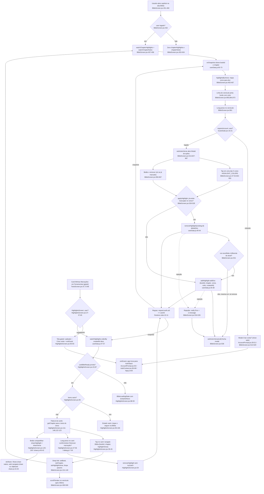
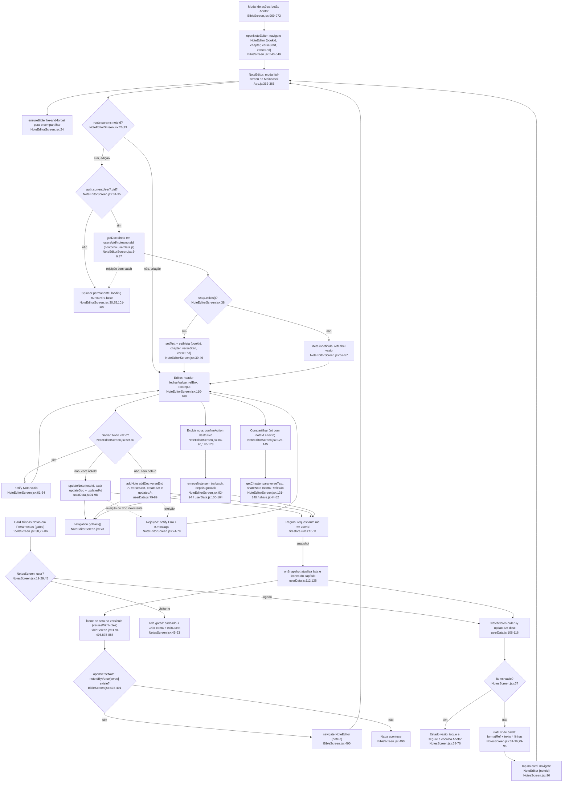
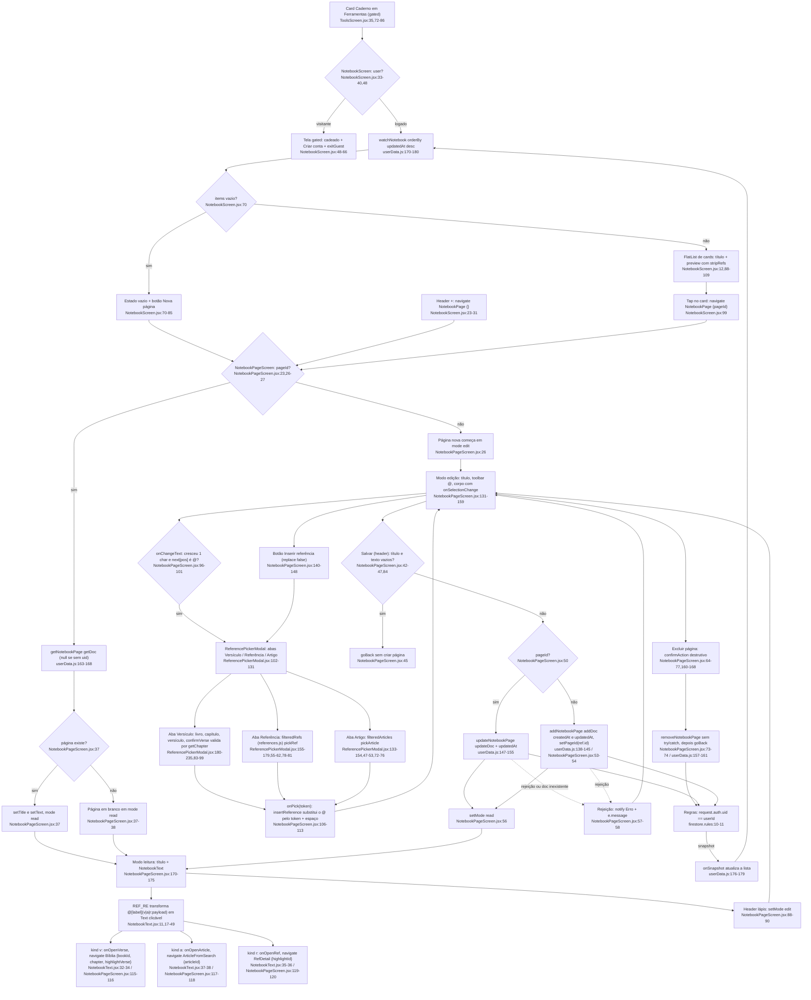

# 10. Fluxograma F10: Dados do usuário (Firestore: marcações, notas, caderno)

Data: 2026-09-23. Fase 1 do Pathfinder (somente leitura). Linhas conferidas no
código atual (commit `f6a5858`).

## Escopo

Tudo o que o usuário logado cria e que vive em `users/{uid}/…` no Firestore:

- **Marcações** (`highlights`): cor por versículo, criadas por long-press na Bíblia, listadas em "Minhas Marcações".
- **Notas de versículo** (`notes`): texto ligado a um intervalo de versículos, editadas no modal `NoteEditor`, listadas em "Minhas Notas".
- **Caderno** (`notebook`): páginas livres com tokens `@[label](v|a|r:payload)` que viram links para Bíblia, artigo ou referência.

Arquivos: `src/services/userData.js` (única camada de acesso, exceto o atalho em
`NoteEditorScreen.jsx:5-6,37`), `src/screens/HighlightsScreen.jsx`,
`NotesScreen.jsx`, `NoteEditorScreen.jsx`, `NotebookScreen.jsx`,
`NotebookPageScreen.jsx`, `src/components/NotebookText.jsx`,
`ReferencePickerModal.jsx`, `GuestGate.jsx`, `AccountPrompt.jsx`,
`firestore.rules`, `src/services/firebase.js`. Consumidor principal:
`src/screens/BibleScreen.jsx:14-17`.

Registros de rota (`App.js`): `Notebook` 109/151, `NotebookPage` 110/152,
`Highlights` 121/159, `Notes` 122/160 (HomeNav/ToolsNav), `NoteEditor` 362-366
(modal `presentation: 'modal'`, `headerShown: false`, no `MainStack`, fora das
abas). Único ponto de entrada por interface para as três listas é o bloco
"Estudo" de `ToolsScreen.jsx:33-40` (cards `Notebook` :35, `Highlights` :37,
`Notes` :38), renderizado por `renderStudyCard` :72-99 que passa por
`requireAccount` :77. `HomeScreen.jsx` não navega para nenhuma delas (grep
negativo), embora o `HomeNav` as registre.

Favoritos e progresso de leitura ficam FORA deste escopo (AsyncStorage, ver
CLAUDE.md).

## Fluxograma 1: Marcações (highlights)

Observações de leitura do diagrama 1:

- Trocar a cor de um verso já marcado gera duas escritas (delete + add,
  `BibleScreen.jsx:530-532`), logo dois snapshots.
- `watchChapterHighlights` não tem `orderBy` (`userData.js:65-69`). Se houver dois
  docs para o mesmo verso, `highlightsByVerse` fica com o último da ordem do
  snapshot (`BibleScreen.jsx:465`) e `applyHighlight` remove só esse.
- O `HighlightsScreen` tem duas barreiras de visitante em série: o card em
  `ToolsScreen.jsx:77` (modal `AccountPrompt`) e a própria tela em
  `HighlightsScreen.jsx:65-83` (alcançável se o usuário deslogar com a tela
  aberta, pois o `useEffect [user]` :27-37 reexecuta).

## Fluxograma 2: Notas de versículo (notes)

Observações de leitura do diagrama 2:

- Toda nota criada pela Bíblia tem `verseStart === verseEnd`
  (`BibleScreen.jsx:547-548`). O campo `verseEnd` e o intervalo em `formatRef`
  (`NotesScreen.jsx:33`) existem no modelo, mas nenhuma tela do app cria
  intervalos.
- `noteIdByVerse` guarda apenas o primeiro noteId por verso (`if (!(v in m))`,
  `BibleScreen.jsx:482`), e `watchChapterNotes` não ordena (`userData.js:123-127`).
  Se um verso tiver duas notas, o ícone abre a que vier primeiro no snapshot.
- O `NoteEditor` é a única tela do F10 que importa `firebase/firestore`
  diretamente (`NoteEditorScreen.jsx:5`). O `userData.js` já tem um análogo para
  o caderno, `getNotebookPage` (:163-168), mas não tem `getNote`.

## Fluxograma 3: Caderno (notebook)

Observações de leitura do diagrama 3:

- O texto salvo é o `text` cru com os tokens (`NotebookPageScreen.jsx:51,53`).
  Quem interpreta é `NotebookText.jsx:11` (leitura) e `NotebookScreen.jsx:12`
  (preview), com duas regex equivalentes mantidas à mão.
- A detecção de `@` depende de `selRef.current.start` capturado em
  `onSelectionChange` (`NotebookPageScreen.jsx:153`) antes da inserção. Não
  verifiquei em execução se o evento chega antes do `onChangeText` nas três
  plataformas.
- `ReferencePickerModal` valida o número do versículo pelo `getChapter`
  (`:89-94`) e cai para "aceita qualquer um" quando a Bíblia ainda não está em
  memória (`maxVerse = Infinity`).
- `ArticleFromSearch` e `RefDetail` existem em HomeNav (`App.js:125-126`),
  ToolsNav (`:162-163`) e SettingsNav (`:195-196`), então o tap resolve dentro
  da aba ativa. `Bíblia` é a rota da aba (`App.js:343`), então o tap troca de aba.

## Efeitos colaterais

### Firestore: esquema das 3 coleções (`users/{uid}/…`)

| Coleção | Campos gravados | Onde | Ordenação nas listas |
|---|---|---|---|
| `highlights` | `bookId` (string), `chapter` (number), `verse` (number), `color` (hex string de `HIGHLIGHT_COLORS`), `createdAt` (serverTimestamp) | `userData.js:30-38` | `orderBy('createdAt','desc')` :52. A do capítulo não ordena :65-69 |
| `notes` | `bookId`, `chapter`, `verseStart`, `verseEnd` (`?? verseStart`), `text`, `createdAt`, `updatedAt` (ambos serverTimestamp). `updateNote` grava só `text` + `updatedAt` | `userData.js:79-98` | `orderBy('updatedAt','desc')` :111. A do capítulo não ordena :123-127 |
| `notebook` | `title` (`\|\| ''`), `text` (`\|\| ''`), `createdAt`, `updatedAt` (serverTimestamp). `updateNotebookPage` regrava `title`, `text`, `updatedAt` | `userData.js:138-155` | `orderBy('updatedAt','desc')` :175 |

Fatos sobre o serviço:

- IDs são gerados pelo `addDoc` (nenhuma coleção usa id determinístico). Um doc por
  marcação e por nota (`userData.js:27-28`).
- `userCol` lança `Error('Usuário não autenticado')` quando não há uid
  (`userData.js:7-11`). O mesmo guard é repetido inline em `removeHighlight` :41-42,
  `updateNote` :92-93, `removeNote` :101-102, `updateNotebookPage` :148-149,
  `removeNotebookPage` :158-159. Só `getNotebookPage` :164-165 devolve `null` em
  vez de lançar.
- Cinco `watch*` (`:47, :60, :106, :118, :170`) devolvem `callback([])` e um
  `() => {}` para visitante, e `onSnapshot` sem handler de erro (segundo argumento
  apenas). Um erro de permissão ou rede no listener não chega a nenhuma tela.
- `deleteAllUserData` (`userData.js:20-24`) faz `getDocs` + `deleteDoc` em cada uma
  das três coleções, um por um (`wipeCollection` :15-18), sem batch. Chamado por
  `AuthContext.jsx:163` com `.catch(() => {})` dentro de `deleteAccount` :153-180,
  que em seguida limpa AsyncStorage :164-172 e chama `deleteUser` :173. Entrada:
  `SettingsScreen.jsx:187`.
- `getFirestore(app)` (`firebase.js:44`) sem `persistentLocalCache`: cache só em
  memória. Persistência configurada é a do **auth** (`firebase.js:33-42`:
  IndexedDB/localStorage na web, AsyncStorage no nativo), não a do Firestore.

### Regras de segurança (`firestore.rules`)

- `match /users/{userId}/{document=**}` com `allow read, write: if request.auth != null && request.auth.uid == userId` (`:10-11`).
- Não há validação de forma dos campos nem limite de tamanho de `text`.
- O comentário `:2` diz para colar no console. Não há `firebase.json` nem
  `firestore.indexes.json` no repo (ls negativo), então o deploy das regras e a
  existência de índices não são verificáveis pelo código.

### Navegação

| Origem | Destino | Onde |
|---|---|---|
| Card Estudo em Ferramentas | `Highlights`, `Notes`, `Notebook` (após `requireAccount`) | `ToolsScreen.jsx:77-78` |
| Modal de ações da Bíblia | `NoteEditor` {bookId, chapter, verseStart, verseEnd} | `BibleScreen.jsx:544-549` |
| Ícone de nota no verso | `NoteEditor` {noteId} | `BibleScreen.jsx:490` |
| Card de nota | `NoteEditor` {noteId} | `NotesScreen.jsx:90` |
| `NoteEditor` salvar/excluir/fechar | `goBack` | `NoteEditorScreen.jsx:73,85,94,116` |
| Card de marcação | aba `Bíblia` {bookId, chapter, highlightVerse} | `HighlightsScreen.jsx:39-45` |
| Header + e estado vazio do caderno | `NotebookPage` {} | `NotebookScreen.jsx:26,81` |
| Card de página | `NotebookPage` {pageId} | `NotebookScreen.jsx:99` |
| Token `v:` | aba `Bíblia` {bookId, chapter, highlightVerse} | `NotebookPageScreen.jsx:115-116` |
| Token `a:` | `ArticleFromSearch` {articleId} | `NotebookPageScreen.jsx:117-118` |
| Token `r:` | `RefDetail` {highlightId} | `NotebookPageScreen.jsx:119-120` |
| Gate de visitante (3 telas + AccountPrompt) | `exitGuest` derruba `signedInOrGuest`, raiz troca para `AuthStack` | `HighlightsScreen.jsx:77`, `NotesScreen.jsx:58`, `NotebookScreen.jsx:60`, `AccountPrompt.jsx:50`, `App.js:425` |

A aba `Bíblia` consome os params em `BibleScreen.jsx:131-149` e os limpa com
`setParams` :146. O `highlightVerse` também bloqueia a restauração de posição
(`:307, :324`) e dispara o scroll (`:499-509`).

### Compartilhar

- `shareHighlight` (`share.js:40-42`) é um alias de `shareVerse` :35-38. Mensagem:
  `"texto"\n\nLivro cap,verso` + `APP_PROMO` :8-10 (sempre vírgula como separador,
  mesmo em EN).
- `shareNote` (`share.js:44-52`) inclui o verso quando `verseText` existe e o bloco
  fixo `Reflexão:` em português, sem tradução.
- `doShare` (`share.js:15-33`): nativo `Share.share` com erro engolido, web
  `navigator.share` ou clipboard + `notify('Copiado', ...)` em PT fixo :24.
- Para o texto do verso, `HighlightsScreen.jsx:122-123` e
  `NoteEditorScreen.jsx:131-132` chamam `getChapter` na hora, por isso as duas
  telas pedem a Bíblia antes (`useBibleReady` :22 e `ensureBible` :24,
  respectivamente).

### Diálogos

`confirmAction` e `notify` (`dialog.js:7-39`) usam `window.confirm`/`window.alert`
na web e `Alert.alert` no nativo. Nenhum diálogo deste escopo usa o modal
customizado `AccountPrompt`, exceto o gate de visitante.

## Ramos

### `auth.currentUser === null` (visitante ou sessão caiu)

| Ponto | Comportamento |
|---|---|
| `watch*` | `callback([])` + unsubscribe no-op (`userData.js:48-51, 61-64, 107-110, 119-122, 171-174`) |
| `add*/update*/remove*` | lança `Usuário não autenticado` (`userData.js:9` e cópias) |
| `getNotebookPage` | devolve `null` (`userData.js:165`) |
| `BibleScreen` | efeito de watch zera listas (`:452-455`), long-press cai no `AccountPrompt` (`:512-521`) |
| `ToolsScreen` | card Estudo mostra cadeado (`:93-95`) e abre `AccountPrompt` em vez de navegar (`:77-86`) |
| `Highlights/Notes/Notebook` | tela gated com botão que chama `exitGuest` (`HighlightsScreen.jsx:65-83`, `NotesScreen.jsx:45-63`, `NotebookScreen.jsx:48-66`) |
| `NoteEditor` com `noteId` | `useEffect` retorna antes de `setLoading(false)` (`:34-35`), spinner fica para sempre (`:101-107`). Só alcançável se a sessão cair entre o tap e a montagem, pois todas as entradas são gated |
| `NotebookPage` com `pageId` | `getNotebookPage` devolve `null`, tela abre em branco em modo `read` (`:26, :37-38`) |

### Erro de escrita (rede, regras, doc inexistente)

| Chamada | Tratamento |
|---|---|
| `applyHighlight` (add/remove) | `try/catch` com `notify(Erro, e.message)` (`BibleScreen.jsx:529-535`), modal fecha de qualquer forma :536 |
| `NoteEditor.handleSave` | `try/catch` + `notify` (`:67-81`), `busy` volta a false |
| `NotebookPage.save` | `try/catch` + `notify` (`:49-61`) |
| `HighlightsScreen.confirmRemove` | `onConfirm: () => removeHighlight(h.id)` sem catch (`:54`), rejeição fica sem tratamento |
| `NoteEditor.handleDelete` | `await removeNote(noteId); navigation.goBack()` sem catch (`:92-95`), se rejeitar não volta |
| `NotebookPage.confirmDelete` | idem (`:72-75`) |
| `deleteAllUserData` | engolido com `.catch(() => {})` em `AuthContext.jsx:163`, a conta é apagada mesmo se os dados ficarem |

### Documento inexistente

- `NoteEditor` com `noteId` órfão: `snap.exists()` false (`:38`) mantém `text=''`
  e `meta` com `bookId/chapter/verseStart/verseEnd` `undefined` (vieram de
  `route.params` :26-28), `refLabel` vira `''` (`:55-57`), e um Salvar chama
  `updateNote` sobre doc ausente, cujo `updateDoc` rejeita e cai no `notify` :75.
- `NotebookPage` com `pageId` órfão: mesmo padrão, `updateNotebookPage` :51
  rejeita e cai no `notify` :58.
- `openVerseNote` sem noteId para o verso: no-op (`BibleScreen.jsx:490`).
- `getDoc` que rejeita (rede/regras) em `NoteEditorScreen.jsx:36-49`: IIFE
  async sem `try/catch`, promessa rejeitada não tratada e spinner permanente.

### Bíblia ainda não carregada (web, pedaço sob demanda)

- `HighlightsScreen` bloqueia a lista até `useBibleReady` (`:22, :87-93`).
- `NoteEditor` e `ReferencePickerModal` só pedem `ensureBible` sem bloquear
  (`:24` e `:22`). Compartilhar sem a Bíblia envia `verseText=''` e `shareNote`
  omite o verso (`share.js:47`). O picker aceita qualquer versículo (`:89-94`).
- `BibleScreen` usa `useBibleReady` :65 para a própria tela.

## Dependências externas (file:line)

| Dependência | Onde |
|---|---|
| `firebase/firestore` (collection, doc, addDoc, updateDoc, deleteDoc, getDoc, getDocs, query, where, orderBy, onSnapshot, serverTimestamp) | `userData.js:1-4`, `NoteEditorScreen.jsx:5` (doc, getDoc), `firebase.js:14` (getFirestore) |
| `firebase/auth` (initializeAuth, persistências, popup resolver) e `auth.currentUser` | `firebase.js:7-13, 33-42`, `userData.js:5`, `NoteEditorScreen.jsx:6` |
| `@react-native-async-storage/async-storage` | `firebase.js:15` (persistência do auth), `AuthContext.jsx:19, 74, 92, 97, 164` |
| `react-native` `Share`, `Alert`, `Modal`, `KeyboardAvoidingView`, `Platform` | `share.js:1`, `dialog.js:1`, `ReferencePickerModal.jsx:2`, `NoteEditorScreen.jsx:2`, `NotebookPageScreen.jsx:2-5`, `BibleScreen.jsx:2` |
| Web APIs `navigator.share`, `navigator.clipboard`, `window.confirm`, `window.alert` | `share.js:18-25`, `dialog.js:17, 35` |
| `react-native-safe-area-context` | `NoteEditorScreen.jsx:7`, `NotebookPageScreen.jsx:8` |
| `@expo/vector-icons` Ionicons | todas as telas do escopo |
| `expo-clipboard` (copiar verso no mesmo modal das marcações) | `BibleScreen.jsx:4, 552-559` |
| Dados estáticos: `getBook`, `bookName`, `bookShort`, `BIBLE_BOOKS` | `HighlightsScreen.jsx:6`, `NotesScreen.jsx:5`, `NoteEditorScreen.jsx:9`, `ReferencePickerModal.jsx:9`, `BibleScreen.jsx:8` |
| Dados estáticos: `articles`, `references`, `translateRef`, `referencesEn` | `ReferencePickerModal.jsx:6-8` |
| `bibleApi.getChapter` / `ensureBible` / `isBibleLoaded` (formato `{ total, verses: [{n, t}], source, language }`, `bibleApi.js:52-91`) | `HighlightsScreen.jsx:7, 122`, `NoteEditorScreen.jsx:10, 24, 131`, `ReferencePickerModal.jsx:10, 22, 91`, `useBibleReady.js:2` |
| `useBibleReady` | `HighlightsScreen.jsx:8, 22`, `BibleScreen.jsx:23, 65`, `SearchScreen.jsx:111` |
| `useScrollHints` + `ScrollHint` | `HighlightsScreen.jsx:14-15`, `NotesScreen.jsx:9-10`, `NotebookScreen.jsx:8-9` |
| Contextos `useTheme`, `useLanguage`, `useAuth`, `useAccountPrompt` | todas as telas; `GuestGate.jsx:1-2` |
| i18n: `header.highlights/notes/notebook` (`strings.js:30-31, 50`), `bible.markColor/annotate` (`:164-165`), `empty.createAccount` (`:192`), `note.delete` (`:207`), `common.*` (`:8-13`); muitas strings destas telas são ternários `isEn ? … : …` inline em vez de chaves | `HighlightsScreen.jsx:49-50, 71-73, 101-103`, `NotesScreen.jsx:51-53, 72-74`, `NoteEditorScreen.jsx:62-63, 76-77, 87-88, 123, 163`, `NotebookScreen.jsx:54-56, 73-77, 83, 102`, `NotebookPageScreen.jsx:58, 67-68, 137, 146, 154, 166`, `ReferencePickerModal.jsx:106-233` |
| Rotas de navegação por nome: `'Bíblia'` (aba, `App.js:343`), `'NoteEditor'` (`:363`), `'ArticleFromSearch'`/`'RefDetail'` (`:125-126, 162-163, 195-196`), `'NotebookPage'` (`:110, 152`) | `HighlightsScreen.jsx:40`, `NotebookPageScreen.jsx:116-120`, `NotesScreen.jsx:90`, `BibleScreen.jsx:490, 544`, `NotebookScreen.jsx:26, 81, 99` |

## Duplicações observadas (fatos, sem solução)

1. **Acesso ao Firestore fora de `userData.js`**: `NoteEditorScreen.jsx:5-6, 37`
   monta `doc(db, 'users', uid, 'notes', noteId)` e chama `getDoc` na tela. O
   serviço tem o equivalente para o caderno (`getNotebookPage`, `userData.js:163-168`)
   e nada para notas.
2. **Guard de uid repetido** 6 vezes em `userData.js` (`:8-9, 41-42, 92-93, 101-102,
   148-149, 158-159`) e o guard de visitante dos `watch*` 5 vezes (`:48-51, 61-64,
   107-110, 119-122, 171-174`), assim como `snap.docs.map((d) => ({ id: d.id, ...d.data() }))`
   5 vezes (`:54, 71, 113, 129, 177`).
3. **Formatação de referência de versículo** `${livro} ${cap}${sep}${verso}` com
   `sep = isEn ? ':' : ','`: `HighlightsScreen.jsx:121-124, 136`,
   `NotesScreen.jsx:31-36`, `NoteEditorScreen.jsx:52-57`, `BibleScreen.jsx:554` e
   `:936`, `ReferencePickerModal.jsx:95-96` (com `bookShort`), `bibleApi.js:107`.
   O intervalo `verseStart === verseEnd ? a : a-b` aparece em `NotesScreen.jsx:33`,
   `NoteEditorScreen.jsx:56` e `share.js:45`. `share.js:36, 48` usa vírgula fixa,
   ignorando o idioma.
4. **Busca do texto do verso** `getChapter(...)?.verses?.find((v) => v.n === X)?.t || ''`:
   `HighlightsScreen.jsx:122-123` e `NoteEditorScreen.jsx:131-132`.
5. **Tela gated de visitante** (ícone `lock-closed-outline` 56px, `empty.createAccount`,
   texto explicativo e botão com estilo inline idêntico chamando `exitGuest`):
   `HighlightsScreen.jsx:65-83`, `NotesScreen.jsx:45-63`, `NotebookScreen.jsx:48-66`.
   O mesmo trio repete o bloco `loading` (`:61-63`, `:41-43`, `:44-46`) e o
   `useEffect [user]` que assina o `watch*` (`:27-37`, `:19-29`, `:33-40`).
6. **Lista de cards** com `FlatList` + `useScrollHints` + par de `ScrollHint` +
   `contentContainerStyle={{ padding: 16, paddingBottom: 40 }}` +
   `scrollEventThrottle={32}`: `HighlightsScreen.jsx:111-150`,
   `NotesScreen.jsx:79-98`, `NotebookScreen.jsx:88-111`. Os `makeStyles` de
   `center`, `emptyTitle`, `muted` e `card` são quase iguais nas três
   (`:155-172`, `:105-113`, `:118-126`).
7. **Regex do token do caderno** em dois lugares:
   `NotebookText.jsx:11` (`/@\[([^\]]+)\]\((v|a|r):([^)]+)\)/g`) e
   `NotebookScreen.jsx:12` (`stripRefs`, mesma gramática com grupo não capturante).
   O formato do token também está descrito em comentário em
   `ReferencePickerModal.jsx:12-15` e `NotebookText.jsx:5-10`.
8. **Dois editores paralelos** (`NoteEditorScreen` e `NotebookPageScreen`) com o
   mesmo esqueleto: `KeyboardAvoidingView` com `behavior` iOS (`:110-113` /
   `:127-130`), estado `busy` + `try/catch` + `notify` no salvar (`:59-82` /
   `:42-62`), `confirmAction` destrutivo (`:84-97` / `:64-77`), botão de excluir com
   `paddingBottom: 14 + Math.max(insets.bottom, 8)` e cor `#c0392b` (`:170-178, 214-223`
   / `:160-168, 208-212`), spinner de carregamento (`:101-107` / `:122-124`).
   Hospedagem diferente: um é modal do `MainStack` (`App.js:362-366`) com header
   próprio, o outro vive nos stacks das abas com header do navigator.
9. **`confirmAction` destrutivo** com a mesma forma em `HighlightsScreen.jsx:47-56`,
   `NoteEditorScreen.jsx:86-96`, `NotebookPageScreen.jsx:66-76`. Nos três, o
   `onConfirm` chama o `remove*` sem `catch`.
10. **Preparação da Bíblia** por dois caminhos para a mesma necessidade:
    `useBibleReady` bloqueante (`HighlightsScreen.jsx:22, 87`, `BibleScreen.jsx:65`,
    `SearchScreen.jsx:111`) e `ensureBible(...).catch(() => {})` sem bloquear
    (`NoteEditorScreen.jsx:24`, `ReferencePickerModal.jsx:22`).
11. **Deep link para a Bíblia com destaque** montado em dois pontos deste escopo
    (`HighlightsScreen.jsx:40-44`, `NotebookPageScreen.jsx:115-116`) além dos
    outros 7 arquivos citados em `00-features.md` (fan-in de `navigate('Bíblia')`).
12. **Mensagens de gate** repetidas com pequenas variações em PT/EN inline:
    `ToolsScreen.jsx:80-83`, `BibleScreen.jsx:514-520`, `AccountPrompt.jsx:18-22`
    (default), mais os textos das três telas gated.

## Confiança e lacunas

- **Alta** nas linhas citadas: todas foram lidas no código atual nesta sessão.
- **Não executado**: nenhum fluxo foi rodado. Não confirmei em runtime a ordem
  `onSelectionChange` vs `onChangeText` na web (base da detecção de `@`), nem o
  comportamento de `orderBy('createdAt')` enquanto o `serverTimestamp` ainda é
  `null` no snapshot local.
- **Fora do repo**: se as regras de `firestore.rules` são as que estão no
  console e se existem índices. Não há `firebase.json` nem
  `firestore.indexes.json`. As queries com dois `where` de igualdade
  (`userData.js:65-69, 123-127`) não combinam `orderBy`, então não deduzi
  necessidade de índice composto, mas isso não é verificável aqui.
- **Offline**: `getFirestore(app)` (`firebase.js:44`) não configura cache
  persistente. Não afirmo o que acontece com escritas feitas sem rede e
  seguidas de fechamento do app.
- **Contagem de nós**: 37 (marcações) + 36 (notas) + 40 (caderno) = 113 nós.

## Fontes consultadas

- `src/services/userData.js` (inteiro, 181 linhas)
- `firestore.rules` (inteiro)
- `src/services/firebase.js` (inteiro)
- `src/screens/HighlightsScreen.jsx`, `NotesScreen.jsx`, `NoteEditorScreen.jsx`,
  `NotebookScreen.jsx`, `NotebookPageScreen.jsx` (inteiros)
- `src/components/NotebookText.jsx`, `ReferencePickerModal.jsx`, `GuestGate.jsx`
  (inteiros), `AccountPrompt.jsx:1-60`
- `src/screens/BibleScreen.jsx:1-30, 40-72, 128-150, 440-600, 846-892, 926-990`
- `src/screens/ToolsScreen.jsx:28-100`
- `src/context/AuthContext.jsx:66-100, 150-180` e grep de `exitGuest`,
  `deleteAccount`, `signedInOrGuest`
- `src/utils/share.js`, `src/utils/dialog.js`, `src/hooks/useBibleReady.js` (inteiros)
- `src/services/bibleApi.js:20-125` e lista de exports
- `App.js:100-165, 350-380` e grep das rotas `Bíblia`, `ArticleFromSearch`,
  `RefDetail`, `NoteEditor`
- `src/i18n/strings.js` (grep das chaves usadas)
- `docs/design/PATHFINDER-2026-09-23/00-features.md` (linha F10 e grafo)
- greps: `from 'firebase/firestore'`, `getDoc(`, `useBibleReady(`,
  `deleteAllUserData`, `isEn ? ':' : ','`, `bookName(book, isEn)`,
  `navigate('(Highlights|Notes|Notebook|NotebookPage|NoteEditor)'`,
  `'Highlights'|'Notes'|'Notebook'` em `src/screens`, `src/components`,
  `src/context`, `src/utils`
