# F11. Ajustes e Legal

Data: 2026-09-23. Fluxograma feito por subagente somente leitura, com file:line conferidos no código atual (`src/` intocado). Sem travessões.

## Escopo

- Tela raiz: `src/screens/SettingsScreen.jsx` (846 linhas), registrada como `SettingsMain` no `SettingsStackScreen` (`App.js:185`) sob a tab `'Ajustes'` (`App.js:345`).
- Sub-tela: `src/screens/LegalScreen.jsx` (158 linhas), registrada como `Legal` no SettingsStack (`App.js:186`) e, duplicada, no HomeStack (`App.js:131`). Conteúdo PRIVACY (`:32-93`) e TERMS (`:95-149`) embutidos no arquivo.
- Componente: `src/components/WebDownloadBanner.jsx` (só web, `:12`).
- O que Ajustes consome: `ThemeContext.jsx` (`setDarkMode` `:144`, `setFontSize` `:146`), `LanguageContext.jsx` (`setLang` `:37-46`), `AuthContext.jsx` (`exitGuest` `:95-98`, `signOut` `:135-139`, `deleteAccount` `:153-182`), `services/notifications.js` (+ variante `.web.js` no-op), `utils/ttsVoice.js`, `sentry.js` (+ `.web.js` no-op), `utils/webUpdate.js` (+ `.web.js`), `utils/dialog.js` (`confirmAction`, `notify`), `hooks/useModalNavBar.js`, `hooks/useScrollHints.js`.
- Fora do escopo, mas citado quando toca em Ajustes: `services/userData.js:20-24` (`deleteAllUserData`), `App.js:380-428` (gate de auth), `docs/privacy.html` e `docs/terms.html` (site).

## Caminhos felizes (resumo antes do diagrama)

**(a) Abrir Ajustes.** Tap na tab `'Ajustes'` (`App.js:345`) abre `SettingsStackScreen` (`App.js:174-203`) com `SettingsMain` (`:185`). Na montagem, `SettingsScreen` lê prefs de notificação (`SettingsScreen.jsx:63-65`) e vozes + voz salva + velocidade para o `lang` atual (`:68-79`). A ordem visual é: `WebDownloadBanner` (`:225`), card de perfil (`:227-239`) ou card dourado de visitante (`:241-252`), Aparência (`:254`), Idioma (`:295`) com Voz (`:328`) e Velocidade (`:363`) dentro, Notificações (`:391-492`, só nativo), Conta (`:494-510`, só logado), Diagnóstico (`:545`), Doação (`:572`), Privacidade e Termos (`:587`), Sobre (`:609-633`). Tap repetido na tab rola ao topo (`:206-213`).

**(b) Tema, letra e idioma.** O `Switch` de modo escuro chama `setDarkMode` direto (`:263`), que é `setDarkModeState` do `ThemeContext` (`ThemeContext.jsx:144`). Um efeito persiste em `settings:darkMode` e, na web, espelha em `localStorage['appg_theme']` (`:93-100`); outro pinta a navigation bar do Android (`:109-114`); outro injeta CSS de autofill na web (`:119-136`). O `value` memoizado recalcula `colors` e `fs` (`:138-152`), e todos os 54 arquivos com `useTheme()` re-renderizam. Os chips de tamanho chamam `setFontSize(opt.key)` (`:279`), persistido em `settings:fontSize` (`ThemeContext.jsx:102-104`), com escala em `FONT_SCALES` (`:49-54`) e piso de 11px em `fs()` (`:149`). Os chips PT/EN chamam `setLang` (`:310`, `:318`), que valida contra `STRINGS`, atualiza o cache do `AuthContext` via `setAuthLanguage` (`LanguageContext.jsx:40`, `AuthContext.jsx:58-60`), persiste em `settings:language` e espelha em `localStorage['appg_lang']` na web (`:41-45`). A troca de `lang` dispara o efeito `[lang]` de Ajustes que recarrega o catálogo de vozes (`SettingsScreen.jsx:68-79`).

**(c) Voz e velocidade.** A linha Voz (`:328-361`) abre `VoicePickerModal` (`:665-737`). Cada item tem um botão play que chama `previewVoice` (`:96-104`: `Speech.stop()` + `Speech.speak` com `language`, `voice`, `rate`, `pitch`). Tap no item chama `chooseVoice` (`:83-87`), que fecha o modal e grava via `saveVoiceId` na chave por idioma (`ttsVoice.js:196-201`: `settings:ttsVoice` para PT, `settings:ttsVoiceEn` para EN). Fechar o modal chama `Speech.stop()` (`:644`). Os chips de velocidade chamam `changeRate` (`:106-116`), que grava `settings:ttsRate` (`ttsVoice.js:213-217`) e fala a frase "Velocidade de leitura." na voz selecionada. Quem lê essas chaves fora de Ajustes: `BibleScreen.jsx:582` e `ArticleDetailScreen.jsx:110` (`resolveVoice` + `getSavedRate`).

**(d) Ligar notificação.** Cada `Switch` chama um `toggleX(value)` (`:123-159`). Se `value` é `true`, chama `requestPermissions()` (`notifications.js:55-61`): devolve `false` em emulador ou simulador (`Device.isDevice`, `:56`), `true` se já concedida, senão pede ao sistema. Negada: `notify(permTitle, permMsg)` e retorno sem mudar nada (`:126`, `:136`, `:146`, `:155`). Concedida: atualiza `notifPrefs` de forma otimista (`:128`) e chama `setXEnabled`, que lê e regrava `notifications:prefs` e chama `rescheduleAll()` (`notifications.js:73-102`). `rescheduleAll` cancela os 5 identificadores fixos (`:63-71`, incluindo `friday-fast`, legado) e agenda o que está ligado: versículo diário na hora salva (`:111-126`), liturgia de domingo 7h (`:128-143`), quiz 19h (`:145-159`), objeção 12h (`:160-175`). Só os toggles de versículo e liturgia olham `res.ok` e avisam com nota sobre Expo Go (`:130`, `:140`); quiz e objeção ignoram o retorno (`:149`, `:158`). "Enviar notificação de teste" (`:469-490`) agenda uma em 5 s (`notifications.js:189-208`).

**(e) Sair e excluir.** "Sair" abre `confirmAction` (`:161-170`; nativo `Alert.alert`, web `window.confirm`, `dialog.js:7-30`) e no confirmar chama `signOut` (`AuthContext.jsx:135-139`: `fbSignOut` + `setGuest(false)` + remove `auth:guestMode`). O `onAuthStateChanged` recebe `null` (`:78-86`), `signedInOrGuest` vira `false` e a raiz troca para `AuthStack` (`App.js:427`); o onboarding não reaparece porque `onboardingPassed` é estado de sessão já `true` (`App.js:388`, `:404-406`). "Excluir conta" tem dupla confirmação: `confirmAction` (`:172-183`) e depois o `Modal` próprio (`:512-543`) que pede senha se o provedor for `password` (`:54`, `:522-532`). `doDeleteAccount` (`:185-199`) chama `deleteAccount` (`AuthContext.jsx:153-182`): reautentica com senha se for conta de senha (`:158-162`), apaga `highlights`, `notes` e `notebook` no Firestore (`userData.js:20-24`), remove 9 chaves locais (`:164-172`), chama `deleteUser` (`:173`). O `onAuthStateChanged` faz o resto (comentário em `:198`).

**(f) Doação e Legal.** Doação chama `Linking.openURL(DONATE_URL)` com `.catch(() => {})` (`:575`, URL em `:28`, aponta para `docs/donate.html` do site). Política e Termos chamam `navigation.navigate('Legal', { kind })` (`:590`, `:600`). `LegalScreen` escolhe `TERMS` ou `PRIVACY` pelo `kind` (`LegalScreen.jsx:11-13`) e renderiza título, data e seções no idioma atual (`:16-29`). O título do header vem do `options` da rota (`App.js:186`).

## Fluxograma

```mermaid
flowchart TD

  subgraph ENTRADA["Entrada e montagem"]
    N1["Tab Ajustes<br/>App.js:345"]
    N2["SettingsStackScreen<br/>App.js:174-203"]
    N3["SettingsMain = SettingsScreen<br/>App.js:185"]
    N4["Efeito: getPrefs para notifPrefs<br/>SettingsScreen.jsx:63-65"]
    N5["Efeito [lang]: listVoicesForLanguage + getSavedVoiceId + getSavedRate<br/>SettingsScreen.jsx:68-79"]
    N6["ScrollView com useScrollHints<br/>SettingsScreen.jsx:217-224"]
    N7["Tap repetido na tab rola ao topo<br/>SettingsScreen.jsx:206-213"]
    N1 --> N2 --> N3
    N3 --> N4
    N3 --> N5
    N3 --> N6
    N3 --> N7
  end

  subgraph WEBBANNER["Banner de download (web)"]
    N8["WebDownloadBanner<br/>SettingsScreen.jsx:225"]
    N9{"Platform.OS === web?<br/>WebDownloadBanner.jsx:12"}
    N10["Card Baixe o app com App Store e Google Play em Em breve<br/>WebDownloadBanner.jsx:27-42"]
    N11["null<br/>WebDownloadBanner.jsx:12"]
    N6 --> N8 --> N9
    N9 -->|sim| N10
    N9 -->|nao| N11
  end

  subgraph PERFIL["Perfil ou visitante"]
    N12{"user?<br/>SettingsScreen.jsx:227"}
    N13["Card de perfil: avatar, displayName, email<br/>SettingsScreen.jsx:228-238"]
    N14{"guest?<br/>SettingsScreen.jsx:241"}
    N15["Card dourado Voce esta como visitante<br/>SettingsScreen.jsx:242-251"]
    N16["exitGuest: setGuest(false) + remove auth:guestMode<br/>AuthContext.jsx:95-98"]
    N17["signedInOrGuest false: AuthStack (Login)<br/>App.js:427"]
    N6 --> N12
    N12 -->|sim| N13
    N12 -->|nao| N14
    N14 -->|sim| N15
    N15 -->|tap| N16 --> N17
  end

  subgraph APARENCIA["Aparencia"]
    N18["Switch modo escuro: onValueChange = setDarkMode<br/>SettingsScreen.jsx:256-267"]
    N19["setDarkModeState<br/>ThemeContext.jsx:144"]
    N20["Persiste settings:darkMode e appg_theme na web<br/>ThemeContext.jsx:93-100"]
    N21["Android: NavigationBar cor de fundo e icones<br/>ThemeContext.jsx:109-114"]
    N22["Web: injeta style de autofill<br/>ThemeContext.jsx:119-136"]
    N23["colors e fs recalculados no useMemo, useTheme em 54 arquivos<br/>ThemeContext.jsx:138-152"]
    N24["Chips tamanho da letra: setFontSize(opt.key)<br/>SettingsScreen.jsx:269-293"]
    N25["setFontSizeState<br/>ThemeContext.jsx:146"]
    N26["Persiste settings:fontSize<br/>ThemeContext.jsx:102-104"]
    N27["fs(n) = max(11, n * FONT_SCALES[fontSize])<br/>ThemeContext.jsx:49-54, :149"]
    N6 --> N18 --> N19
    N19 --> N20
    N19 --> N21
    N19 --> N22
    N19 --> N23
    N6 --> N24 --> N25
    N25 --> N26
    N25 --> N27 --> N23
  end

  subgraph IDIOMA["Idioma"]
    N28["Chips Portugues / English: setLang<br/>SettingsScreen.jsx:295-325"]
    N29{"STRINGS[newLang] existe?<br/>LanguageContext.jsx:38"}
    N30["setLangState + setAuthLanguage<br/>LanguageContext.jsx:39-40"]
    N31["Cache _cachedLang para erros do Firebase<br/>AuthContext.jsx:53-60"]
    N32["Persiste settings:language e appg_lang na web<br/>LanguageContext.jsx:41-45"]
    N33["t(), isEn, isPt recalculados, useLanguage em 48 arquivos<br/>LanguageContext.jsx:48-58"]
    N6 --> N28 --> N29
    N29 -->|nao| N28
    N29 -->|sim| N30
    N30 --> N31
    N30 --> N32
    N30 --> N33
    N33 -->|lang mudou| N5
  end

  subgraph VOZ["Voz e velocidade (TTS)"]
    N34["Linha Voz com dica por plataforma: abre picker<br/>SettingsScreen.jsx:328-361"]
    N35["VoicePickerModal + useModalNavBar<br/>SettingsScreen.jsx:665-737"]
    N36["Android: NavigationBar botoes conforme tema<br/>useModalNavBar.js:9-18"]
    N37{"voices.length === 0?<br/>SettingsScreen.jsx:684"}
    N38["Aviso: nenhuma voz para este idioma<br/>SettingsScreen.jsx:686-690"]
    N39["FlatList de vozes com describeVoice, badge, play, check<br/>SettingsScreen.jsx:693-731"]
    N40["previewVoice: Speech.stop + Speech.speak<br/>SettingsScreen.jsx:96-104"]
    N41["chooseVoice: setTtsVoiceId, fecha, saveVoiceId(id, lang)<br/>SettingsScreen.jsx:83-87"]
    N42["Grava settings:ttsVoice ou settings:ttsVoiceEn<br/>ttsVoice.js:184-201"]
    N43["onClose: fecha + Speech.stop<br/>SettingsScreen.jsx:644"]
    N44["Chips velocidade: changeRate(opt.value)<br/>SettingsScreen.jsx:363-389, :653-658"]
    N45["saveRate em settings:ttsRate + fala Velocidade de leitura<br/>SettingsScreen.jsx:106-116, ttsVoice.js:213-217"]
    N46["Consumidores: resolveVoice + getSavedRate<br/>BibleScreen.jsx:582, ArticleDetailScreen.jsx:110"]
    N47["Catalogo: nativo por padroes de identifier, web por speechSynthesis com retry<br/>ttsVoice.js:159-182, :115-155"]
    N6 --> N34 --> N35
    N35 --> N36
    N35 --> N37
    N37 -->|sim| N38
    N37 -->|nao| N39
    N39 -->|play| N40
    N39 -->|tap item| N41 --> N42
    N35 -->|fechar| N43
    N6 --> N44 --> N45
    N42 --> N46
    N45 --> N46
    N5 --> N47
  end

  subgraph NOTIF["Notificacoes (so nativo)"]
    N48{"Platform.OS !== web?<br/>SettingsScreen.jsx:391"}
    N49["Secao inteira oculta na web<br/>SettingsScreen.jsx:391-492, notifications.web.js"]
    N50["4 switches: versiculo, liturgia domingo, quiz, objecao<br/>SettingsScreen.jsx:395-467"]
    N51["toggleX(value)<br/>SettingsScreen.jsx:123-159"]
    N52{"value true?<br/>SettingsScreen.jsx:124"}
    N53["requestPermissions<br/>notifications.js:55-61"]
    N54{"Device.isDevice?<br/>notifications.js:56"}
    N55["getPermissionsAsync, senao requestPermissionsAsync<br/>notifications.js:57-60"]
    N56{"granted?<br/>notifications.js:58-60"}
    N57["notify Permissao necessaria e sai sem mudar<br/>SettingsScreen.jsx:126, :136, :146, :155"]
    N58["setNotifPrefs otimista<br/>SettingsScreen.jsx:128, :138, :148, :157"]
    N59["setXEnabled: getPrefs, savePrefs em notifications:prefs<br/>notifications.js:73-102"]
    N60["rescheduleAll: cancela 5 ids fixos e agenda os ligados<br/>notifications.js:106-180"]
    N61{"res.ok? (so versiculo e liturgia checam)<br/>SettingsScreen.jsx:130, :140"}
    N62["notify Atencao + nota sobre Expo Go<br/>SettingsScreen.jsx:121, :130, :140"]
    N63["Enviar notificacao de teste em 5 s<br/>SettingsScreen.jsx:469-490, notifications.js:189-208"]
    N6 --> N48
    N48 -->|nao| N49
    N48 -->|sim| N50 --> N51 --> N52
    N52 -->|sim| N53 --> N54
    N54 -->|nao, emulador| N57
    N54 -->|sim| N55 --> N56
    N56 -->|nao| N57
    N56 -->|sim| N58
    N52 -->|nao, desligar| N58
    N58 --> N59 --> N60 --> N61
    N61 -->|nao| N62
    N48 -->|sim| N63 --> N53
  end

  subgraph CONTA["Conta (so logado)"]
    N64{"user?<br/>SettingsScreen.jsx:494"}
    N65["Sair da conta: confirmAction<br/>SettingsScreen.jsx:161-170, dialog.js:7-30"]
    N66["signOut: fbSignOut + setGuest(false) + remove auth:guestMode<br/>AuthContext.jsx:135-139"]
    N67["onAuthStateChanged(null): user null<br/>AuthContext.jsx:78-86"]
    N68["Excluir conta: confirmAction Continuar<br/>SettingsScreen.jsx:172-183"]
    N69["Modal proprio com aviso e senha se provedor password<br/>SettingsScreen.jsx:54, :512-543"]
    N70["doDeleteAccount: deleteAccount({password})<br/>SettingsScreen.jsx:185-199"]
    N71{"conta de senha sem senha?<br/>AuthContext.jsx:158-159"}
    N72["needsPassword: notify Senha necessaria<br/>SettingsScreen.jsx:189-192"]
    N73["reauthenticateWithCredential<br/>AuthContext.jsx:160-161"]
    N74["deleteAllUserData: wipe highlights, notes, notebook<br/>userData.js:20-24"]
    N75["multiRemove 9 chaves locais<br/>AuthContext.jsx:164-172"]
    N76["deleteUser + setGuest(false)<br/>AuthContext.jsx:173-174"]
    N77["Erro: notify Nao foi possivel excluir (requires-recent-login traduzido)<br/>SettingsScreen.jsx:193-196, AuthContext.jsx:176-181"]
    N6 --> N64
    N64 -->|sim| N65
    N65 -->|confirmar| N66 --> N67 --> N17
    N64 -->|sim| N68
    N68 -->|confirmar| N69
    N69 -->|Excluir| N70 --> N71
    N71 -->|sim| N72
    N71 -->|nao| N73 --> N74 --> N75 --> N76 --> N67
    N73 -->|falha| N77
  end

  subgraph DIAG["Diagnostico"]
    N78["Enviar erro de teste: captureException(new Error)<br/>SettingsScreen.jsx:546-570"]
    N79{"Expo Go ou web?<br/>sentry.js:9, :33-36, sentry.web.js:9"}
    N80["no-op silencioso<br/>sentry.js:34, sentry.web.js:9"]
    N81["Sentry.captureException<br/>sentry.js:35"]
    N82["notify Erro de teste enviado (sempre, mesmo no no-op)<br/>SettingsScreen.jsx:551-554"]
    N6 --> N78 --> N79
    N79 -->|sim| N80 --> N82
    N79 -->|nao| N81 --> N82
  end

  subgraph DOACAO["Doacao"]
    N83["Fazer uma doacao: Linking.openURL(DONATE_URL).catch<br/>SettingsScreen.jsx:28, :573-585"]
    N84["docs/donate.html no site<br/>SettingsScreen.jsx:28"]
    N6 --> N83 --> N84
  end

  subgraph LEGAL["Privacidade e Termos"]
    N85["Politica: navigate Legal kind privacy<br/>SettingsScreen.jsx:588-597"]
    N86["Termos: navigate Legal kind terms<br/>SettingsScreen.jsx:598-607"]
    N87["Rota Legal no SettingsStack, titulo por kind<br/>App.js:186"]
    N88["LegalScreen: kind escolhe TERMS ou PRIVACY<br/>LegalScreen.jsx:8-14"]
    N89["Render titulo, data e secoes em pt ou en<br/>LegalScreen.jsx:16-29"]
    N90["PRIVACY embutido, 8 secoes, 23 mai 2026<br/>LegalScreen.jsx:32-93"]
    N91["TERMS embutido, 7 secoes, 23 mai 2026<br/>LegalScreen.jsx:95-149"]
    N6 --> N85 --> N87
    N6 --> N86 --> N87
    N87 --> N88 --> N89
    N88 --> N90
    N88 --> N91
  end

  subgraph SOBRE["Sobre"]
    N92["aboutBox: versao, build, descricao, 1 Pedro 3,15<br/>SettingsScreen.jsx:609-633"]
    N93["appVersion = Constants.expoConfig.version<br/>SettingsScreen.jsx:40"]
    N94["buildLabel = getBuildId() 7 chars<br/>SettingsScreen.jsx:41-44"]
    N95["Nativo: null<br/>webUpdate.js:5-7"]
    N96["Web: hash do script AppEntry-*.js<br/>webUpdate.web.js:53-58"]
    N6 --> N92
    N92 --> N93
    N92 --> N94
    N94 --> N95
    N94 --> N96
  end
```

Total: 96 nós.

## Efeitos colaterais

### AsyncStorage (todas as chaves tocadas a partir de Ajustes)

| Chave | Quem grava | Quem lê | Disparado por |
|---|---|---|---|
| `settings:darkMode` | `ThemeContext.jsx:95` | `ThemeContext.jsx:76` (boot) | Switch `SettingsScreen.jsx:263`; também `AuthTopToggles.jsx:17` |
| `settings:fontSize` | `ThemeContext.jsx:103` | `ThemeContext.jsx:77` | Chips `SettingsScreen.jsx:279` |
| `settings:language` | `LanguageContext.jsx:41` | `LanguageContext.jsx:26`, `AuthContext.jsx:54` (cache) | Chips `SettingsScreen.jsx:310, :318`; também `AuthTopToggles.jsx:26` |
| `settings:ttsVoice` (PT) | `ttsVoice.js:198` | `ttsVoice.js:190` | `chooseVoice` `SettingsScreen.jsx:86` |
| `settings:ttsVoiceEn` (EN) | `ttsVoice.js:198` | `ttsVoice.js:190` | idem, quando `lang === 'en'` |
| `settings:ttsRate` | `ttsVoice.js:215` | `ttsVoice.js:205` | `changeRate` `SettingsScreen.jsx:108` |
| `notifications:prefs` | `notifications.js:51` | `notifications.js:43` | qualquer toggle `SettingsScreen.jsx:129, :139, :149, :158` |
| `auth:guestMode` | removida em `AuthContext.jsx:97` (exitGuest), `:138` (signOut), `:83` (login) | `AuthContext.jsx:74` | card visitante `SettingsScreen.jsx:242`; Sair `:168` |
| `favorites:articles`, `reading:read`, `reading:plan`, `reading:plan:fundamentos`, `reading:plan:aprofundamento`, `notifications:prefs`, `search:history`, `bible:position`, `bible:read` | `multiRemove` em `AuthContext.jsx:164-172` | outras features | Excluir conta `SettingsScreen.jsx:187` |

Chaves que a exclusão de conta NÃO limpa (fato já registrado em `00-features.md`, item 8): `settings:*` (tema, letra, idioma, voz, velocidade), `lastRead:article`, `quiz:*`, `onboarding:*`, caches de liturgia e notícias.

### localStorage e sessionStorage (só web)

- `appg_theme`: `ThemeContext.jsx:73` (lê) e `:98` (grava). Compartilhado com a landing `docs/index.html:15, :613, :619`.
- `appg_lang`: `LanguageContext.jsx:23` (lê) e `:44` (grava). Landing: `docs/index.html:607, :618`.
- `appg:updateReloaded` (sessionStorage): só `webUpdate.web.js:16, :67, :79`. Ajustes não toca, apenas usa `getBuildId()` (`:53-58`), que lê o DOM.

### Notifications (`expo-notifications`, só nativo)

- `setNotificationHandler` roda no import do módulo (`notifications.js:15-22`), ou seja, ao carregar o bundle nativo, porque `SettingsScreen.jsx:15-20` importa o serviço estaticamente.
- `getPermissionsAsync` / `requestPermissionsAsync`: `notifications.js:57-59`.
- `cancelScheduledNotificationAsync` x5: `notifications.js:65-69` (ids `daily-verse`, `sunday-liturgy`, `friday-fast`, `daily-quiz`, `objection-of-day`).
- `scheduleNotificationAsync`: `notifications.js:113, :129, :146, :162` (recorrentes) e `:194` (teste, `TIME_INTERVAL` 5 s).
- Títulos e corpos das notificações são fixos em português (`notifications.js:116-117, :132-133, :149-150, :165-166, :196-197`), sem passar por `t()`.
- `ensureScheduled` (`notifications.js:182-186`) não tem chamador em `App.js` nem em `src/` (grep vazio). Ninguém trata tap em notificação (`addNotificationResponseReceivedListener` ausente), então `data.type` e `data.dialogueId` (`:118, :134, :151, :167`) não são lidos.

### Speech (`expo-speech`)

- `Speech.stop()` + `Speech.speak()` em `SettingsScreen.jsx:97-103` (preview) e `:109-115` (velocidade). `Speech.stop()` também em `:644` (fechar picker).
- `Speech.getAvailableVoicesAsync()` em `ttsVoice.js:117` (web, com até 6 tentativas de 150 ms) e `:162` (nativo).
- Não há cleanup de `Speech.stop()` ao sair da tela: se o usuário tocar play e trocar de tab, a fala continua até terminar.

### Linking

- `Linking.openURL(DONATE_URL)` (`SettingsScreen.jsx:575`) com `.catch(() => {})`. `DONATE_URL` fixa em `:28` apontando para `movits.github.io/apologetica-app/donate.html`.

### Sentry

- `captureException(new Error('Teste manual do Sentry, APPologetica'))` (`SettingsScreen.jsx:550`). No nativo standalone vira `Sentry.captureException` (`sentry.js:35`); em Expo Go retorna antes (`sentry.js:34`, `isExpoGo` em `:9`); na web é função vazia (`sentry.web.js:9`). O `try/catch` de `SettingsScreen.jsx:549-560` nunca cai no `catch` porque `captureException` já engole o erro (`sentry.js:35`), então o `notify` de "Sentry não está disponível" (`:556-559`) é código morto e o usuário sempre vê "Erro de teste enviado".

### Firebase Auth e Firestore

- `fbSignOut(auth)`: `AuthContext.jsx:136`.
- `EmailAuthProvider.credential` + `reauthenticateWithCredential`: `AuthContext.jsx:160-161` (só provedor `password`).
- `deleteAllUserData`: `userData.js:20-24` apaga as coleções `highlights`, `notes`, `notebook` sob `users/{uid}`; o `.catch(() => {})` em `AuthContext.jsx:163` faz a exclusão da conta seguir mesmo se o Firestore falhar.
- `deleteUser(u)`: `AuthContext.jsx:173`. Erro `auth/requires-recent-login` vira mensagem traduzida (`:34`, `:47`, `:177-179`).
- `onAuthStateChanged` (`AuthContext.jsx:78-86`) é quem, após sair ou excluir, zera `user` e leva a raiz ao `AuthStack` (`App.js:427`).

### Android NavigationBar (`expo-navigation-bar`)

- Troca de tema: `ThemeContext.jsx:112-113`.
- Abrir e fechar o `VoicePickerModal`: `useModalNavBar.js:12, :16` (chamado em `SettingsScreen.jsx:667`). O modal de exclusão de conta (`:512`) não usa `useModalNavBar`.

## Ramos

### Web

- `WebDownloadBanner` só renderiza na web (`WebDownloadBanner.jsx:12`); botões de loja são `View` estáticos marcados "Em breve", sem `onPress` (`:17-25`).
- Seção Notificações inteira escondida por `Platform.OS !== 'web'` (`SettingsScreen.jsx:391-492`). O Metro resolve `notifications.web.js` (stubs no-op, `requestPermissions` devolve `false`, `sendTestNotification` devolve erro, `:19-21, :45-47`), então mesmo os imports (`:15-20`) não trazem `expo-notifications` para o bundle web.
- `confirmAction` e `notify` viram `window.confirm` e `window.alert` (`dialog.js:16-20, :34-37`).
- `captureException` é no-op (`sentry.web.js:9`); `getBuildId` devolve o hash do bundle e Ajustes mostra `Versão 1.0.0 · abc1234` (`SettingsScreen.jsx:41-44, :613-616`).
- Tema e idioma espelham em `localStorage` compartilhado com a landing (`ThemeContext.jsx:97-99`, `LanguageContext.jsx:43-45`); na hidratação, o `localStorage` tem prioridade sobre o AsyncStorage (`ThemeContext.jsx:79-83`, `LanguageContext.jsx:22-27`).
- Vozes: `listVoicesWeb` filtra `speechSynthesis` por prefixo de idioma, ordena locais antes de rede, corta em 6 (`ttsVoice.js:141-155`); `describeVoice` limpa prefixos "Microsoft"/"Google" (`:135-137, :232-235`).
- Dicas por plataforma da linha Voz (`SettingsScreen.jsx:347-360`) não aparecem na web.

### Visitante

- `!user && guest` mostra o card dourado com borda `colors.accent` e ícone `person-add-outline` (`SettingsScreen.jsx:241-252`). Tap chama `exitGuest` (`AuthContext.jsx:95-98`), o que zera `signedInOrGuest` (`:191`) e a raiz renderiza `AuthStack` (`App.js:427`).
- Seção Conta (Sair, Excluir) só aparece com `user` (`SettingsScreen.jsx:494`). Visitante não tem como "sair do modo visitante" além do card.
- Tema, letra, idioma, voz e notificações funcionam iguais para visitante (nada aqui consulta `user`).

### Permissão negada

- `requestPermissions` devolve `false` (`notifications.js:55-61`) e o toggle mostra `notify('Permissão necessária', 'Habilite as notificações nas configurações do celular.')` (`SettingsScreen.jsx:118-119, :126`). O `Switch` não muda porque `setNotifPrefs` só roda depois (`:128`). Não há `Linking.openSettings()` nem atalho para as configurações do sistema.
- Emulador e simulador: `Device.isDevice === false` (`notifications.js:56`) cai no mesmo aviso, mesmo com permissão disponível.
- Desligar (`value === false`) nunca pede permissão (`:124`), só regrava prefs e reagenda.

### Expo Go

- Notificações: se `rescheduleAll` falhar, os toggles de versículo e liturgia mostram o erro com a nota "O Expo Go tem limitações com notificações. Vai funcionar normalmente quando publicado." (`SettingsScreen.jsx:121, :130, :140`). Quiz e objeção ignoram `res` (`:149, :158`), então falham em silêncio.
- Sentry: `isExpoGo` (`sentry.js:9`) faz `captureException` retornar sem fazer nada (`:34`), mas Ajustes ainda avisa "Erro de teste enviado" (`SettingsScreen.jsx:551-554`).

### Outros ramos observados

- `ttsVoices.length === 0`: linha Voz mostra "Nenhuma voz encontrada" (`SettingsScreen.jsx:339-341`) e o picker mostra aviso em vez de lista (`:684-691`). `selectedVoice` fica `null` (`:81`) e o preview cai em `fallbackLang()` (`:94, :99, :111`).
- `isPasswordUser` (`:54`): o modal de exclusão só mostra `TextInput` de senha para provedor `password` (`:522-532`) e desabilita "Excluir" sem senha (`:537`). Conta Google vai direto ao `deleteAccount` sem reautenticar (`AuthContext.jsx:158`), e o Firebase pode responder `auth/requires-recent-login` (`:177-179`).
- Estado inicial de `notifPrefs` (`:55`) não tem `objectionOfDay`, então o quarto `Switch` recebe `value={undefined}` (`:462`) até `getPrefs` resolver (`:63-65`).

## Dependências externas (file:line)

| Dependência | Onde em Ajustes | Observação |
|---|---|---|
| `expo-speech` | `SettingsScreen.jsx:7`, `ttsVoice.js:3` | `speak`, `stop`, `getAvailableVoicesAsync`. Web via `speechSynthesis`. |
| `expo-notifications` + `expo-device` | `notifications.js:1-2` (nativo); `notifications.web.js` stub | Handler global em `notifications.js:15-22`. |
| `expo-constants` | `SettingsScreen.jsx:8, :40`; `sentry.js:5, :9` | Versão do app e detecção de Expo Go. |
| `expo-navigation-bar` | `ThemeContext.jsx:4, :112-113`; `useModalNavBar.js:3, :12, :16` | Só Android. |
| `@sentry/react-native` | `sentry.js:4` (nunca importado direto em Ajustes) | Web: `sentry.web.js`. |
| `firebase/auth` | `AuthContext.jsx:3-14` (`signOut`, `deleteUser`, `EmailAuthProvider`, `reauthenticateWithCredential`) | |
| Firestore via `userData.js` | `AuthContext.jsx:16`, `userData.js:20-24` | Coleções `highlights`, `notes`, `notebook`. |
| `@react-native-async-storage/async-storage` | `ThemeContext.jsx:3`, `LanguageContext.jsx:3`, `AuthContext.jsx:2`, `ttsVoice.js:2`, `notifications.js:3` | 9 chaves gravadas a partir de Ajustes, 9 removidas na exclusão. |
| `react-native` `Linking`, `Alert`, `Switch`, `Modal` | `SettingsScreen.jsx:2`, `dialog.js:1` | `Alert` é no-op na web, por isso `dialog.js`. |
| `@react-navigation/native` | `SettingsScreen.jsx:5` (`useNavigation`), `App.js:185-186` | `navigate('Legal', { kind })`. |
| `@expo/vector-icons` Ionicons | `SettingsScreen.jsx:4`, `WebDownloadBanner.jsx:2` | |
| Site GitHub Pages | `SettingsScreen.jsx:28` (`donate.html`) | URL absoluta fixa no código. |
| `version.json` do deploy | `webUpdate.web.js:73` | Ajustes só usa `getBuildId`, que não faz fetch. |

## Duplicações observadas (fatos, sem solução)

1. **Linha de configuração local vs card do resto do app.** `SettingsScreen.jsx:815-821` define `row`/`rowLeft`/`rowLabel`/`rowSub` (fundo `c.card`, raio 12, padding 16, margem 8, ícone 22 + label + chevron 18 ou `Switch`). `ToolsScreen.jsx:130-139` define `card`/`cardIcon`/`cardLabel`/`cardSub` (raio 10, padding 13, margem 9, ícone dentro de um quadrado `badgeBg`). `HomeScreen.jsx:148-156` e os cards `ContinueBibleCard.jsx:39`, `ContinueReadingCard.jsx:42`, `LiturgyCard.jsx:72` repetem o mesmo trio ícone + texto + `chevron-forward size=18 color=textSubtle`. São 16 linhas construídas à mão em `SettingsScreen.jsx` (`:256, :269, :296, :328, :363, :395, :415, :433, :451, :469, :497, :503, :546, :573, :588, :598`), sem componente compartilhado.

2. **Chips reaproveitados por nome errado.** `fontGrid`/`fontChip`/`fontChipActive`/`fontChipLabel` (`SettingsScreen.jsx:822-829`) servem tamanho de letra (`:274-292`), idioma (`:307-324`) e velocidade (`:371-388`): três grupos de "escolha única" com o mesmo markup copiado.

3. **Toggle de tema e idioma em dois lugares.** Ajustes usa `Switch` + chips (`SettingsScreen.jsx:256-267, :307-324`); `AuthTopToggles.jsx:15-29` usa pílulas com `setDarkMode(!darkMode)` e `setLang(lang === 'pt' ? 'en' : 'pt')`, montadas em `OnboardingScreen.jsx:65`, `LoginScreen.jsx:61`, `SignupScreen.jsx:54`. Mesmos setters, duas UIs, rótulos de acessibilidade só no `AuthTopToggles` (`:19-22`).

4. **Textos legais em três cópias divergentes.** `LegalScreen.jsx:32-149` (PT+EN, "23 de maio de 2026", contato `deusosfera@gmail.com`, 8 + 7 seções) vs `docs/privacy.html` (só PT, "22 de maio de 2026", 11 seções, contato `appologetica@proton.me`, `:19-20, :61-69`) vs `docs/terms.html` (só PT, "22 de maio de 2026", 13 seções). A política embutida diz que para excluir a conta é preciso "enviar e-mail solicitando exclusão" (`LegalScreen.jsx:74-75`), e o site diz o mesmo com prazo de 7 dias (`docs/privacy.html:66`), enquanto o app tem exclusão dentro de Ajustes (`SettingsScreen.jsx:503-508`, `AuthContext.jsx:153-182`). A política embutida cita "versículo do dia, liturgia de domingo, quiz diário" (`LegalScreen.jsx:67-68`) e não a objeção do dia (`notifications.js:30, :160-175`).

5. **Bilíngue por dois mecanismos na mesma tela.** `t('settings.*')` cobre 26 chaves (`strings.js:93-114, :213-216` e equivalentes EN `:331-352, :451-454`), mas `SettingsScreen.jsx` tem 38 ternários `isEn ? ... : ...` inline (`:89-121, :163-196, :303, :340, :350-358, :402-403, :421, :439, :455-457, :475-481, :506, :516-538, :552-558, :614-632, :679-689`). O rótulo "Objeção do dia" (`:455`) é inline enquanto os três vizinhos usam `t()` (`:399, :419, :437`).

6. **Fórmula da objeção do dia.** `notifications.js:8-12` repete a rotação determinística de `HomeScreen.jsx:65-67` (já anotado em `00-features.md`, item 7).

7. **`DEFAULT_PREFS` em dois arquivos.** `notifications.js:32-39` e `notifications.web.js:6-13` têm o mesmo objeto, e `SettingsScreen.jsx:55` tem uma terceira versão parcial (sem `objectionOfDay`).

8. **Rota `Legal` registrada duas vezes** com o mesmo `options` literal: `App.js:131` (HomeStack) e `:186` (SettingsStack). Só Ajustes navega para ela (grep de `navigate('Legal'` retorna apenas `SettingsScreen.jsx:590, :600`).

9. **Modais com tratamento diferente.** `VoicePickerModal` usa `useModalNavBar` e `statusBarTranslucent` (`SettingsScreen.jsx:667, :674`); o modal de exclusão (`:512`) não usa nenhum dos dois.

10. **`try/catch` morto no diagnóstico.** `SettingsScreen.jsx:549-560` trata uma exceção que `sentry.js:35` já engole, e o ramo `catch` (`:555-560`) não tem como executar.

## Confiança e lacunas

- **Alta** para `SettingsScreen.jsx`, `LegalScreen.jsx`, `WebDownloadBanner.jsx`, os três contextos, `notifications(.web).js`, `ttsVoice.js`, `sentry(.web).js`, `webUpdate(.web).js`, `dialog.js`, `useModalNavBar.js`: lidos na íntegra.
- **Alta** para os trechos de `App.js` citados (`:94-203`, `:380-451`) e `userData.js:20-24`.
- **Média** para as afirmações sobre o comportamento do `expo-device` em emulador (`Device.isDevice`) e do `expo-speech` na web (`speechSynthesis`): baseadas na documentação das bibliotecas, não em execução.
- **Não verificado em execução**: nada foi rodado. Não conferi se o Firebase de fato responde `auth/requires-recent-login` para conta Google sem reautenticação, nem o comportamento do `Switch` com `value={undefined}` (`:462`).
- **Fora do escopo e não lido**: `BibleScreen.jsx` e `ArticleDetailScreen.jsx` além das linhas `:582` e `:110`; `docs/index.html` além dos greps; `firestore.rules`.
- Contagem de 96 nós é do diagrama acima; a numeração é sequencial por subgraph.

## Fontes consultadas

- `/home/user/apologetica-app/src/screens/SettingsScreen.jsx` (íntegra, 846 linhas)
- `/home/user/apologetica-app/src/screens/LegalScreen.jsx` (íntegra, 158 linhas)
- `/home/user/apologetica-app/src/components/WebDownloadBanner.jsx` (íntegra)
- `/home/user/apologetica-app/src/components/AuthTopToggles.jsx` (íntegra)
- `/home/user/apologetica-app/src/context/ThemeContext.jsx`, `LanguageContext.jsx`, `AuthContext.jsx` (íntegras)
- `/home/user/apologetica-app/src/services/notifications.js` e `notifications.web.js` (íntegras)
- `/home/user/apologetica-app/src/services/userData.js:20-24`
- `/home/user/apologetica-app/src/utils/ttsVoice.js`, `dialog.js`, `webUpdate.js`, `webUpdate.web.js` (íntegras)
- `/home/user/apologetica-app/src/sentry.js`, `sentry.web.js` (íntegras)
- `/home/user/apologetica-app/src/hooks/useModalNavBar.js` (íntegra), `useScrollHints.js:1-25`
- `/home/user/apologetica-app/src/components/GuestGate.jsx:1-22`
- `/home/user/apologetica-app/App.js:38-59, :94-203, :291-345, :380-451`
- `/home/user/apologetica-app/src/screens/ToolsScreen.jsx:50-100, :128-140`; `HomeScreen.jsx:144-156`
- `/home/user/apologetica-app/src/i18n/strings.js` (grep das chaves `settings.*`)
- `/home/user/apologetica-app/docs/privacy.html:2, :19-23, :61-69`; `docs/terms.html:2, :18-22`; `docs/index.html:15, :526, :607-619`; `docs/donate.html` (existência)
- `/home/user/apologetica-app/package.json` (versões de `expo-speech`, `expo-notifications`, `expo-device`, `expo-navigation-bar`, `@sentry/react-native`); `app.json:5`
- `/home/user/apologetica-app/docs/design/PATHFINDER-2026-09-23/00-features.md` (linha F11 e fatos 6, 7, 8)
- Greps: chaves `settings:*`, `notifications:prefs`, `auth:guestMode`, `appg_theme`, `appg_lang`; `ensureScheduled`; `addNotificationResponseReceivedListener`; `resolveVoice`; `AuthTopToggles`; `chevron-forward`
