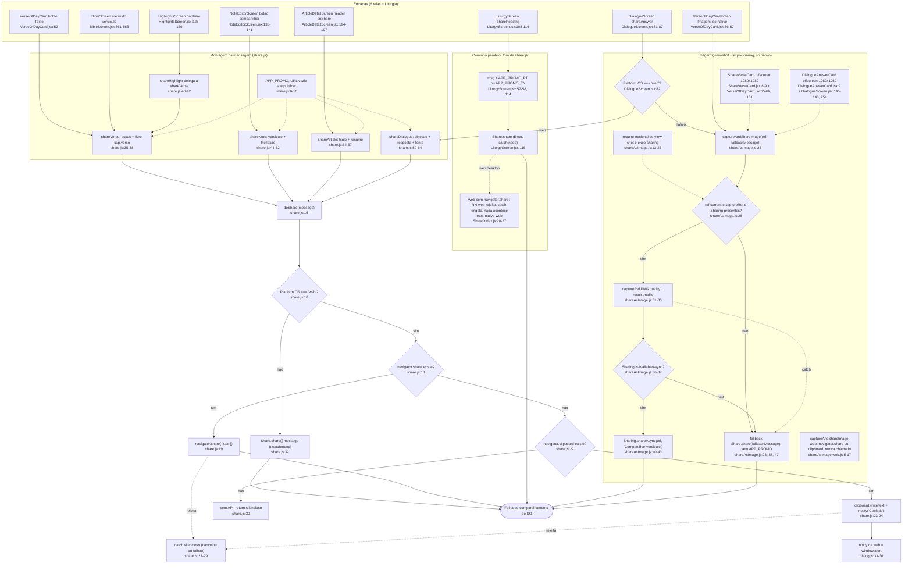
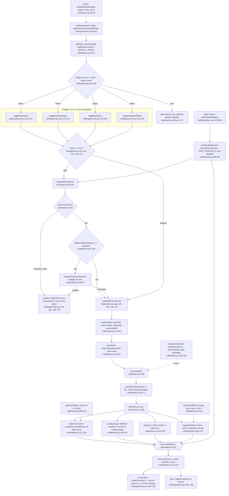
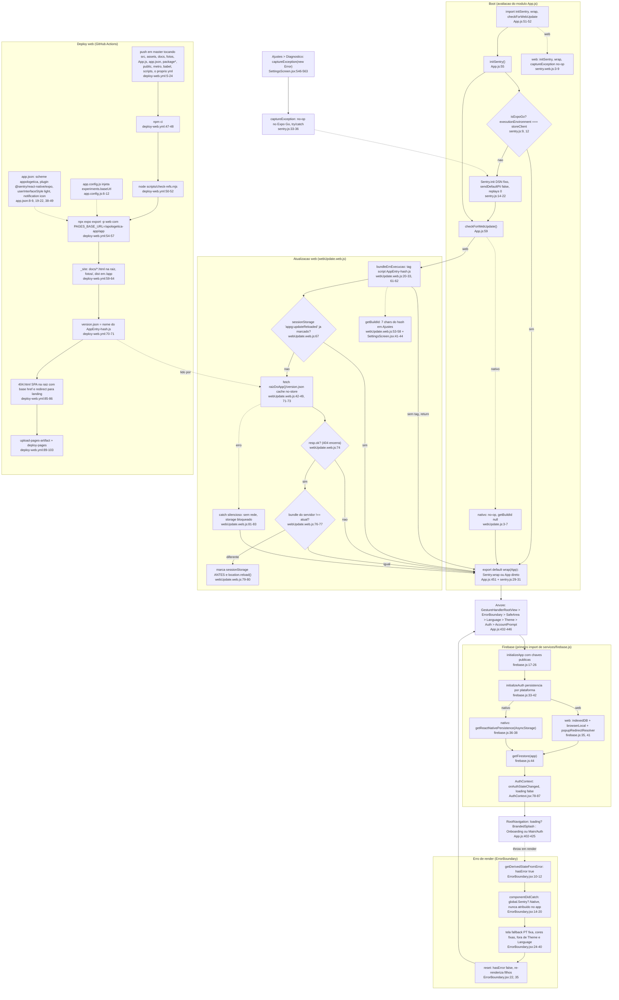

# 12. Fluxograma transversal: Compartilhamento (F12), Notificações locais (F13) e Infra (F14)

Data: 2026-09-23. Base: commit `f6a5858` (branch `claude/funny-cray-ret9a0`), `src/` intocado. Levantamento somente leitura, com todo fato apontado para `arquivo:linha` do código atual. Segue o inventário em `00-features.md` (linhas 28-30), que agrupou as três features num único fluxograma por serem pequenas e transversais.

## Escopo

| Feature | Arquivos centrais | Consumidores |
|---|---|---|
| F12 Compartilhamento | `src/utils/share.js` (65 linhas), `src/utils/shareAsImage.js` (50), `src/utils/shareAsImage.web.js` (18), `src/components/ShareVerseCard.jsx` (52), `src/components/DialogueAnswerCard.jsx` (42) | `VerseOfDayCard.jsx:5-7`, `BibleScreen.jsx:7`, `HighlightsScreen.jsx:13`, `NoteEditorScreen.jsx:13`, `ArticleDetailScreen.jsx:11`, `DialogueScreen.jsx:11-13`, e `LiturgyScreen.jsx:8` (usa `Share` do React Native direto, sem passar por `share.js`) |
| F13 Notificações locais | `src/services/notifications.js` (208 linhas), `src/services/notifications.web.js` (47, stubs no-op) | Único consumidor: `SettingsScreen.jsx:15-20` (import), toggles em `:123-159`, botão de teste em `:470-483` |
| F14 Infra | `src/services/firebase.js` (44), `src/sentry.js` (36), `src/sentry.web.js` (9), `src/components/ErrorBoundary.jsx` (52), `src/utils/webUpdate.js` (7), `src/utils/webUpdate.web.js` (84), `app.config.js` (13), `app.json` (56), `.github/workflows/deploy-web.yml` (103) | Boot em `App.js:51-59` e `:430-451`; `firebase.js` importado por `AuthContext.jsx:15`, `useGoogleSignIn.js:6`, `useGoogleSignIn.web.js:3`, `NoteEditorScreen.jsx:6`; `getBuildId` e `captureException` em `SettingsScreen.jsx:9,6` |

Regra de plataforma: o Metro resolve a variante `.web.js` na web e a base no nativo, e o import nunca traz o sufixo (`App.js:51-52`, `SettingsScreen.jsx:20`). Por isso `notifications.web.js`, `sentry.web.js`, `shareAsImage.web.js` e `webUpdate.web.js` precisam espelhar a interface da variante nativa.

## Fluxograma 1: Compartilhamento (texto e imagem)

Caminho feliz texto: consumidor monta os campos, `share*` de `share.js` monta a mensagem e acrescenta `APP_PROMO`, `doShare` decide por plataforma. No nativo abre a folha de compartilhamento (`Share.share`, `share.js:32`). Na web tenta `navigator.share` (`:18-19`), senão copia para a área de transferência e avisa com `notify` (`:22-24`, que na web é `window.alert`, `dialog.js:33-36`).

Caminho feliz imagem (só nativo): o card 1080x1080 já está renderizado fora da tela (`VerseOfDayCard.jsx:65-66`, `DialogueScreen.jsx:145-148`), `captureAndShareImage` captura a View como PNG em arquivo temporário (`shareAsImage.js:31-35`) e abre `expo-sharing` (`:40-43`). Qualquer falha recai para `Share.share` com o texto de fallback (`:28,38,47`).

Notas do fluxo 1:

- `shareHighlight` é um alias puro de `shareVerse` (`share.js:40-42`).
- `VerseOfDayCard` deriva `bookName` e `chapter` por regex sobre a string `ref` (`VerseOfDayCard.jsx:22-27`), enquanto `BibleScreen`, `HighlightsScreen` e `NoteEditorScreen` passam os campos estruturados.
- O `fallbackMessage` de imagem é montado pelo consumidor sem `APP_PROMO` (`VerseOfDayCard.jsx:30`, `DialogueScreen.jsx:85`), então o texto de fallback difere do texto que `shareDialogue`/`shareVerse` produziriam.
- O `dialogTitle` de `expo-sharing` é fixo em português, "Compartilhar versículo" (`shareAsImage.js:42`), inclusive quando o que se compartilha é a resposta de uma objeção (`DialogueScreen.jsx:85`).
- `shareAsImage.web.js` está morto por construção: `VerseOfDayCard.jsx:56` esconde o botão na web e `DialogueScreen.jsx:82` desvia para `shareDialogue` antes de chegar nele. O próprio arquivo diz isso em `:3-4`.
- `NoteEditorScreen.jsx:21-24` pré-carrega a Bíblia no `useEffect` porque o `navigator.share` da web exige rodar dentro do gesto do usuário.

## Fluxograma 2: Notificações locais (toggles em Ajustes)

Caminho feliz: `SettingsScreen` carrega prefs ao montar (`:63-65`), o usuário liga um toggle, `requestPermissions` pede permissão ao SO (`notifications.js:55-61`), o estado local é atualizado de forma otimista (`SettingsScreen.jsx:128`), `setXEnabled` grava as prefs em AsyncStorage e chama `rescheduleAll` (`notifications.js:73-102`), que cancela os 5 identificadores conhecidos (`:63-71`) e reagenda só o que está ligado (`:110-175`).

Notas do fluxo 2:

- Não existe UI para alterar `verseHour`/`verseMinute`: os únicos usos em `SettingsScreen.jsx` são o estado inicial (`:55`), o repasse no toggle (`:129`) e a exibição (`:401-402`). Na prática o versículo diário fica sempre às 07:00, mesmo o modelo de dados prevendo hora configurável.
- O estado inicial de `notifPrefs` em `SettingsScreen.jsx:55` não traz `objectionOfDay`; o campo só aparece quando `getPrefs` resolve (`notifications.js:44`, merge com `DEFAULT_PREFS`).
- O corpo do versículo diário (`notifications.js:117`) e a objeção (`:166`) são calculados no momento do agendamento. Como o gatilho é `DAILY` repetido, o SO reenvia o mesmo texto todo dia até `rescheduleAll` rodar de novo, o que só acontece por um toggle em Ajustes. `ensureScheduled` (`:182-186`) seria o ponto de reciclar no boot, mas nenhum arquivo o chama (grep em `src/` e `App.js`: único hit é a definição).
- A permissão é só pedida ao ligar (`SettingsScreen.jsx:124`); desligar nunca pede. No emulador `Device.isDevice` é falso e `requestPermissions` devolve `false` sem dialogo (`notifications.js:56`).
- Textos das notificações são só em português (`notifications.js:116-118, 132-133, 150-151, 165-166`), sem passar por `strings.js`.
- `data.type` e `data.dialogueId` são gravados na notificação (`notifications.js:118, 134, 152, 167`), mas não há nenhum `addNotificationResponseReceivedListener` ou `getLastNotificationResponseAsync` no app (grep sem resultado fora de `notifications.js`): tocar na notificação abre o app sem navegar.
- `friday-fast` é mantido apenas para cancelar agendamentos antigos (`notifications.js:28, 67`).
- A política de privacidade menciona três lembretes (`LegalScreen.jsx:67-68`) e o app agenda quatro (objeção do dia entrou depois).

## Fluxograma 3: Infra (boot, ErrorBoundary, atualização web, deploy)

Caminho feliz do boot: no import de `App.js` rodam `initSentry()` (`:55`) e `checkForWebUpdate()` (`:59`), ambos no-op conforme plataforma/ambiente. `firebase.js` inicializa no primeiro import (via `AuthContext.jsx:15`) com persistência por plataforma (`firebase.js:33-42`). A árvore de providers fica dentro de `ErrorBoundary` (`App.js:433-445`) e o export é `wrap(App)` (`:451`). `AuthContext` assina `onAuthStateChanged` e só então `loading` cai (`AuthContext.jsx:78-87`), liberando `RootNavigation` (`App.js:402-404`).

Notas do fluxo 3:

- `ErrorBoundary` está fora de `LanguageProvider` e `ThemeProvider` (`App.js:433-435`), por isso a tela de fallback tem textos em português e cores fixas `#1a3a5c`/`#c9a84c` (`ErrorBoundary.jsx:29-30, 45-51`), sem acompanhar o tema escuro nem o idioma.
- `global.Sentry` não é atribuído em nenhum arquivo de `src/` nem em `App.js` (grep por `global.Sentry\s*=`: sem resultado). O único caminho de captura confirmado no código é `src/sentry.captureException`, chamado apenas pelo botão de diagnóstico (`SettingsScreen.jsx:550`).
- `useGoogleSignIn.js:17` repete o teste `Constants.executionEnvironment === 'storeClient'` que `sentry.js:9` também faz.
- `metro.config.js:1-5` usa `getSentryExpoConfig`, então o plugin Sentry participa do bundle mesmo quando `initSentry` é no-op.
- `app.json:9` fixa `userInterfaceStyle: light`; o modo escuro é interno ao `ThemeContext`, não segue o SO.
- A regra de disparo `docs/**` (`deploy-web.yml:11`) inclui `docs/design/`, então este próprio arquivo, se for para `master`, dispara um build e deploy completos do site, embora o passo de montagem só copie `docs/*.html` da raiz (`deploy-web.yml:62`).
- `LINKING.prefixes` já traz a URL pública `https://movits.github.io/apologetica-app` (`App.js:72`), enquanto `APP_PROMO_URL` continua vazia (`share.js:6`).

## Efeitos colaterais

| Efeito | Onde | Observação |
|---|---|---|
| Folha de compartilhamento do SO | `share.js:32`, `shareAsImage.js:28, 38, 47`, `LiturgyScreen.jsx:115` (`Share.share`); `shareAsImage.js:40` (`expo-sharing`) | Cancelamento é engolido por `.catch(() => {})` |
| Web Share API | `share.js:19`, `shareAsImage.web.js:8`, e indiretamente `LiturgyScreen.jsx:115` via react-native-web | Exige gesto do usuário (`NoteEditorScreen.jsx:21-24`) |
| Área de transferência | `share.js:23` (`navigator.clipboard`, só web); `BibleScreen.jsx:556` (`expo-clipboard`, copiar versículo) | Duas APIs de clipboard no app |
| `window.alert` / `Alert.alert` | `share.js:24` via `dialog.js:33-39`; `SettingsScreen.jsx:126, 130, 474-481, 551-558` | Feedback bloqueante na web |
| Arquivo temporário PNG | `shareAsImage.js:31-35` (`result: 'tmpfile'`) | Nunca apagado pelo app; fica com o cache do view-shot |
| Agendador de notificações do SO | `notifications.js:65-69` (cancel), `:113, 129, 146, 162, 194` (schedule) | Sempre cancela os 5 ids antes de reagendar |
| Diálogo de permissão do SO | `notifications.js:59` | Só ao ligar um toggle ou no botão de teste |
| AsyncStorage `notifications:prefs` | `notifications.js:24, 43, 51` | JSON com 6 campos; erros de leitura/escrita silenciados |
| AsyncStorage (Firebase auth) | `firebase.js:37` | Persistência do login no nativo |
| IndexedDB / localStorage (Firebase auth) | `firebase.js:35` | Persistência do login na web |
| `sessionStorage` `appg:updateReloaded` | `webUpdate.web.js:16, 67, 79` | Garante no máximo um reload por aba |
| `window.location.reload()` | `webUpdate.web.js:80` | Só quando `version.json` anuncia bundle diferente |
| Rede: `version.json` | `webUpdate.web.js:73` | `cache: 'no-store'`, ancorado na raiz do app |
| Rede: Sentry ingest | `sentry.js:15` (DSN), `:35` (evento) | Só em build standalone; crash-only sem PII |
| Rede: Firebase Auth e Firestore | `firebase.js:26, 33, 44` | Fora do escopo detalhar (F2/F10) |
| GitHub Pages | `deploy-web.yml:89-103` | Publica `_site` inteiro a cada push elegível |

## Ramos e casos de borda

| Ramo | Comportamento | Fonte |
|---|---|---|
| Web sem Web Share API (desktop) | `share.js`: copia para clipboard e avisa "Copiado". `LiturgyScreen`: react-native-web rejeita a promise e o `catch` engole, sem feedback | `share.js:22-24`; `LiturgyScreen.jsx:115`; `react-native-web/dist/exports/Share/index.js:20-27` |
| Web sem Web Share e sem clipboard | `doShare` retorna em silêncio | `share.js:30` |
| Usuário cancela o share | Nativo: promise resolve com `dismissedAction`, ignorado. Web: rejeita e cai no `catch` vazio | `share.js:27-29, 32` |
| `react-native-view-shot` ou `expo-sharing` ausentes | `require` em try/catch deixa `captureRef`/`Sharing` nulos; `captureAndShareImage` cai para `Share.share` com texto. Ambos estão em `package.json:48, 33`, então hoje o ramo não dispara | `shareAsImage.js:13-23, 26-28` |
| `Sharing.isAvailableAsync()` falso | Fallback para texto | `shareAsImage.js:36-38` |
| Captura lança | Fallback para texto | `shareAsImage.js:45-47` |
| Botão Imagem na web | Escondido em `VerseOfDayCard`; `DialogueScreen` desvia para texto | `VerseOfDayCard.jsx:56`; `DialogueScreen.jsx:82-83` |
| Permissão de notificação negada | `notify('Permissão necessária')` e retorno sem salvar nem mudar o switch | `SettingsScreen.jsx:125-126` |
| Emulador (`!Device.isDevice`) | `requestPermissions` devolve `false` sem diálogo; mesma mensagem de permissão | `notifications.js:56` |
| Falha ao agendar (ex.: Expo Go) | `rescheduleAll` devolve `{ok:false, error}`; só versículo e liturgia mostram aviso com nota do Expo Go; quiz e objeção ignoram | `notifications.js:177-179`; `SettingsScreen.jsx:130, 140, 149, 158` |
| Notificações na web | Seção oculta; stubs devolvem `{ok:true}` e `sendTestNotification` devolve erro fixo | `SettingsScreen.jsx:391`; `notifications.web.js:23-47` |
| Expo Go (Sentry) | `initSentry`, `wrap` e `captureException` viram no-op por `executionEnvironment === 'storeClient'` | `sentry.js:9, 12, 30, 34` |
| Web (Sentry) | Variante inteira no-op | `sentry.web.js:3-9` |
| `Sentry.init` lança | try/catch silencioso | `sentry.js:23-25` |
| `version.json` 404 ou sem rede | `!resp.ok` retorna; exceção cai no `catch` vazio | `webUpdate.web.js:74, 81-83` |
| Tag do bundle não encontrada (dev local) | `bundleEmExecucao()` nulo, verificação encerra; `getBuildId` nulo e Ajustes omite o rótulo | `webUpdate.web.js:61-62, 54-55`; `SettingsScreen.jsx:41-44` |
| `sessionStorage` bloqueado | `?.` e `catch` deixam seguir sem reload | `webUpdate.web.js:67, 79, 81` |
| Bundle diferente em aba já recarregada | Marca impede segundo reload (sem laço) | `webUpdate.web.js:65-67` |
| `getReactNativePersistence` ausente | `persistence: undefined` (memória) no nativo | `firebase.js:36-38` |
| Erro de render | `ErrorBoundary` mostra fallback PT e botão "Tentar novamente" | `ErrorBoundary.jsx:24-39` |
| Erro em handler assíncrono | Não passa pelo `ErrorBoundary` (só erros de render); nenhum outro capturador no código | limite do React, sem arquivo |
| Push que não toca os paths listados | Workflow não roda (ex.: `brain/`, `documentos/`) | `deploy-web.yml:5-23` |
| URL abaixo de `/app/` inexistente | `404.html` na raiz serve o `index.html` do app com `<base>`; URL fora de `/app/` redireciona para a landing | `deploy-web.yml:85-86` |

## Dependências externas

| Pacote / serviço | Versão instalada | Onde entra |
|---|---|---|
| `react-native` `Share` | (RN do Expo 54) | `share.js:1, 32`; `shareAsImage.js:8`; `LiturgyScreen.jsx:8, 115` |
| `react-native-web` `Share` | 0.21.2 | Resolve `Share.share` na web (`node_modules/react-native-web/dist/exports/Share/index.js:20-27`) |
| Web Share API / Clipboard API (navegador) | n/a | `share.js:18-23`; `shareAsImage.web.js:7-12` |
| `react-native-view-shot` | 4.0.3 (`package.json:48`) | `shareAsImage.js:14, 31` |
| `expo-sharing` | 14.0.8 (`package.json:33`) | `shareAsImage.js:20, 36, 40` |
| `expo-clipboard` | 8.0.8 (`package.json:25`) | `BibleScreen.jsx:4, 556` (copiar versículo, fora de `share.js`) |
| `expo-notifications` | 0.32.17 (`package.json:32`) | `notifications.js:1, 15, 57-59, 65-69, 113-174, 194` |
| `expo-device` | 8.0.10 (`package.json:28`) | `notifications.js:2, 56` |
| `@react-native-async-storage/async-storage` | 2.2.0 (`package.json:16`) | `notifications.js:3, 43, 51`; `firebase.js:15, 37` |
| `firebase` (app, auth, firestore) | ^12.13.0 (`package.json:37`) | `firebase.js:6-14, 26, 33, 44` |
| `@sentry/react-native` + plugin Expo | ~7.2.0 (`package.json:21`) | `sentry.js:4`; `app.json:40-47`; `metro.config.js:1-5` |
| `expo-constants` | (Expo 54) | `sentry.js:5, 9`; `SettingsScreen.jsx:8, 40`; `useGoogleSignIn.js:4, 17` |
| Sentry ingest (SaaS) | DSN em `sentry.js:15`; org `appologetica`, projeto `react-native` em `app.json:43-45` | Só standalone |
| Firebase projeto `appologetica7` | `firebase.js:17-24` | Auth + Firestore |
| GitHub Pages + Actions (`checkout@v4`, `setup-node@v4`, `upload-pages-artifact@v3`, `deploy-pages@v4`) | `deploy-web.yml:40-45, 89-103` | Node 20, `npm ci` |
| `scripts/check-refs.mjs` | existe na raiz de `scripts/` | Bloqueia deploy com referência inválida (`deploy-web.yml:50-52`) |

## Duplicações observadas (fatos, sem solução)

1. **Promo de compartilhamento em dois lugares.** `share.js:6-10` define `APP_PROMO_URL` (vazia) e `APP_PROMO` só em PT; `LiturgyScreen.jsx:57-58` redefine `APP_PROMO_PT` e `APP_PROMO_EN` com o mesmo texto PT e uma versão EN que `share.js` não tem. As cinco funções de `share.js` sempre anexam a versão PT, mesmo com o app em inglês.
2. **Dois caminhos para a folha de compartilhamento.** `share.js:15-33` (`doShare`, com fallback de clipboard na web) e `LiturgyScreen.jsx:115` (`Share.share` direto, sem fallback). Na web desktop o primeiro copia e avisa, o segundo não faz nada.
3. **Fórmula da objeção do dia repetida.** `notifications.js:8-12` e `HomeScreen.jsx:65-67` têm o mesmo cálculo (`dayOfYear + ano*7 % DIALOGUES.length`). `dailyVerses.js:98-104` usa a mesma ideia com `ano*7` e `quiz.js:1966-1967` com `ano*13`, cada um em seu arquivo, sem função compartilhada para "item do dia".
4. **Quatro toggles com o mesmo esqueleto.** `SettingsScreen.jsx:123-159` repete quatro vezes "se ligar, pedir permissão; setNotifPrefs otimista; chamar setXEnabled". Em `notifications.js:73-102`, os quatro `setXEnabled` repetem "getPrefs, muda um campo, savePrefs, rescheduleAll".
5. **`ErrorBoundary` não usa o wrapper de Sentry.** `ErrorBoundary.jsx:16-17` procura `global.Sentry?.Native?.captureException`, que nenhum arquivo define; `src/sentry.js:33-36` já expõe `captureException` com a mesma proteção de Expo Go, e o único chamador é `SettingsScreen.jsx:550`.
6. **`ensureScheduled` e `rescheduleAll` sem chamador no boot.** `notifications.js:182-186` existe para reciclar os agendamentos com o texto do dia, mas não é chamado em `App.js` nem em nenhum contexto; `rescheduleAll` só roda a partir dos toggles.
7. **Dois cards offscreen 1080x1080 com estilos paralelos.** `ShareVerseCard.jsx:30-49` e `DialogueAnswerCard.jsx:28-39` compartilham fundo `#1a3a5c`, padding 80, `justifyContent: 'space-between'`, marca dourada `#c9a84c` "APPologética" e cruz; cada tela também repete o wrapper `offscreen: { position:'absolute', left:-10000, top:-10000, opacity:0 }` (`VerseOfDayCard.jsx:131`, `DialogueScreen.jsx:254`). O `variant: 'story'` (1080x1920) de `ShareVerseCard.jsx:8-9` não tem chamador.
8. **Cores da marca como literais.** `#1a3a5c` e `#c9a84c` aparecem em `ShareVerseCard.jsx`, `DialogueAnswerCard.jsx`, `ErrorBoundary.jsx:46-51`, `App.js:266-283` (splash) e `app.json:12, 21, 31`, fora das paletas de `ThemeContext`.
9. **Detecção de Expo Go duplicada.** `sentry.js:9` e `useGoogleSignIn.js:17` fazem o mesmo teste `Constants.executionEnvironment === 'storeClient'`.
10. **Dois clientes de clipboard.** `share.js:23` usa `navigator.clipboard` (só web); `BibleScreen.jsx:556` usa `expo-clipboard` (todas as plataformas).
11. **Texto de fallback de imagem montado fora de `share.js`.** `VerseOfDayCard.jsx:30` e `DialogueScreen.jsx:85` remontam à mão o que `shareVerse`/`shareDialogue` já produzem, sem `APP_PROMO`.
12. **Contagem de lembretes divergente.** `LegalScreen.jsx:67-68` fala em três lembretes; `notifications.js:32-37` tem quatro.

## Confiança e lacunas

- **Alta confiança** nos fluxos de código estático: todos os nós apontam para linhas lidas neste levantamento em `f6a5858`.
- **Comportamento em runtime não foi executado**: não rodei o app, não disparei notificação nem share. As afirmações sobre "cancelar o share resolve com `dismissedAction`" e "react-native-web rejeita sem `navigator.share`" vêm da leitura da biblioteca instalada (`node_modules/react-native-web/dist/exports/Share/index.js:20-27`), não de teste.
- **Sentry.wrap**: não inspecionei o que `Sentry.wrap` (`sentry.js:30`) instala por dentro. A afirmação "erros capturados pelo `ErrorBoundary` não chegam ao Sentry" se limita ao que o código do app faz (`global.Sentry` nunca é definido); se o SDK instala algum capturador próprio para erros de render, isso não está no repositório.
- **Limpeza do arquivo temporário do view-shot**: `shareAsImage.js:34` usa `result: 'tmpfile'` e nada apaga o arquivo no app. Onde o SO o guarda e quando o limpa depende da biblioteca, não conferido.
- **`getReactNativePersistence` ausente** (`firebase.js:36-38`): o ramo `undefined` existe no código, mas não verifiquei em qual versão do SDK ele deixaria de ser função.
- **Deploy**: o workflow foi lido, não executado. A afirmação de que `docs/design/**` dispara deploy vem do glob `docs/**` em `deploy-web.yml:11`.
- Fora do escopo e não detalhado: fluxo de auth e Firestore (F2, F10), TTS, liturgia/notícias (F8).

## Fontes consultadas

Código lido integralmente: `src/utils/share.js`, `src/utils/shareAsImage.js`, `src/utils/shareAsImage.web.js`, `src/components/ShareVerseCard.jsx`, `src/components/DialogueAnswerCard.jsx`, `src/services/notifications.js`, `src/services/notifications.web.js`, `src/services/firebase.js`, `src/sentry.js`, `src/sentry.web.js`, `src/components/ErrorBoundary.jsx`, `src/utils/webUpdate.js`, `src/utils/webUpdate.web.js`, `src/utils/dialog.js`, `app.config.js`, `app.json`, `eas.json`, `metro.config.js`, `.github/workflows/deploy-web.yml`, `App.js`.

Trechos lidos: `src/screens/SettingsScreen.jsx` (`:36-70, 116-162, 388-495, 536-570`), `src/components/VerseOfDayCard.jsx` (`:10-72, 131`), `src/screens/DialogueScreen.jsx` (`:76-90, 140-152, 254`), `src/screens/LiturgyScreen.jsx` (`:57-58, 104-118`), `src/screens/BibleScreen.jsx` (`:548-568`), `src/screens/HighlightsScreen.jsx` (`:120-134`), `src/screens/NoteEditorScreen.jsx` (`:18-32, 126-145`), `src/screens/ArticleDetailScreen.jsx` (`:192-200`), `src/screens/HomeScreen.jsx` (`:55-80`), `src/context/AuthContext.jsx` (`:60-100`), `src/hooks/useGoogleSignIn.web.js` (`:2-31`), `src/data/dailyVerses.js` (`:94-106`), `src/screens/LegalScreen.jsx` (`:62-70`), `package.json` (`:1-15` e dependências citadas), `docs/index.html` (`:390, 426, 513`), `node_modules/react-native-web/dist/exports/Share/index.js` (`:1-30`), `docs/design/PATHFINDER-2026-09-23/00-features.md`.

Greps em `src/` e `App.js`: consumidores de `utils/share`, `shareAsImage`, `ShareVerseCard`, `DialogueAnswerCard`, `Enviado pelo`/`APP_PROMO`, `services/notifications`, `ensureScheduled`/`rescheduleAll`/`sendTestNotification`, `global.Sentry`, `captureException`, `services/firebase`, `webUpdate`/`getBuildId`/`version.json`, `dayOfYear`, `addNotificationResponseReceivedListener`, `executionEnvironment`, `sessionStorage`/`localStorage`, `verseHour`/`verseMinute`.
