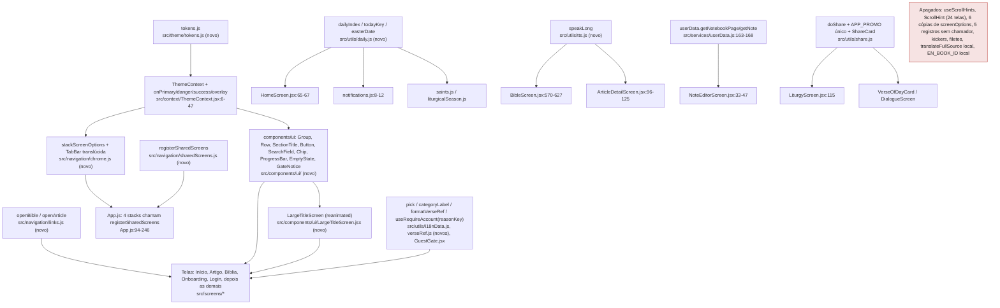

# 03. Proposta unificada (orquestrador)

Regras que segui: um caminho em vez de dois, deleção antes de abstração, nenhuma camada "para flexibilidade", nenhuma flag mantendo os dois caminhos, nenhum registro ou factory onde um objeto ou uma função resolvem. Especialização legítima fica como está e é dita explicitamente. Cada concern citado é o C-número de `02b-duplicacao-entre-features.md`; os locais completos estão lá.

Restrições que a proposta respeita (Fase 0 e CLAUDE.md): as 5 abas e todos os nomes de rota ficam; as telas secundárias continuam registradas em mais de um stack de propósito (o toque precisa resolver na aba ativa), só o jeito de registrar muda; sem dependência nova além de expo-blur, expo-linear-gradient e expo-font; Expo Go compatível; web, iOS e Android com o mesmo código.

## Sistemas unificados

### S1. Tokens e tema (C5, C15, C10, C16, C8, C13, C20)

**Hoje**: 48 `makeStyles(c, fs)` com escalas próprias (20 raios, 17 tamanhos `fs()`, 21 paddings), 44 hex literais fora da paleta (`#fff` 93x, `#c0392b` 13x), 43 kickers em caixa alta em 9 combinações, 18 tamanhos de ícone, 23 filetes laterais em 3 larguras, bloco de marca em 8 lugares com cores fixas.

**Proposta**: um módulo `src/theme/tokens.js` exportando constantes puras (sem React): `space` (4, 8, 12, 16, 20, 24, 32, 40), `radius` (sm 8, md 12, lg 20), `type` (papéis com `size`, `lineHeight`, `weight`, `family`: largeTitle, title, section, headline, body, callout, subhead, footnote, caption, reading, readingBible, tabLabel), `icon` (sm 18, md 22, lg 26), `motion` (touch 120, layout 250, screen 350, easings), `shadow` (só `sheet` e `floating`). `ThemeContext` ganha 4 chaves de cor que hoje são literais (`onPrimary`, `danger`, `success`, `overlay`) e passa a expor `tokens` junto com `colors` e `fs` (`useTheme()` devolve `{ colors, tokens, fs, ... }`). `fs()` continua sendo a única escala de fonte e passa a ser aplicada por `type` (cada papel já vem com `fs` aplicado).

**Entrada única**: `useTheme()` (já existe, `src/context/ThemeContext.jsx:139-160`). Não há nova abstração de estilo: cada tela continua com seu `makeStyles`, só que sem número solto (todo valor vem de `tokens`) e sem hex literal.

**Cada call site vira**: `borderRadius: 12` → `radius.md`; `fontSize: fs(11), textTransform: 'uppercase', letterSpacing: 1` → `...type.footnote, color: colors.text2` (o kicker deixa de existir como padrão: vira texto secundário em caixa normal); `borderLeftWidth: 3/4/6, borderLeftColor: accent` → removido (o destaque passa a ser posição e tipografia, não filete); `color: '#fff'` sobre navy → `colors.onPrimary`; `size={11..48}` em ícone → `icon.sm/md/lg`; bloco de marca → um componente `<BrandMark size="sm|md|lg" />` (`src/components/BrandMark.jsx`) usado por splash, Início, Login e Onboarding no lugar de `CrossMark` + título montados à mão.

**Perda**: os kickers em caixa alta e os filetes somem como linguagem. Aceito: a auditoria de Rams os marcou como decoração competindo com o conteúdo e marcadores datados (princípios 5 e 7).

### S2. Componentes base (C6, C7, C9, C11, C12, C17, C18, C19)

**Hoje**: card de navegação em 18 implementações, card de conteúdo em 17, cabeçalho de seção em 8 tratamentos, 7 campos de busca com 5 caixas, 15 estilos de botão em 2 cores de fundo, estados de gate/vazio copiados em 5 telas, 5 chips, 5 barras de progresso.

**Proposta**: uma pasta `src/components/ui/` com sete componentes, cada um a tradução direta de um padrão do iOS que o protótipo já mostra:
- `Group` + `Row` (lista agrupada com separadores): substitui card de navegação e card de conteúdo. `Row` aceita `icon`, `title`, `subtitle`, `trailing` (texto, chevron ou nada), `onPress`, e já carrega `accessibilityRole="button"` e alvo de 44.
- `SectionTitle` (Cormorant, `type.section`): substitui os 8 tratamentos.
- `Button` com `variant="primary|secondary|plain"`: substitui os 15 estilos; a única cor de fundo é `colors.tint`; "tentar de novo" é `plain`.
- `SearchField`: uma caixa, foco visível (anel de 2 px em `tint`), sem `outlineStyle: 'none'`; a barra falsa da Início usa o mesmo componente com `asButton`.
- `Chip` (seleção única), `ProgressBar` (3 px, `gold`), `EmptyState` (ícone, título, texto, ação opcional) e `GateNotice` (visitante) com as mensagens em `strings.js`.

**Entrada única**: `import { Group, Row, Button, ... } from '../components/ui'`.

**Cada call site vira**: `HomeScreen.jsx:128-142` (6 tiles) → um `Group` com 6 `Row`; `ToolsScreen.jsx:130-139` → `Row`; `TodayScreen` cards → `Group`/`Row` com o conteúdo do card dentro; `RelatedArticles.jsx:23` e `RelatedDialogues.jsx:23` → `Row`; `ContinueReadingCard.jsx:33-58` e `ContinueBibleCard.jsx:15-67` → um só `ContinueRow` (`Row` com `ProgressBar`), recebendo props: a leitura de `getLastRead` sobe para `HomeScreen` (que já tem `refreshKey`), a do progresso fica em `BibleScreen`; `LoginScreen.jsx:131-135` e `:158-162` → um único divisor "ou".

**Perda**: os cards com caixa de ícone colorida deixam de existir. Aceito, é a direção da Fase 0 (listas agrupadas).

### S3. Chrome e navegação (C1, C14, C2, C3, C4)

**Hoje**: `screenOptions` de header em 6 cópias literais (`App.js:100-102, 144-146, 180-182, 213-215, 312-314, 355-357`); `useScrollHints` + par de `ScrollHint` + 4 props de scroll em 24 telas; 57 registros de rota para 27 rotas escritos um a um; `navigate('Bíblia', {...})` montado à mão em 10 chamadas e `navigate('ArticleFromSearch', {articleId})` em 9.

**Proposta**:
- `src/navigation/chrome.js` exporta `stackScreenOptions(colors)` (header translúcido, `headerTransparent` + `headerBlurEffect` no iOS, fundo `material` na web e no Android, título `type.headline`, back em PT) e o `TabBar` customizado (`expo-blur` no iOS e web, `colors.material` no Android, ícones `icon.lg`, rótulo `type.tabLabel`, `tabBarActiveTintColor: colors.tint`). As 6 cópias somem.
- `src/components/ui/LargeTitleScreen.jsx`: o contêiner de tela com large title próprio (Cormorant) que encolhe no scroll com reanimated e revela o título inline; recebe `title`, `subtitle`, `right`. Início, Bíblia (capítulo), Artigos e Ferramentas usam.
- `useScrollHints` e `ScrollHint` são **apagados** (24 telas). A affordance "tem mais abaixo" passa a ser o conteúdo passando sob a tab bar translúcida e, nas telas de leitura, a `ProgressBar` no header.
- `src/navigation/sharedScreens.js` exporta `registerSharedScreens(Nav, { t, isEn })` que devolve o mesmo conjunto de `<Nav.Screen>` para cada stack. Os 4 stacks chamam a função; os nomes de rota não mudam; os 5 registros sem chamador (listados em C2) são apagados.
- `src/navigation/links.js` exporta `openBible(navigation, { bookId, chapter, verse, verseEnd })` e `openArticle(navigation, articleId)`; os 19 chamadores trocam o objeto montado à mão pela chamada.

**Perda**: `headerLargeTitle` nativo do iOS não é usado (não existe no Android nem na web); o large title é próprio. Aceito pela decisão da Fase 0 (uma linguagem nas 3 plataformas).

### S4. Helpers de dados bilíngues e formatação (C32, C25, C27, C24, C23)

**Hoje**: `isEn ? (a.titleEn || a.title) : a.title` em 13 pontos, rótulo de categoria em 11, `articles.find` em 5; "Livro cap,verso" em 7 lugares com separador `isEn ? ':' : ','` e 2 que ignoram o idioma (bug em EN no share); `requireAccount` com título e mensagem inline em 3 telas; `translateFullSource` local em `ReferencesScreen.jsx:17-70` paralelo a `references.js:2394-2446`; nomes de livro em 4 tabelas (`bible.js`, `LiturgyScreen.jsx:14-41`, `references.js:2367-2392`, mais uma).

**Proposta**: `src/utils/i18nData.js` com `pick(item, field, lang)` e `categoryLabel(id, t)`; `src/utils/verseRef.js` com `formatVerseRef({ bookId, chapter, verse, verseEnd }, lang)` (um só separador por idioma, usado também por `share.js`); `useRequireAccount(reasonKey)` lendo as mensagens de `strings.js` (`gate.favorites`, `gate.highlights`, `gate.tools`); `translateFullSource` movida para `references.js` ao lado de `translateRef`; `EN_BOOK_ID` e `BOOK_PT_TO_EN` derivadas de `bible.js` (única fonte).

**Perda**: nenhuma. Ganho colateral: o bug do share em EN some.

### S5. "Do dia" e datas (C21, C30, C28)

**Hoje**: fórmula `(dayOfYear + year*7) % len` em 4 módulos; `easterDate` idêntica em `saints.js` e `liturgicalSeason.js`; chave de "hoje" em 4 formatos; streak do quiz em UTC e do plano em hora local.

**Proposta**: `src/utils/daily.js` com `dailyIndex(len, date = new Date())`, `todayKey(date)` (formato único, hora local) e `easterDate(year)`. Os 4 módulos e os 2 streaks passam a importar daqui.

**Perda**: nenhuma. Especialização legítima mantida: as regras de streak do quiz e do plano continuam separadas (são produtos diferentes), só a data é comum.

### S6. Correções pontuais de lógica que valem sozinhas (C26, C35, C22, C36)

- `src/utils/tts.js` com `speakLong(text, opts)` (fatiamento em 4000 caracteres, fila, parar) usado por `BibleScreen.jsx:570-627`, `ArticleDetailScreen.jsx:96-125` e pelo preview de `SettingsScreen`. Hoje o artigo longo (20 de 83 acima de 4000 caracteres) não tem fila.
- `NoteEditorScreen.jsx:5-6, 33-47` passa a usar `getNotebookPage`/`getNote` de `userData.js` em vez de `doc/getDoc` direto.
- `APP_PROMO` só em `share.js`; `LiturgyScreen.jsx:57-58, :115` passa a usar `doShare` (ganha o fallback web).
- `ShareVerseCard` e `DialogueAnswerCard` viram um `ShareCard` com `variant`; o wrapper offscreen fica em um lugar.

## O que é especialização legítima (fica)

- `ContinueBibleCard` restaura posição real, `ContinueReadingCard` reabre o último artigo: a lógica é diferente e fica nas telas; só a linha visual é compartilhada (S2).
- `liturgyApi` e `newsApi` com cache-first próprios (TTL e formato diferentes): manter, no máximo um helper `cacheFirst(key, ttl, fetcher)` se a Fase 5 tocar nos dois.
- Compartilhar como imagem só no nativo (`shareAsImage.web.js` no-op): plataforma, não duplicação.
- `useGoogleSignIn` em duas variantes por plataforma: arquivos por plataforma são a convenção do projeto.
- Telas secundárias registradas em vários stacks: intencional (CLAUDE.md), muda só a forma de registrar (S3).

## Fluxograma do sistema unificado

## Ordem de execução (por dependência, não por pontuação)

1. S1 tokens e tema (base de tudo).
2. S2 componentes base e S3 chrome, em paralelo (os dois só dependem de S1).
3. Migração das 5 telas prioritárias para S1 + S2 + S3 (é o protótipo da Fase 4 virando código), com S4 onde a tela for tocada.
4. S5 e S6 (pequenos, valem sozinhos; podem ir antes se quiserem uma onda barata com bugs corrigidos).
5. Demais telas, uma onda por feature, cada onda com lint, export web e commit próprio.
